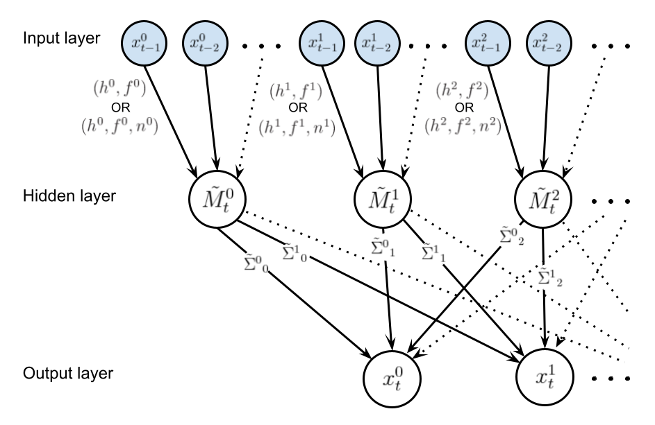
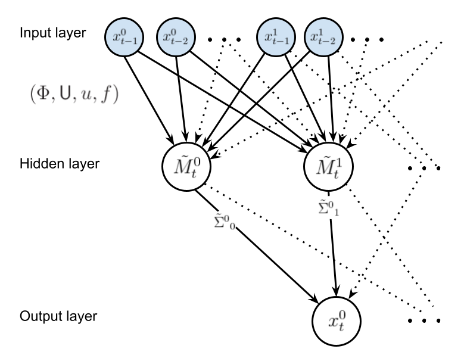

## Dynamic Bayesian graphical model structure

A dynamic Bayesian graphical model (or network) can be denoted as ${\rm DBN}(G,p)$ where $G$ denotes the graph structure and $p$ denotes the joint probability distribution over vertices. The latter, for the observation vector of an $N$-dimensional time series process $x_{t}$ (with $i$ indexing an element of the vector $x$, and $t$ denoting a discrete observation timepoint index) is factorisable with respect to the graph structure in the following manner

$$
\begin{equation}
p(x_{t},x_{t-1},\dots ,x_{1}) = \prod_{n=0}^{t-1}p[x_{t-n}\vert {\rm pa}(x_{t-n})]\,,
\end{equation}
$$

where ${\rm pa}(x_{t})$ denotes the parent nodes of $x_{t}$ which are defined by $G$. Choosing a set of parameters $\Theta$ (defined within their prior domain $\Omega_\Theta$), graph $G$, and an observation of $x_t$, Bayes' rule yields the following for the posterior distribution over $\Theta$ at timepoint $t$, given the data $x_{t}, x_{t-1}, \dots$

$$
\begin{equation}
{\cal P}_G(\Theta \vert x_{t}, x_{t-1}, \dots ) = \frac{\prod_{n=0}^{t-1}P_G(x_{t-n},\Theta )}{\prod_{n=0}^{t-1}\int_{\Theta \in \Omega_\Theta} {\rm d}\Theta P_G(x_{t-n},\Theta )} = \frac{\prod_{n=0}^{t-1}{\cal L}_G(x_{t-n} \vert \Theta )\pi_G (\Theta )}{\prod_{n=0}^{t-1}{\cal E}_G(x_{t-n})}\,,
\end{equation}
$$

where we have assumed that each data point $x_t$ is an independent observation from its predecessor $x_{t-1}$ and, as usual, ${\cal L}_G$ is the likelihood, $\pi_G$ is the prior and ${\cal E}_G$ is the evidence.

From an empirical Bayes [@carlin2000empirical] standpoint, one may define an auxiliary time-dependent vector variable $m_t$ (which $\pi_G$ and ${\cal E}_G$ are typically conditioned on) to marginalise over in this posterior definition like so

$$
\begin{equation}
{\cal P}_G(\Theta \vert x_{t}, x_{t-1}, \dots ) = \prod_{n=0}^{t-1}\int_{m \in \Omega_{m_{t-n}}} {\rm d}m \, P_G(m\vert x_{t-n}, x_{t-n-1}, \dots )\frac{{\cal L}_G(x_{t-n}\vert \Theta )\pi_G (\Theta \vert m)}{{\cal E}_G(x_{t-n}\vert m)} \,.
\end{equation}
$$

The vector variable $m_t$, which will form an intermediate layer in our network, acts as a compression of the time series $x_{t}, x_{t-1}, \dots$ into the mean vector of a Gaussian at time $t$ which we will importantly assume to be _Markovian_ (note that this assumption will clearly not always hold well for the best compressions). For some references on Gaussian processes (a related, but different kind of inference model), see, e.g., [@friedman2013gaussian], [@titsias2010bayesian], [@damianou2013deep] or [@frigola2015bayesian].

Up until this point in our study, the technique used for compressing $x_{t}, x_{t-1}, \dots \rightarrow m_t$ is still undetermined.

## 'AR-G': a simple Gaussian model with autoregressive kernel convolution compression

A simple nonparametric way to obtain $m_t$ is through autoregressive techniques with convolution kernels. This models the whole vector process as

$$
\begin{align}
P(x_{t}\vert m_{t}, f_t, {\sf V}) &= {\cal N}( x_{t}; m_{t} + f_t, {\sf V}) \\
P[m_{t}\vert {\rm pa}(x_{t}), h, \Sigma] &= {\cal N}\big\{ m_{t};M_t[{\rm pa}(x_{t}) \vert h] ,\Sigma \big\} \\
M^i_t[{\rm pa}(x^i_{t}) \vert h^i] &= \sum_{n=1}^{t-1}\frac{x^i_{t-n}}{H^i}\exp \left[ -\frac{A^i(n)}{(h^i)^2}\right] \,,
\end{align}
$$

where the kernel we are using requires the following additional set of definitions

$$
\begin{equation}
H^i = \sum_{n=1}^{t-1}\exp \left[ -\frac{A^i(n)}{(h^i)^2}\right]\,, \quad A^i(n) = \begin{cases} \frac{n^2}{2} \,\, ({\rm and}\,\, f^i_t=0) &  {\rm Squared}\,\,{\rm exponential}\\ 2\sin^2\big( \big\vert \frac{\pi n}{n^i}\big\vert \big) \,\, ({\rm and}\,\, f^i_t=\sin (\frac{\pi t}{n^i} + \pi s^i) ) & {\rm Periodic}\end{cases}\,.
\end{equation}
$$

In the expressions above, ${\cal N}(\mu , \Sigma )$ is a multivariate normal distribution with mean vector $\mu$ and covariance matrix $\Sigma$. The likelihood of data point $x_t$ is therefore very simply

$$
\begin{equation}
{\cal L}_G(x_{t}\vert \Theta ) = {\cal N}\big[ x_{t};\tilde{M}_t(f_t,h),\tilde{\Sigma} \big] \,, \quad \tilde{M}_t(f_t,h) \equiv f_t+M_t[{\rm pa}(x_{t}) \vert h]\,, \quad  \tilde{\Sigma} \equiv {\sf V}+\Sigma\,. 
\end{equation}
$$

The graph displayed below illustrates the structure of this graphical model, where shaded nodes are observed at time $t$ and the edges of the graph indicate functional dependencies (either deterministic or stochastic).

It is clear that investigating the data for evidence of seasonality (by, e.g., examining the autocorrelation functions) with be an important first step before deciding on the convolution kernels connecting the input layer to the hidden layer. 

Not all of the graph edges should be strongly weighted by the data so we can (and should) select graph structures based on their combined Bayesian evidence over all of the past observations of the process $Z_t=\prod_{n=0}^{t-1}{\cal E}_G(x_{t-n})$. In order to convert the evaluation of $Z_t$ into an optimisation problem, we can choose an appropriate prior over $\tilde{\Sigma}$ that parameterises the family of posterior distributions. For a multivariate normal with fixed mean (assuming that the priors over $h$ and $f_t$ are independent) and unknown covariance, the conjugate prior is just the inverse-Wishart distribution ${\cal W}^{-1}$ so from the definition of the posterior, we have simply

$$
\begin{aligned}
&P_G(x_{t}, \Theta ) \propto {\cal N}\big[ x_{t};\tilde{M}_t(f_t,h),\tilde{\Sigma} \big]{\cal W}^{-1}(\tilde{\Sigma};\Psi , \nu) \\
&\Longleftrightarrow Z_t=\prod_{n=0}^{t-1}{\cal E}_G(x_{t-n}) \propto \prod_{n=0}^{t-1}{\sf t}_{\nu - N +1}\bigg[ x_{t-n};\tilde{M}_{t-n}(f_{t-n},h),\frac{\Psi}{\nu - N + 1} \bigg] \,,
\end{aligned}
$$

where ${\sf t}_{\nu}(\mu , \Sigma)$ is a multivariate t-distribution and the latter expression is obtained by marginalisation over the degrees of freedom in $\tilde{\Sigma}$. It is preferable at this point to define the priors over $h$ and $f_t$ as simply Dirac delta distributions centered on single parameter values (or $n^i$ and $s^i$ in the case of the $f_t^i$ functions) so that all of the epistemic uncertainty is propagated to the hidden-to-output layer weights. Using this prior one may replace the proportionalities above with exact equalities, which correspond to the method that is actually implemented within the 'bants' class we've written [here](https://github.com/umbralcalc/bants/blob/master/source/bants.py). Note also that one may choose a non-informative prior over the covariance matrix by setting the degrees of freedom $\nu = N$.

In case a gradient descent algorithm is used to optimise $\ln Z_t$, it first derivatives (and other relevant quantities) are

$$
\begin{align}
\frac{\partial \ln H^i}{\partial (h^i)^2} &= \frac{1}{H^i}\sum_{n=1}^{t-1}\frac{A^i(n)}{(h^i)^4}\exp \left[ -\frac{A^i(n)}{(h^i)^2}\right] \\
\frac{\partial}{\partial (h^i)^2}M^i_t[{\rm pa}(x^i_{t}) \vert h^i] &= \sum_{n=1}^{t-1} \bigg[ \frac{A^i(n)}{(h^i)^4} - \frac{\partial \ln H^i}{\partial (h^i)^2}\bigg] \frac{x^i_{t-n}}{H^i} \exp \left[ -\frac{A^i(n)}{(h^i)^2}\right] \\
&= \sum_{n=1}^{t-1} \frac{A^i(n)}{(h^i)^4} \frac{x^i_{t-n}}{H^i} \exp \left[ -\frac{A^i(n)}{(h^i)^2}\right] - \frac{\partial \ln H^i}{\partial (h^i)^2}M^i_t[{\rm pa}(x^i_{t}) \vert h^i] \\
\ln Z_t &= \ln \Gamma \bigg(\frac{\nu + 1}{2}\bigg) - \ln\Gamma \bigg(\frac{\nu - N + 1}{2}\bigg) - \frac{N}{2}\ln ( \pi ) - \frac{1}{2}\ln {\rm det} ( \Psi ) \\
&- \frac{\nu + 1}{2}\sum_{n=0}^{t-1}\ln \bigg\{ 1+\big[ x_{t-n}-\tilde{M}_{t-n}(f_{t-n},h) \big]^{\rm T} \Psi^{-1}\big[ x_{t-n}-\tilde{M}_{t-n}(f_{t-n},h) \big] \bigg\} \\
\frac{\partial \ln Z_t}{\partial (h^i)^2} &= - (\nu + 1)\sum_{n=0}^{t-1}\bigg\{ 1+\big[ x_{t-n}-\tilde{M}_{t-n}(f_{t-n},h) \big]^{\rm T} \Psi^{-1}\big[ x_{t-n}-\tilde{M}_{t-n}(f_{t-n},h) \big] \bigg\}^{-1} \\
&\qquad \qquad \qquad \times \frac{\partial}{\partial (h^i)^2}M^i_{t-n}[{\rm pa}(x^i_{t-n}) \vert h^i] \sum_{j=1}^N\big( \Psi^{-1}\big)^i_j\big[ x^j_{t-n}-\tilde{M}^j_{t-n}(f^j_{t-n},h^j) \big] \\
\frac{\partial \ln Z_t}{\partial \Psi^i_j} &= - \frac{1}{2}\delta^i_j + \frac{\nu + 1}{2}\sum_{n=0}^{t-1} \bigg\{ 1+\big[ x_{t-n}-\tilde{M}_{t-n}(f_{t-n},h) \big]^{\rm T} \Psi^{-1}\big[ x_{t-n}-\tilde{M}_{t-n}(f_{t-n},h) \big] \bigg\}^{-1}\\
&\qquad \qquad \qquad \qquad \times \big[ x^i_{t-n}-\tilde{M}^i_{t-n}(f^i_{t-n},h^i) \big] \big( \Psi^{-2}\big)^i_j\big[ x^j_{t-n}-\tilde{M}^j_{t-n}(f^j_{t-n},h^j) \big]\,.
\end{align}
$$

### 'KM-G': a simple Gaussian model with $k$-means clustering compression

Let us now consider an alternative method to perform the compression $x_t, x_{t-1}, \dots \rightarrow m_t$. In particular, the method we shall choose for the compression in this case is [$k$-means clustering with dynamic time warping](https://tslearn.readthedocs.io/en/stable/user_guide/clustering.html#k-means-and-dynamic-time-warping) (implemented using the brilliant tslearn package [@JMLR:v21:20-091]). The graph below illustrates the structure of this alternative graphical model, where, once again, the shaded nodes are observed at time $t$.

In this graphical model, we will assume a linear transformation for $\tilde{M}_{t-n}(f_{t-n},m_{t-n},{\sf U},u)$ such that the vector elements are

$$
\begin{equation}
\tilde{M}^i_{t}(f^i_{t},m_{t},{\sf U},u^i) = \sum_{j=1}^N{\sf U}^i_jm_t^j + u^i + f^i_t \,.
\end{equation}
$$

The empirical Bayes formula we discussed at the beginning of these notes can be used to evaluate the graph posterior, and the overall evidence in this case can be obtained through marginalisation like so

$$
\begin{align}
Z_t &=\prod_{n=0}^{t-1}{\cal E}_G(x_{t-n}) \\
&= \prod_{n=0}^{t-1}\int_{m \in \Omega_{m_{t-n}}} {\rm d}m \, P_G(m\vert x_{t-n}, x_{t-n-1}, \dots ,\Phi ) \, {\cal E}_G(x_{t-n} \vert m) \\
&= \prod_{n=0}^{t-1} \int_{m \in \Omega_{m_{t-n}}} {\rm d}m \, P_G(m\vert x_{t-n}, x_{t-n-1}, \dots ,\Phi )\, {\sf t}_{\nu - N +1}\bigg[ x_{t-n}; \tilde{M}_{t-n}(f_{t-n},m,{\sf U},u),\frac{\Psi}{\nu - N + 1} \bigg] \,,
\end{align}
$$

where $\Phi$ denotes the hyperparameter set used by the $k$-means algorithm for the compression. Note that this algorithm renders $P_G(m\vert x_{t-n}, x_{t-n-1}, \dots ,\Phi )$ to a (deterministic) Dirac delta $\delta (m-m_{t-n})$ for each timepoint $t$, and so we obtain simply

$$
\begin{equation}
Z_t = \prod_{n=0}^{t-1} {\sf t}_{\nu - N +1}\bigg[ x_{t-n}; \tilde{M}_{t-n}(f_{t-n},m_{t-n},{\sf U},u),\frac{\Psi}{\nu - N + 1} \bigg] \,.
\end{equation}
$$

For each choice of $\Phi$, a gradient descent algorithm can be used to optimise the remaining parameters in $\ln Z_t$, where the first derivatives which need to be added for this particular model are

$$
\begin{align}
\frac{\partial \ln Z_t}{\partial u^i} &= (\nu + 1)\sum_{n=0}^{t-1}\bigg\{ 1+\big[ x_{t-n}-\tilde{M}_{t-n}(f_{t-n},m_{t-n},{\sf U},u) \big]^{\rm T} \Psi^{-1}\big[ x_{t-n}-\tilde{M}_{t-n}(f_{t-n},m_{t-n},{\sf U},u) \big] \bigg\}^{-1} \\
&\qquad \qquad \qquad \times \sum_{j=1}^N\big( \Psi^{-1}\big)^i_j\big[ x^j_{t-n}-\tilde{M}^j_{t-n}(f^j_{t-n},m_{t-n},{\sf U},u^j) \big] \\
\frac{\partial \ln Z_t}{\partial {\sf U}^i_j} &= (\nu + 1)\sum_{n=0}^{t-1}\bigg\{ 1+\big[ x_{t-n}-\tilde{M}_{t-n}(f_{t-n},m_{t-n},{\sf U},u) \big]^{\rm T} \Psi^{-1}\big[ x_{t-n}-\tilde{M}_{t-n}(f_{t-n},m_{t-n},{\sf U},u) \big] \bigg\}^{-1} \\
&\qquad \qquad \qquad \times m^j_{t-n} \sum_{j'=1}^N\big( \Psi^{-1}\big)^i_{j'}\big[ x^{j'}_{t-n}-\tilde{M}^{j'}_{t-n}(f^{j'}_{t-n},m_{t-n},{\sf U},u^{j'}) \big] \,.
\end{align}
$$

## Additional details

**Code:** The code for this article was developed here: [https://github.com/umbralcalc/bants](https://github.com/umbralcalc/bants).

**License:** Shared by the author under an [MIT License](../LICENSE)

## References
