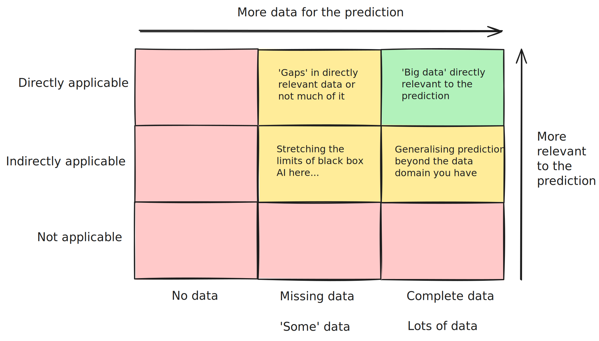

# Black box AI is an accelerator

## Some opinions

Here are some opinions on the realistic potential for 'black box' AI methods to improve human prediction and decision-making processes.

A 'black box' AI method for prediction here means a tool we can use to predict outcomes (provided sufficient relevant data), but which cannot be easily interrogated for insights into _why_ a specific prediction was made.

Models like this are also designed to bring relatively little inductive bias into their predictions. Inductive bias here can be thought of as information which is brought in which does not come from the data itself.

## Data is often irrelevant, incomplete, scarce or wrong

For many high-value problems that humanity (or just businesses) would like solve, the truth is that data is often irrelevant, incomplete, scarce or wrong.

In other words, you often do _not_ have data: which is directly relevant the the problem; which forms a complete set; which is enough for model training; or which is without any false entries, etc.

In situations where you do actually have data which satisfies these (or most of these) conditions, then training black box AI models becomes viable.

## Keeping humans in the loop with world models

In order to tackle the highly-challenging data environments we described above, it helps to bring as much useful information into the problem as possible. This information could be the model structure or prior knowledge provided by an expert.

When you use world models (which allow for more inductive bias), it allows for this information to be incorporated into the prediction.

- Inductive bias brings more information, for better or worse
- AI should be providing _insights_, not just predictive outputs

There is a _lot_ of nuance on what level of predictive 'explainability' is actually needed to achieve a goal with these tools.

## Black box AI is an accelerator

- Black box AI therefore can't have all the answers, but can be an enormous accelerator in this paradigm
- We can see this already with Agentic tools for writing simulation code and bespoke simulation emulators