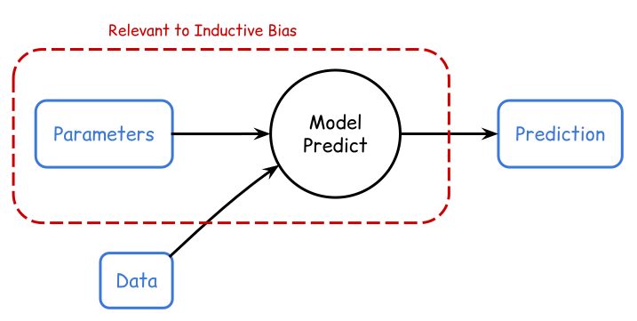
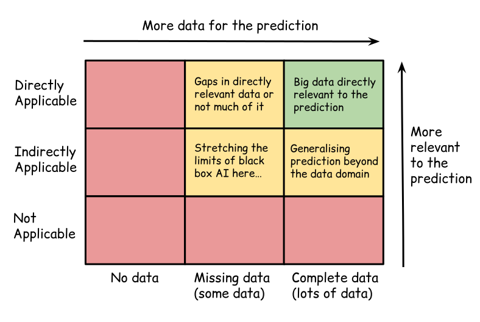
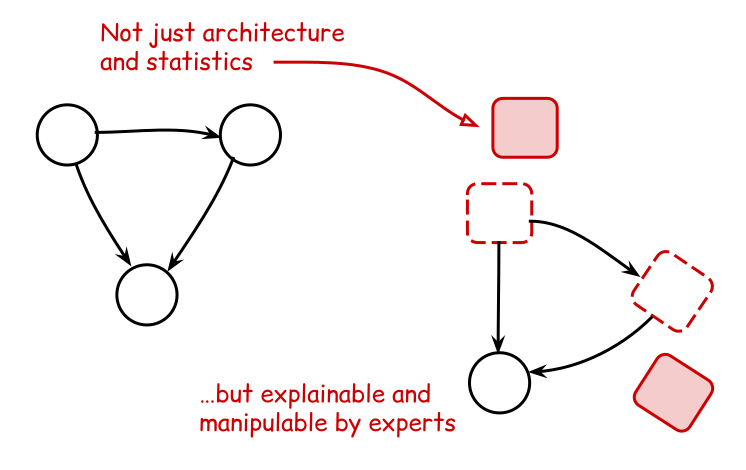

# Black box AI is an accelerator paradigm

## Some opinions

Here are some opinions on the realistic potential for 'black box' AI methods to improve human prediction and decision-making processes.

A black box AI method for prediction here means a tool we can use to predict outcomes (provided sufficient relevant data), but which cannot be easily interrogated for insights into _why_ a specific prediction was made.

Inductive bias is another concept which is worthy of discussion here. This can be thought of as information which is brought in which does not come from the data itself.

## Data is often irrelevant, incomplete, scarce or wrong

For many high-value problems that humanity (or just businesses) would like solve, the truth is that data is often irrelevant, incomplete, scarce or wrong.

In other words, you often do _not_ have data: which is directly relevant the the problem; which forms a complete set; which is enough for model training; or which is without any false entries, etc.

In situations where you do actually have data which satisfies these (or most of these) conditions, then training black box AI models becomes viable.

## Keeping humans in the loop with world models

In order to tackle the data environments we described above, it helps to bring as much useful information into the problem as possible. This information could come in the form of inductive biases in the model structure or prior knowledge provided by an expert.

Black box AI at best encodes only generic statistical or architectural inductive biases, but they usually lack the rich, domain‑specific structure that an explicit world model can provide.

A true world model should enable sources of information _distinct from the data_ to be included in its prediction, i.e., domain-specific structure with expert interpretation. This is the only clear way to circumvent data limitations.

Humans 'in the loop' can also interrogate their world models to find explanations for their predictions. In this sense, world models can provide _insights_, not just predictive outputs.

## Black box AI as an accelerator

- Black box AI therefore can't have all the answers, but can be an enormous accelerator in this paradigm
- We can see this already with Agentic tools for writing simulation code and bespoke simulation emulators

<!-- Needs a diagram here to help with explanation -->