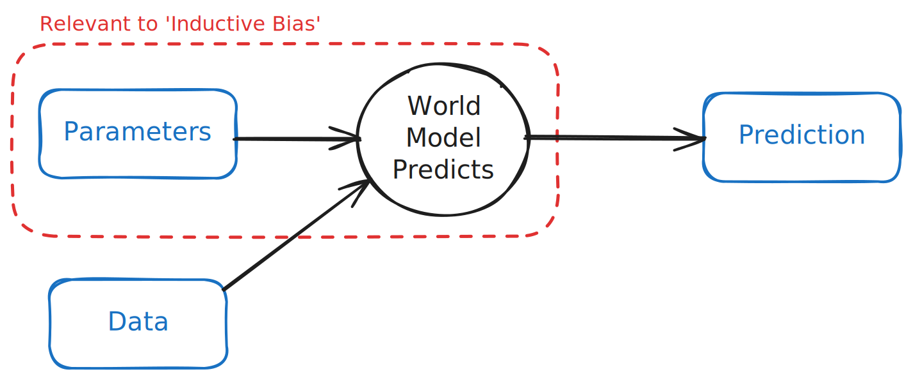

# Data, world models and black boxes

- Data is usually indirect, incomplete, scarce or wrong
- Keeping humans in the loop with world models
  - Inductive bias brings more information, for better or worse
  - Explainability is insight, not output
- Black box AI therefore can't have all the answers, but can be an enormous accelerator in this paradigm