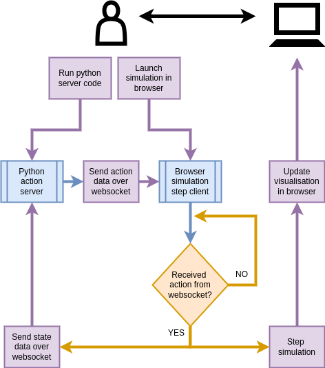

## Web application design

Previously, we have conceptualised and built the stochadex engine [@stochadexI-2024]; which provides a generalised framework for constructing stochastic simulations of practically any kind. In addition to enabling the construction of simulations which model real-world phenomena, we would also like to enable interactivity with these simulations and empower users to build their own control algorithms over them. Even though an API was built to minimise the amount of code required in these constructions, the requirement that new simulation iterations are written in Go may be a higher barrier to entry than is desirable --- especially for pure python programmers and machine learning engineers.

In this article, we're going to sidestep this barrier by providing the necessary tools to support web applications out of pre-built stochadex simulations. This application-building framework makes use of both WebAssembly [@wasm] technology for browser-based user experience (eliminating the need for a Go compiler on the user's side), and websocket client I/O with a local python server run by the user. The basic functionality of the framework is illustrated in the diagram below, in which the core application logic is also outlined.

In order to run the stochadex engine inside the browser simulation step client, we can embed a WebAssembly-compiled stochadex binary inside the encapsulating JavaScript code by registering the former as a function. On receiving messages from the client code over websocket, we can then simply pass this data into the function and use it to set the relevant simulation iterator parameters. Extracting current simulation state from the simulation binary is a little less obvious: in this case, we have chosen to register a 'websocket sender' callback function inside a new $\texttt{OutputFunction}$ implementation. The latter can then be plugged into the stochadex configuration as usual.

Compiling the stochadex to WebAssembly comes with some performance limitations. Most notable is the restriction to single-threaded execution of the code. However, we are still able to maintain an asynchronous runtime thanks to how goroutines are compiled to WebAssembly. This is because effectively we are running with $\texttt{GOMAXPROCS=1}$ --- for more details about the Go runtime execution model, see here [@goruntime].

Now let's recall that a local python server must be run by the user in order to interact with the simulation client over a websocket connection. In order to make this a straightforward experience for the pure python programmer, we have created a small python package to wrap all of the details into a single $\texttt{launch_websocket_server}$ function and $\texttt{ActionTaker}$ protocol for the user to implement as desired for their interactions with the simulation. This server code is now distributed as a python package called 'dexAct' for anyone to easily install here: [https://pypi.org/project/dexact](https://pypi.org/project/dexact).

At this point, we can now introduce the dexetera web application. This is hosted statically by GitHub pages with this url: [https://umbralcalc.github.io/dexetera](https://umbralcalc.github.io/dexetera). On this site, any user may run and visualise a selection of stochadex simulations as purely-frontend applications, while interacting with them over local websocket connections and easily-installable python server code.

Having introduced our new web application and outlined its essential design patterns, we can now move on to discuss some of the interactive user experiences and simulation types which are supported by dexetera and the stochadex engine, respectively.

## References
