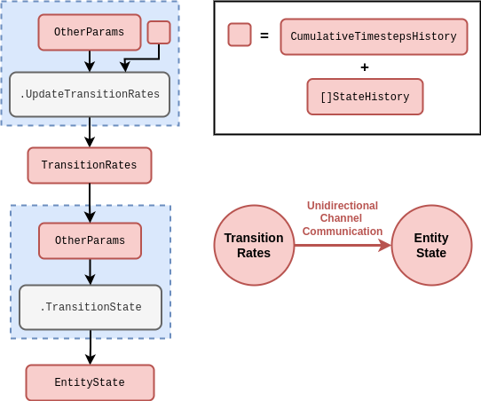
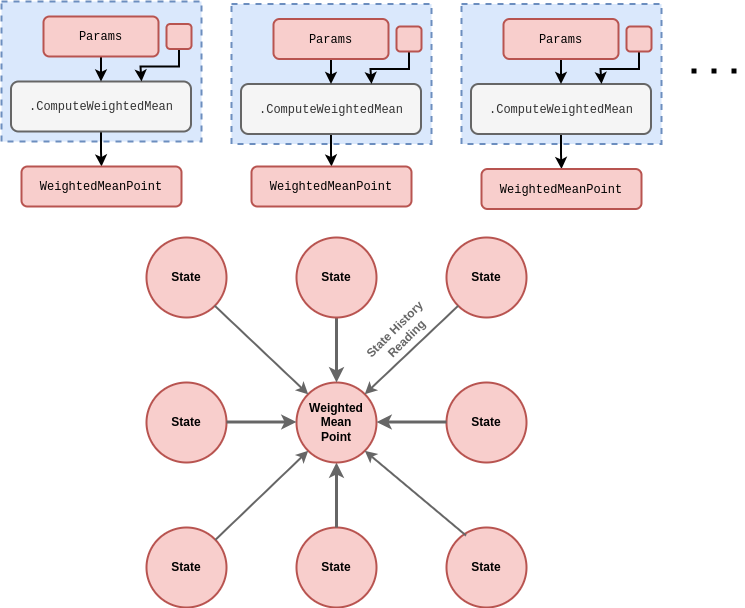
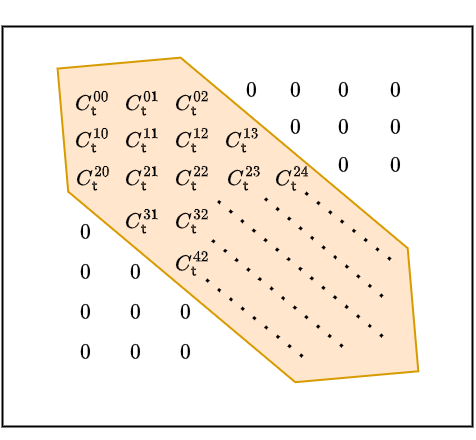
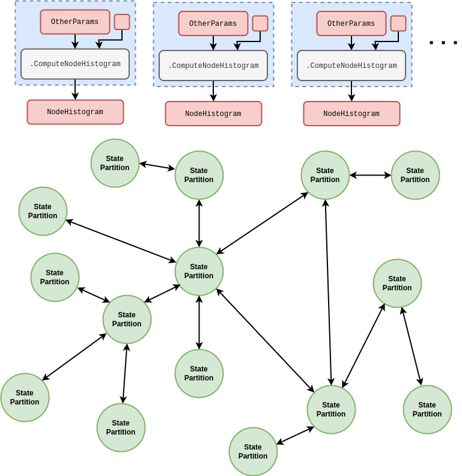
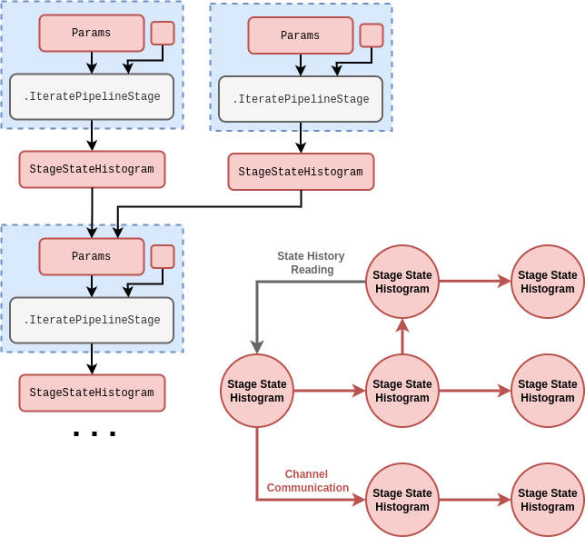
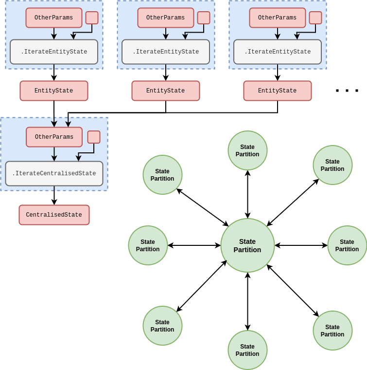

## Archetype simulations

To end this article, in this section, we're going to define and develop some archetype simulations which typically appear in the real-world. These archetypes will help to both illustrate how partitioning the state can be helpful to conceptualise the phenomena one wishes to simulate and provide some practical insights into how the stochadex may be configured for different purposes.

We begin with the _simple state transition archetype_, which refers to simulation environments where there is no obvious computational benefit to partitioning the state into concurrently updating or acting on separate components. There may even be performance benefits from keeping state information all within the same common data structure in memory, but this can depend on the specific problem of study.

In the interest of completeness, we have illustrated the trivial state partition graph topology for this archetype in Fig.~\ref{fig:state-partition-graph-simple-state-transitions}.

In order to understand what sorts of data might be collected about this archetype in realistic scenarios, let's begin by considering the types of real-world problem domain which have leveraged simulation environments to train control algorithms in the literature. The subset of these which may best suit the simple state transition environment archetype are:

- Event-based simulations of sports matches, e.g., football [@pulis2022reinforcement], rugby [@sawczuk2022markov], tennis [@ding2022deep], etc., and other forms of game --- all of which typically define a relatively simple global match/gameplay context as their 'state'.
- Sequential design simulations to change the configuration or data collection strategies of, e.g., astronomical telescopes (see [@jia2023observation] and [@yatawatta2021deep]), biological experiments [@treloar2022deep] and user interfaces [@lomas2016interface], which typically define a relatively simple and finite set of possible actions that can be taken.

Based on the examples given above, what kinds of data may be available to infer the state and parameters of a simulation environment using this archetype?

In the case of team sports matches, a team manager could have access to a large body of data which assesses the capabilities of their players before a game, but they must rely on more subjective or limited data to assess the performance of their team (and the opposition) in the middle of a match. The 'state' of the whole system in this case can be not only the state of play, but also information about, e.g., fatigue or on-the-day performance of each player for both teams and sets of substitutes.

- Talk about sequential design data here...

In a general offline learning setting, realistic historical data collected about the state values for this archetype will typically provide an important mechanism for model determination. Users of this archetype in the real world also typically have access to independent datasets that can be used offline to better determine some parameters of the simulation environment which are not observed directly. In the online learning setting, one typically directly observes some portion of the state values, and may only indirectly observe the other state values, if at all.

Within this topological archetype there will also be other categories to think are applicable:

- Types of observation that can be made about the state.
- Types of action that can be taken by an agent.
- Types of agent? How frequently do these actions get taken? On what part of the state?

Types of actor in this archetype:

- Sports team manager and other game player 1. substitute players 2. changes to tactics

The _dynamic spatial field archetype_ refers to simulation environments which have highly-structured, bidirectional communication between state partitions. The graph toplogy of this archetype is totally connected, but some connections matter more than others. As a helpful analogy, you can think of these partitions as being structured topologically in a kind of 'lattice' configuration, where connections to other partitions over different distances in the lattice can contribute different importance weights in affecting each local state partition. This lattice structure can be best intuited from a visual discription, so we have illustrated an example graph topology for the dynamic spatial field archetype in Fig.~\ref{fig:state-partition-graph-dynamic-spatial-fields}.

Depending on the spatial dimensionality of the field, we might need to visualise the lattice in Fig.~\ref{fig:state-partition-graph-dynamic-spatial-fields} as existing in more spatial dimensions than the 2-dimensional example we have illustrated. However, as it turns out, there are many important real-world examples of 2-dimensional spatial systems to control anyway.

Before we move onto a discussion of data, we can study spatial systems which follow this archetype a little more mathematically by adapting the probabilistic formalism we developed in the first part of this book.

- Need to give more recall to the reader here about the probabilistic formalism...

Let's return to this probabilistic formalism that we introduced earlier and note that the covariance matrix estimate with elements $C^{ij}_{{\sf t}+1}(z)$ represents a matrix that could get very large, depending on the problem. For example; if we encoded the state of a 2-dimensional spatial field of values into the elements $X^i_{\sf t}$, the number of elements in the covariance matrix $C^{ij}_{{\sf t}+1}(z)$ would scale as $4N^2$ --- where $N$ here is the number of spatial points we wanted to encode.

One solution to this scaling problem is to exploit the fact that, in many spatial processes, the proximity of points can strongly determine how correlated they are. Hence, for pairwise distances further than some threshold, the covariance matrix elements should tend towards 0. If we were to place points along the diagonal of $C^{ij}_{{\sf t}+1}(z)$ in order of how close they are to each other, this threshold would then be represented as a \emph{banded matrix}. We have illustrated such a matrix in Fig.~\ref{fig:banded-matrix} in which the 'bandwidth' is defined as the number of diagonals one needs to traverse from the main diagonal before encountering a diagonal of 0s.

- At some point it might be sensible to move into the Fourier domain here --- at least for derivations and calculations. Probably more intuitive for the reader to keep it mostly in real space though if possible.
- The extra detail that's also needed here is to consider how we encode a 2-dimensional spatial process into our state vector, and how the elements of the resulting state vector might be correlated to one another depending on their spatial proximity. If we start with a Markovian Gaussian random field, we can derive the Matérn kernel over these spatial coordinates in order to correlate the state vectors in such a way.

To begin our discussion of data, let's start by considering the subset of real-world problem domains which fit well within the dynamic spatial field archetype. These would be:

- Spatial simulations of population disease spread and control in the context of global disease outbreaks [@ohi2020exploring] or endemic, spatially-clustered infections like malaria [@carter2000spatial].
- Spatial ecosystem management environments to infer forest wildfire dynamics [@ganapathi2018using] or improve conservation decision-making [@lapeyrolerie2022deep].
- Weather system simulations to improve decision-making for agricultural yields [@chen2021reinforcement] or enhance stormwater flood mitigations [@saliba2020deep].

Within this topological archetype there will also be other categories to think are applicable:

- Types of observation that can be made about the state.
- Types of action that can be taken by an agent.
- Types of agent? How frequently do these actions get taken? On what part of the state?

Types of actor in this archetype:

- public health authority and wildlife/national park control authority and livestock/crop farmer 1. spatially detect disease or damage 2. change state of a subset of the population

The _distributed state network archetype_ refers to simulation environments whose bidirectional state partition graph topology is completely arbitrary, requiring no particular connectivity structure at all. Each state partition in this archetype typically refers to the same type of real-world node, object or sub-model. Due to the flexibility in topological structure, this archetype is well-suited to 'network' models of realistic phenomena. We have illustrated the state partition graph which fits into this category in Fig.~\ref{fig:state-partition-graph-distributed-state-networks}.

Before discussing what kinds of data are typically available to infer states and parameters of environments in this archetype, it will be informative to consider the various real-world problem domains which apply. The particular subset of these domains which seem to fit well within this classification include:

- Computational models of human brain conditions, e.g., Parkinson's disease [@lu2019application], epilepsy [@pineau2009treating], Alzheimer's [@saboo2021reinforcement], etc., for deep brain stimulation control and other forms of treatment.
- Simulations of complex urban infrastructure networks to target various kinds of optimisation, e.g., traffic signal control [@yau2017survey], power dispatch [@li2021integrating] and water pipe maintainance [@bukhsh2023maintenance].

Within this topological archetype there will also be other categories to think are applicable:

- Types of observation that can be made about the state.
- Types of action that can be taken by an agent.
- Types of agent? How frequently do these actions get taken? On what part of the state?

Types of actor in this archetype:

- brain doctor and traffic light controller and city infrastructure maintainer 1. change the state of a subset of nodes in the network

The _multi-stage pipeline archetype_ refers to simulation environments with a directional state partition graph with arbitrary connection topology. In this case, each state partition corresponds to a separate stage in some pipeline model of the real-world phenomenon. Directionality in the connection structure is the key distinction between this archetype and the others in our classification scheme. We've provided one illustrated example of a multi-stage pipeline state partition graph in Fig.~\ref{fig:state-partition-graph-multi-stage-pipelines}.

We're now ready to discuss how multi-stage pipelines are typically observed with data from realistic scenarios. To do this, it will help to first consider which real-world problem domains are best-suited to this archetype structure. From the literature, we can identify these as:

- Simulations of human logistics pipelines, e.g., organised supply chains [@yan2022reinforcement], humanitarian aid distribution pipelines [@yu2021reinforcement], hospital capacity planning [@shuvo2021deep], etc.
- Environments which emulate data pipeline optimisation problems [@nagrecha2023intune].

Within this topological archetype there will also be other categories to think are applicable:

- Types of observation that can be made about the state.
- Types of action that can be taken by an agent.
- Types of agent? How frequently do these actions get taken? On what part of the state?

Types of actor in this archetype:

- supply/relief chain controller and hospital logistics manager and data pipeline controller 1. modify the relative flows between different pipeline stages

The _centralised exchange archetype_ refers to simulation environments with a very specific bidirectional state partition graph topology. The graph connection structure is a star configuration where every state partition is connected to the same, centralised state partition which itself has a unique function in the model. In case this description isn't that clear, we've added an illustration of the graph for this archetype in Fig.~\ref{fig:state-partition-graph-centralised-exchanges}.

Before moving on to discuss how data is typically collected for centralised exchanges, it will be informative to list the examples of phenomena where this archetype can be found in the real-world. These problem domains are:

- Financial (see [@fischer2018reinforcement] and [@meng2019reinforcement]) and sports betting [@cliff2021bbe] market simulations for developing algo-trading strategies and portfolio optimisation [@dangi2013financial], as well as housing market simulations (see [@yilmaz2018stochastic] and [@carro2023heterogeneous]) to evaluate government policies.
- Simulations of other forms of resource exchange through centralised mediation, such as in prosumer energy markets [@may2023multi].

Within this topological archetype there will also be other categories to think are applicable:

- Types of observation that can be made about the state.
- Types of action that can be taken by an agent.
- Types of agent? How frequently do these actions get taken? On what part of the state?

Types of actor in this archetype:

- financial/betting/other market trader and market exchange mediator 1. interact with the market using an agent or collection of agents

## References
