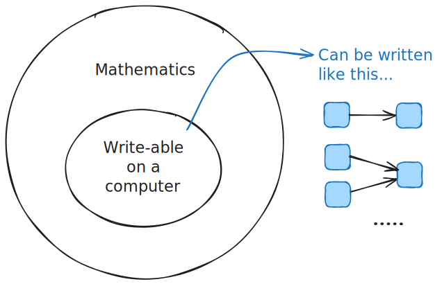

# Introducing the fundamentals

## Who are these posts for?

These posts are aimed at programmers and non-technical readers wanting to learn the fundamentals of simulating real-world systems.

Together, we will explore the power of stochastic phenomena and probabilistic thinking without the need for mathematical symbols.

Those eager to follow along with code should also check out the [stochadex project](https://umbralcalc.github.io/stochadex), which was designed with these fundamentals in mind.

## Why no mathematical symbols?

Mathematical concepts and tools are absolutely essential to understanding and deriving deeper relationships when analysing systems in the real world.

While the explanatory power of mathematical symbols is enormous, their power to effectively communicate ideas is limited by layers of pre-requiste knowledge. Wouldn't it be cool to try something a bit different?

Instead of churning through all of these interesting concepts with mathematical symbols, this documentation uses a _diagrammatic language_ for understanding simulated systems.

This language owes its mathematical rigor to the fact that [any computation can be written as a series of function abstrations and applications](https://en.wikipedia.org/wiki/Lambda_calculus). Therefore, since all of the practically useful mathematical calculations in these pages ultimately must be expressed in the computer, we can always find some diagrammatic description of the relevant mathematics that leverages the function abstractions.

The intention is to transfer some level of analytical power from the world of symbols into the world of diagrams and engage a wider group of analytical thinkers in understanding the deeper aspects of simulated systems.

We've used these diagrams instead of any mathematical formalism throughout these posts, where one can rest assured that the mathematical foundations are solid.

## What can you do with these simulations?

One of the most compelling uses for simulations of real-world systems is in powering decision-making technologies.

If you want to answer questions like 'if I take this action, then what will happen in my system?', then it is often essential to build a simulation of your system and use this to simulate what might happen in the future.

