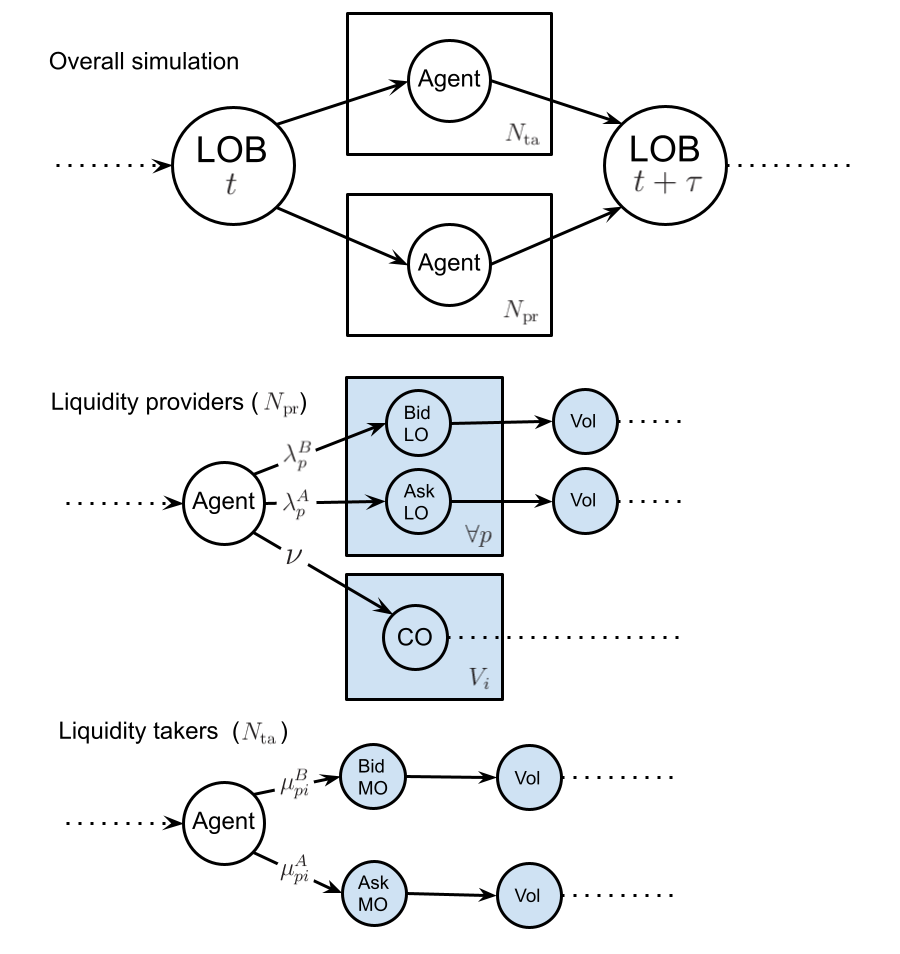
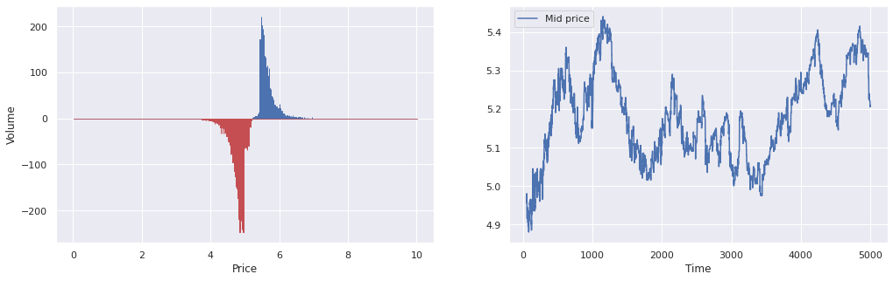
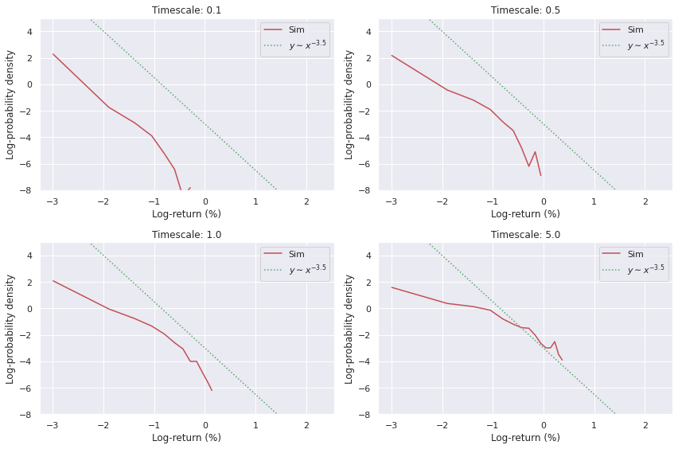
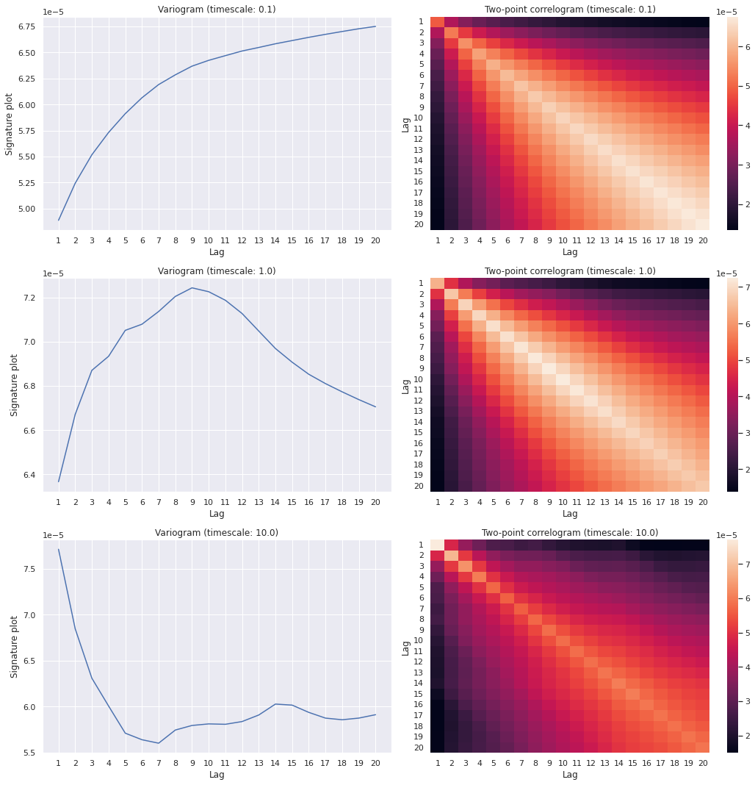

## Introduction

The simulation of financial markets through the use of agent-based models is an increasingly popular technique to understand the microstructure of their dynamics from the bottom up. See, for some examples:

- [Raberto et al. (2001)](https://www.sciencedirect.com/science/article/abs/pii/S0378437101003120?via%3Dihub) is a basic model of a financial market with constant total cash being conserved [@raberto2001agent].
- [Alfarano, Lux & Wagner (2005)](https://link.springer.com/article/10.1007/s10614-005-6415-1) details the construction of a market microsimulation with asymmetric herding to explain the fat tails in the distribution of returns while also showing how it follows a Fokker-Planck equation up to second-order corrections [@alfarano2005estimation].
- [Smith et al. (2006)](https://www.tandfonline.com/doi/abs/10.1088/1469-7688/3/6/307) is the original Santa Fe model for limit order book (LOB) simulations [@smith2003statistical].
- [Tóth et al. (2011)](https://journals.aps.org/prx/abstract/10.1103/PhysRevX.1.021006) extends the original Santa Fe models to become '$\epsilon$-intelligence' models [@toth2011anomalous].
- [Mastromatteo, Tóth & Bouchaud (2014)](https://journals.aps.org/pre/abstract/10.1103/PhysRevE.89.042805) develops the $\epsilon$-intelligence model further by including non-unit market and limit meta-orders [@mastromatteo2014agent].
- [Chen, Tan & Zheng (2015)](https://www.nature.com/articles/srep08399) looks at multi-level herding in agent-based market simulation. This is able to maintain both sector-level structure of markets and clustering between them at the same time as their respective temporal correlation structures [@chen2015agent].
- [Bouchaud et al. (2018)](https://doi.org/10.1017/9781316659335) is a detailed textbook on market microstructure [@bouchaud2018trades].
- [Chen et al. (2017)](https://link.springer.com/article/10.1007/s11467-017-0661-2) looks at the 'information driving force' as a way to calibrate their specific form of agent-based model empirically [@chen2017new].
- [Marcaccioli, Bouchaud, Benzaquen (2021)](https://arxiv.org/abs/2106.07040) shows how endogenous (self-exciting) and exogeneous (driven by external factors like sudden news breaks) price jumps belong to different dynamical classes as their relaxation profiles can be inferred to be different [@marcaccioli2022exogenous].

In this post, we'll build an example LOB simulation which replicates many of the key empirical stylised facts in real-world financial markets.

## A synchronous ensemble version of the $\epsilon$-intelligence model

The simulation we will design is an **individual-agent** version of the $\epsilon$-intelligence extension to the original Santa Fe model. In plate notation, where have also added blue-shaded regions to indicate when a choice of path must be taken for a given moment in time, the LOB simulation we have constructed can be summarised by the following graphs 

In the above model, we separate liquidity providers in the market - who place limit orders at price $p$ with rates $\lambda^B_p$ and $\lambda^A_p$ on the bid and ask side, respectively, and cancel these orders at a uniform rate of $\nu$ for each individual unit of volume - from liquidity takers - who place market orders at price $p$ for the $i$-th agent at rates $\mu^B_{pi}$ and $\mu^A_{pi}$. 

Let us denote the complete set of volumes for both bid $B_p\equiv\sum_{i=0}^{N_{\rm pr}}B_{pi}$ and ask $A_p\equiv\sum_{i=0}^{N_{\rm pr}}A_{pi}$ for all liquidity providing agents and at all $p$ prices, i.e., ${\cal V} = \{ \dots, B_{pi}, \dots, A_{pi}, \dots\}$. Using this notation, an approximate Markovian LOB master equation for the distribution over volumes $P({\cal V}, t)$ is

$$
\begin{align}
\frac{{\rm d}}{{\rm d}t}P({\cal V}, t) &= \sum_{p=\theta}^\infty \sum_{i=1}^{N_{\rm pr}}\bigg[ \sum^\infty_{S=1}\lambda^B_{p}({\cal V}_{B_p:B_p-S}, t) L_{i} (S\vert B_{p}-S) P({\cal V}_{B_p:B_p-S}, t) - \lambda^B_{p}({\cal V}, t) P({\cal V}, t)\bigg] \\
& + \sum_{p=\theta}^\infty \sum_{i=1}^{N_{\rm pr}}\bigg[ \sum^\infty_{S=1}\lambda^A_{p}({\cal V}_{A_p:A_p-S}, t) L_{i} (S\vert A_{p}-S) P({\cal V}_{A_p:A_p-S}, t) - \lambda^A_{p}({\cal V}, t) P({\cal V}, t) \bigg] \\
& + \sum_{p=\theta}^\infty \sum_{i=1}^{N_{\rm ta}}\bigg[ \sum^\infty_{S=1}\mu^B_{pi}({\cal V}_{A_p:A_{p}+S}, t) M_{i} (S\vert {\cal V}_{A_p:A_p+S}, t) P({\cal V}_{A_p:A_p+S}, t) - \mu^B_{pi}({\cal V}, t) P({\cal V}, t)\bigg] \\
& + \sum_{p=\theta}^\infty \sum_{i=1}^{N_{\rm ta}}\bigg[ \sum^\infty_{S=1}\mu^A_{pi}({\cal V}_{B_p:B_{p}+S}, t) M_{i} (S\vert {\cal V}_{B_p:B_{p}+S}, t) P({\cal V}_{B_p:B_{p}+S}, t) - \mu^A_{pi}({\cal V}, t) P({\cal V}, t) \bigg] \\
& + \sum_{p=\theta}^\infty \sum_{i=1}^{N_{\rm pr}}\bigg[ (B_{p}+1)\nu^B P({\cal V}_{B_p:B_{p}+1}, t) - B_{p}\nu^B P({\cal V}, t)\bigg] \\
& + \sum_{p=\theta}^\infty \sum_{i=1}^{N_{\rm pr}}\bigg[ (A_{p}+1)\nu^A P({\cal V}_{A_p:A_{p}+1}, t) - A_{p}\nu^A P({\cal V}, t)\bigg] \,, 
\end{align}
$$

where in the above relation we have used the notation ${\cal V}_{X:Y}$ to denote the set ${\cal V}$ where the element $X$ has been replaced with $Y$. The limit order rates for each liquidity-providing agent are given by

$$
\begin{align}
\lambda^B_{p}({\cal V}, t) &= \sum_{\delta b_-\in \{0, 1\}}(1+\alpha \delta b_-)P(\delta b_-\vert {\cal V}, t) e^{-\frac{d}{2}[a({\cal V})+b({\cal V})-2p]}\lambda^B \mathbb{1}_{a({\cal V})+b({\cal V})\geq 2p} \\
\lambda^A_{p}({\cal V}, t) &= \sum_{\delta a_+\in \{0, 1\}}(1+\alpha \delta a_+)P(\delta a_+\vert {\cal V}, t) e^{-\frac{d}{2}[2p-a({\cal V})-b({\cal V})]}\lambda^A \mathbb{1}_{2p\geq a({\cal V})+b({\cal V})} \,,
\end{align}
$$

where the distribution $P(\delta b_-\vert {\cal V}, t)$ denotes the conditional probability that the best bid price decreased ($\delta b_-=1$) or not ($\delta b_-=0$) in the last transaction of the market given the current state $({\cal V},t)$. Similarly, the distribution $P(\delta a_+\vert {\cal V}, t)$ denotes the conditional probability that the best ask price _increased_ ($\delta a_+=1$) or not ($\delta a_+=0$) in the last transaction of the market given the current state $({\cal V},t)$.

The market order rates for each liquidity-taking agent are given by

$$
\begin{align}
\mu^B_{pi}({\cal V}, t) &= \sum_{\epsilon_i\in\{-1, 1\}}(1+\epsilon_i)P_i(\epsilon_i\vert {\cal V}, t)\mu^B \mathbb{1}_{a({\cal V})=p} \\
\mu^A_{pi}({\cal V}, t) &= \sum_{\epsilon_i\in\{-1, 1\}}(1-\epsilon_i)P_i(\epsilon_i\vert {\cal V}, t)\mu^A \mathbb{1}_{b({\cal V})=p} \,, 
\end{align}
$$

where $\epsilon_i$ denotes the market order 'sign' of each liquidity-taking agent, which can change according to the strategy adopted. The $\epsilon_i$ values for each of these agents are autocorrelated in time and are generated according to the power-law latent volume distribution suggested in [@mastromatteo2014agent].

## Running simulations

The model we have introduced and analysed above has been implemented in the src/ folder of this repo: [https://github.com/umbralcalc/lobsim](https://github.com/umbralcalc/lobsim) using a synchronous ensemble rejection algorithm. All we need to do is call the necessary class structures and run them to see the LOB sim in action. The key point to remember for this algorithm to produce sensible results will be to make sure the overall holding rate is large enough to minimise the number of anachronisms in the order flow.

After running a simulation with our Python code, the dynamics of the LOB can be tracked by a mid-price time series and snapshot observations of the state of orders in the book itself. These are displayed in the plots below.  

In order to investigate how well the simulated LOB matches the stylised facts of real books, we can look at the distributions of returns as well as the variogram correlations for different choices of timescale.

## Future potential work on price emulation

In future, we could potentially try to build a model which compresses $({\cal V},t)\rightarrow (b, a, t)$. To do this, we would need to make a few approximations to the expressions in the previous section in order to gain some tractability. Using the processes described in the $P({\cal V},t)$ master equation, we could write down an approximate master equation for $P(b, a, t)$ which assumes all price movements take value $\theta$ (we can investigate the validity of this assumption with respect to the full LOB simulation later)

$$
\begin{align}
&\frac{{\rm d}}{{\rm d}t}P(b, a, t) \simeq \\
& \sum_{p=b}^\infty \sum_{i=1}^{N_{\rm pr}} \bigg[ \tilde{\lambda}^B_{p}(b-\theta, a, t)J (\theta \vert b-\theta, a, t)P(b-\theta, a, t) - \tilde{\lambda}^B_{p}(b, a, t)P(b, a, t) \bigg] \\
& + \sum_{p=\theta}^a \sum_{i=1}^{N_{\rm pr}} \bigg[ \tilde{\lambda}^A_{p}(b, a+\theta, t)J (\theta \vert b, a+\theta, t)P(b, a+\theta, t) -  \tilde{\lambda}^A_{p}(b, a, t)P(b, a, t) \bigg] \\
& + \sum_{i=1}^{N_{\rm ta}} \bigg[ \tilde{\mu}^B_{(a-\theta )i}(b, a-\theta, t) \tilde{M}_{i} (A_{a-\theta}\vert b, a-\theta, t) J (\theta \vert b, a-\theta, t) P(b, a-\theta, t) - \tilde{\mu}^B_{ai}(b, a, t) \tilde{M}_{i} (A_{a}\vert b, a, t)P(b, a, t) \bigg] \\
& + \sum_{i=1}^{N_{\rm ta}} \bigg[ \tilde{\mu}^A_{(b+\theta )i}(b+\theta, a, t) \tilde{M}_{i} (B_{b+\theta}\vert b+\theta, a, t) J (\theta \vert b+\theta, a, t) P(b+\theta, a, t) - \tilde{\mu}^A_{bi}(b, a, t) \tilde{M}_{i} (B_b\vert b, a, t)P(b, a, t) \bigg] \\
& + \sum_{i=1}^{N_{\rm pr}} \nu^A  \bigg[ J (\theta \vert b, a-\theta, t) P(b, a-\theta, t) - P(b, a, t) \bigg]  + \sum_{i=1}^{N_{\rm pr}} \nu^B \bigg[ J (\theta \vert b+\theta, a, t)P(b+\theta, a, t) - P(b, a, t) \bigg] \,,
\end{align}
$$

where $J (\theta \vert b, a, t)$ is the conditional distribution over price jump size $\theta$ triggered by any individual market event (one could potentially distinguish between types of triggering events, however we shall attempt to approximate this as a single overall distribution here).

From the equation above we can quickly ascertain that the means and square-expecations of the marginal distributions over $b$ and $a$ evolve according to the equations

$$
\begin{align}
\frac{{\rm d}}{{\rm d}t}{\rm E}_t(b) &\simeq \sum_{b=\theta}^\infty \sum_{a=\theta}^\infty \sum_{p=b}^\infty \sum_{i=1}^{N_{\rm pr}} {\rm E} (\theta \vert b, a, t) \tilde{\lambda}^B_{p}(b, a, t)P(b, a, t) - \sum_{b=\theta}^\infty \sum_{a=\theta}^\infty \sum_{i=1}^{N_{\rm ta}} {\rm E} (\theta \vert b, a, t)\tilde{\mu}^A_{bi}(b, a, t) \tilde{M}_{i} (B_{b}\vert b, a, t)P(b, a, t) - \nu^B{\rm E}_t(\theta)  \\
\frac{{\rm d}}{{\rm d}t}{\rm E}_t(a) &\simeq \sum_{b=\theta}^\infty \sum_{a=\theta}^\infty \sum_{i=1}^{N_{\rm ta}} {\rm E} (\theta \vert b, a, t)\tilde{\mu}^B_{ai}(b, a, t) \tilde{M}_{i} (A_{a}\vert b, a, t)P(b, a, t) + \nu^A{\rm E}_t(\theta) -\sum_{b=\theta}^\infty \sum_{a=\theta}^\infty \sum_{p=a}^\theta \sum_{i=1}^{N_{\rm pr}} {\rm E} (\theta \vert b, a, t) \tilde{\lambda}^A_{p}(b, a, t)P(b, a, t) \\
\frac{{\rm d}}{{\rm d}t}{\rm E}_t(b^2) &\simeq \sum_{b=\theta}^\infty \sum_{a=\theta}^\infty \sum_{p=b}^\infty \sum_{i=1}^{N_{\rm pr}} \big[ 2b{\rm E} (\theta \vert b, a, t) + {\rm E} (\theta^2 \vert b, a, t) \big] \tilde{\lambda}^B_{p}(b, a, t)P(b, a, t) \\
&- \sum_{b=\theta}^\infty \sum_{a=\theta}^\infty \sum_{i=1}^{N_{\rm ta}} \big[ 2b{\rm E}(\theta \vert b, a, t) - {\rm E} (\theta^2 \vert b, a, t) \big] \tilde{\mu}^A_{bi}(b, a, t) \tilde{M}_{i} (B_{b}\vert b, a, t)P(b, a, t) - \big[ 2{\rm E}_t(b\theta) - {\rm E}_t(\theta^2) \big] \nu^B  \\
\frac{{\rm d}}{{\rm d}t}{\rm E}_t(a^2) &\simeq \sum_{b=\theta}^\infty \sum_{a=\theta}^\infty \sum_{i=1}^{N_{\rm ta}} \big[ 2a{\rm E} (\theta \vert b, a, t) + {\rm E} (\theta^2 \vert b, a, t) \big] \tilde{\mu}^B_{ai}(b, a, t) \tilde{M}_{i} (A_{a}\vert b, a, t)P(b, a, t) \\ 
&+   \big[ 2{\rm E}_t(a\theta) - {\rm E}_t(\theta^2)  \big] \nu^A -\sum_{b=\theta}^\infty \sum_{a=\theta}^\infty \sum_{p=a}^\theta \sum_{i=1}^{N_{\rm pr}} \big[ 2a{\rm E} (\theta \vert b, a, t) - {\rm E} (\theta^2 \vert b, a, t)\big] \tilde{\lambda}^A_{p}(b, a, t)P(b, a, t) \\
\frac{{\rm d}}{{\rm d}t}{\rm E}_t(ba) &\simeq \sum_{b=\theta}^\infty \sum_{a=\theta}^\infty \sum_{p=b}^\infty \sum_{i=1}^{N_{\rm pr}} a{\rm E} (\theta \vert b, a, t) \tilde{\lambda}^B_{p}(b, a, t)P(b, a, t) - \sum_{b=\theta}^\infty \sum_{a=\theta}^\infty \sum_{i=1}^{N_{\rm ta}} a{\rm E} (\theta \vert b, a, t) \tilde{\mu}^A_{bi}(b, a, t) \tilde{M}_{i} (B_{b}\vert b, a, t)P(b, a, t) - \nu^B {\rm E}_t(a\theta) \\
&+ \sum_{b=\theta}^\infty \sum_{a=\theta}^\infty \sum_{i=1}^{N_{\rm ta}} b{\rm E} (\theta \vert b, a, t)\tilde{\mu}^B_{ai}(b, a, t) \tilde{M}_{i} (A_{a}\vert b, a, t)P(b, a, t) + \nu^A {\rm E}_t(b\theta) -\sum_{b=\theta}^\infty \sum_{a=\theta}^\infty \sum_{p=a}^\theta \sum_{i=1}^{N_{\rm pr}} b{\rm E} (\theta \vert b, a, t) \tilde{\lambda}^A_{p}(b, a, t)P(b, a, t) \,.
\end{align}
$$

These moments could be used to construct a price time series emulator. For example, one could replace $P(b, a, t)$ with a Gaussian process approximation.

## Additional details

The code for this article was developed here: [https://github.com/umbralcalc/lobsim](https://github.com/umbralcalc/lobsim).

Shared by the author under an [MIT License](../LICENSE)

## References
