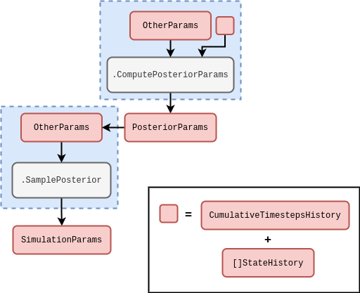
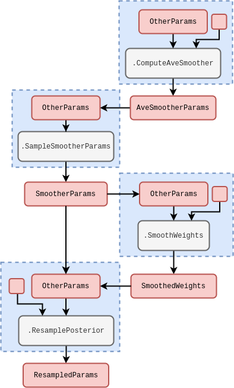

## Problem statement

Say that we have a generator of probabilistic weights which takes a vector of parameters $z$ as input. This generator represents a non-stationary probability distribution and the weights are effectively stochastic around the true value for each given $z$ as input. The problem is that we would like to be able to efficiently sample from the underlying distribution regardless of its shape or modality.

Solution we will study is to create an adaptive sequential Monte Carlo algorithm, e.g., see [@del2006sequential] or [@wills2023sequential].

## Adaptively estimating a smoothed density

We can motivate the density smoothing model through specifying the following functional 'distribution over distributions' which uses a symmetrised form of the Kullback-Leibler divergence [@kullback1951information]

$$
\begin{align}
{\cal P}_{{\sf t}+1}[Q] \propto \tilde{{\cal P}}_{{\sf t}+1}[Q] &= e^{-D^{\rm sym}_{\rm KL}[Q,P_{{\sf t}+1}]} \\
D^{\rm sym}_{\rm KL}[Q,P_{{\sf t}+1}] &= \frac{1}{2}D_{\rm KL}[Q\vert\vert P_{{\sf t}+1}] + \frac{1}{2}D_{\rm KL}[P_{{\sf t}+1} \vert\vert Q] \\
 &= \frac{1}{2}\int {\rm d}Z \, Q(Z)\ln \frac{Q(Z)}{P_{{\sf t}+1}(Z)} + \frac{1}{2}\int {\rm d}Z \, P_{{\sf t}+1}(Z)\ln \frac{P_{{\sf t}+1}(Z)}{Q(Z)} \,,
\end{align}
$$

where we are using the state history matrix formalism used in [@stochadexI-2024] such that $Z$ corresponds to a matrix which adds a row for every new instantaneous $z$ state vector which time evolves to. Note that we can take 'functional expectation values' with this distribution, such that

$$
\begin{align}
{\rm E}_{{\sf t}+1}[Q(Z)] &= \frac{\int {\cal D}[Q(Z)] Q(Z) e^{-D^{\rm sym}_{\rm KL}[Q(Z),P_{{\sf t}+1}(Z)]}}{\int {\cal D}[Q(Z)] e^{-D^{\rm sym}_{\rm KL}[Q(Z),P_{{\sf t}+1}(Z)]}} \,.
\end{align}
$$

If we then expand $D^{\rm sym}_{\rm KL}$ logarithmically around $\ln P_{{\sf t}+1}$ such that $\ln Q=\ln P_{{\sf t}+1} + \delta \ln P_{{\sf t}+1}$, we arrive at the following approximation up to second order in the expansion

$$
\begin{align}
D^{\rm sym}_{\rm KL}[e^{\ln P_{{\sf t}+1} + \delta \ln P_{{\sf t}+1}},P_{{\sf t}+1}] &\simeq \frac{1}{2}\int {\rm d}Z \,P_{{\sf t}+1}(Z) [\delta \ln P_{{\sf t}+1}(Z)]^2 \,.
\end{align}
$$

Idea is to dynamically train the noise scale $\sigma$ and kernel bandwidth matrix $H$ of a Gaussian Process-based [@williams2006gaussian] density estimation algorithm which can be used to calculate the latest density

$$
\begin{align}
\tilde{{\cal P}}_{{\sf t}+1}[Q(z);H,\sigma] &\propto \exp \Bigg[ -\frac{1}{2} \sum_{{\sf t}+1\geq {\sf t}'}\sum_{{\sf t}'\geq {\sf t}''}\sum_{(z_{{\sf t}''},\ell_{{\sf t}''})}\frac{(\ell_{{\sf t}'}-\ell)e^{\ell}(\ell_{{\sf t}''}-\ell)}{K_{{\sf t}'{\sf t}''}(z;H)} \Bigg] \\
K_{{\sf t}'{\sf t}''}(z;H) &= \sigma^2 \beta^{{\sf t}''-{\sf t}'} \exp \bigg[ -\frac{1}{2}\sum_{i,j}(z_{{\sf t}'}-z)^i(H^{-1})^{ij}(z_{{\sf t}''}-z)^j\bigg] \,.
\end{align}
$$

If we were to vary $H$ and $\sigma$ across samples of $z$, we can also think of the 'distribution over distributions' as representing a probabilistic weighting for cross-validation which maximises when the best representation of $P_{{\sf t}+1}$ has been found. By computing the marginal expectation values for $H$ and $\sigma$ using these samples and their corresponding weights like this

$$
\begin{align}
{\rm E}_{{\sf t}+1}[(H,\sigma )] &\simeq \frac{\sum_{z_{{\sf t}+1}} (H,\sigma )\tilde{{\cal P}}_{{\sf t}+1}[Q(z_{{\sf t}+1});H,\sigma]}{\sum_{z_{{\sf t}+1}}\tilde{{\cal P}}_{{\sf t}+1}[Q(z_{{\sf t}+1});H,\sigma]} \,,
\end{align}
$$

we can then input these expectation values as the centre of the sampler for the next $H$ (inverse-Wishart distribution) and $\sigma$ (Gaussian distribution) values in the sequence. This pattern enables us to construct an iterative sampling algorithm for the hyperparameters of our density smoothing model which encodes cross-validation in its design.

Note that the smoothed modes of the distribution can also be detected by initialising a $z$-optimising step at time ${\sf t}$ with initial conditions set by all of the current samples and an objective given by the $\tilde{{\cal P}}_{{\sf t}+1}[Q(z);H,\sigma]$ formula.

Scaling in time history is probably the main nuisance here! Might motivate the use of Rust though since having a really good handle on what memory is actually necessary will be very useful.

## Resampling

Start by drawing samples centred from different points, where each centre is randomly chosen from the current pool of samples with a frequency weighted by the smoothed new density of that point. If we then sample around each point using $fH$ as the covariance around the point (where $f$ is some exploration factor $<1$), we end up being able to effectively sample from the smoothed density.

## Implementation

Initial implementation should be in the stochadex to try out the ideas. Then the article can turn to implementing it from scratch in Rust (and a Python interop) using a custom shared-memory actor pattern design which improves on the initial design with the stochadex by allowing the number of samples to scale up or down dynamically through successive generations of actors producing more or less future actors.

Probably fits into the shared-memory actor pattern nicely!

The rough schematic for the simulation parameter posterior sampler is below.

We are suggesting to make the following change to this schematic.

## References
