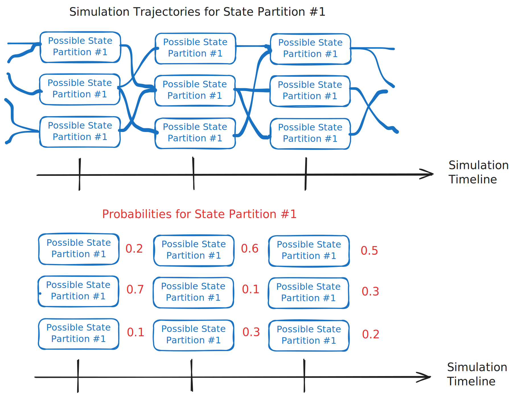
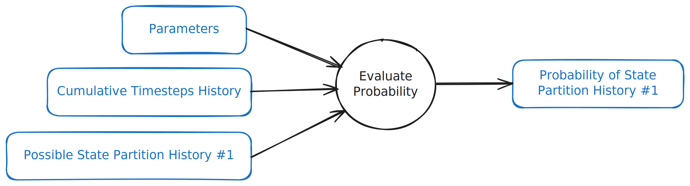
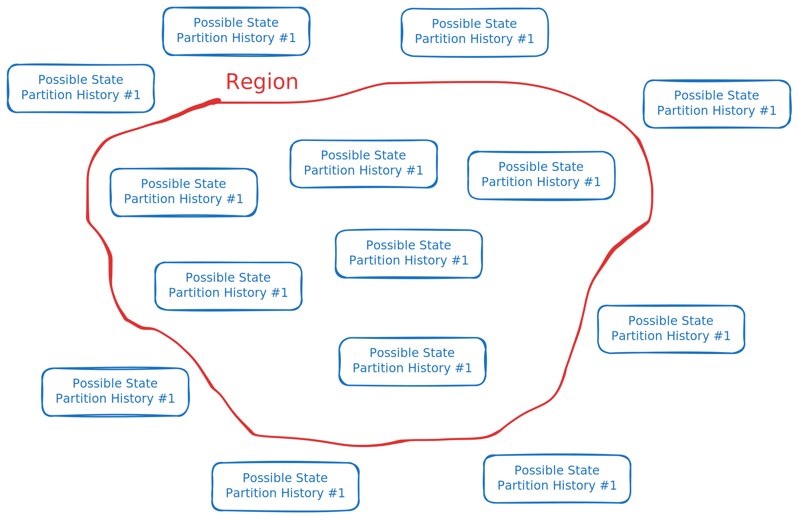
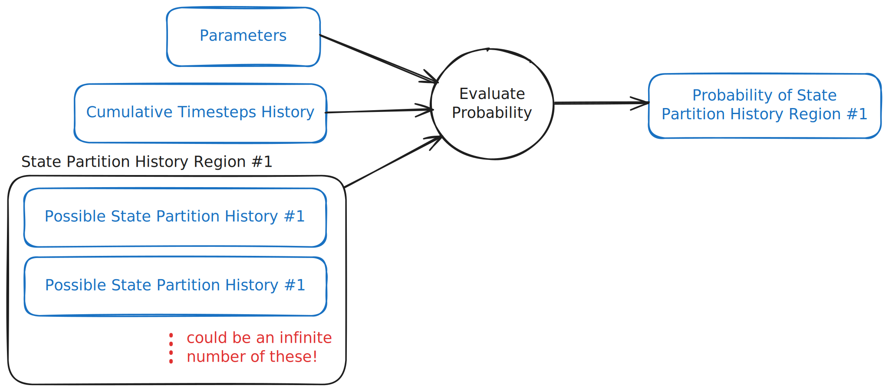

# Probabilistic thinking for simulations

## Why do we care?

Probabilities essentially represent sampling all of the possible Trajectories that a simulation could take in Time simultaneously.

Using this representation for a real-world simulation, there are two important use cases.

The first uses all of the possible Trajectories the simulation can take to represent how likely it is to take them. This makes it possible to create algorithms which learn the most likely Parameters for State Partitions to match real-world Data.

The second uses the Probabilities to represent a model in place of the simulation itself. In the right circumstances, this results in algorithms which are much more efficient than sampling multiple Trajectories.

## Probabilities and regions

Evaluating the Probability of a particular State Partition History, given Parameters and a Cumulative Timesteps History, looks a similar to the Iterate computation. However, in contrast, this computation does _not_ progress forward in Time.

We might also want to evaluate the Probability of Regions which join together possible values that the whole State Partition History can take.

In many situations, it would be impossible to count the all of the possible values in some Regions, but we can still imagine the computation in this way.

## Estimating the mean and variance in state

## Estimating state probabilities in time

## Returning to why we care
