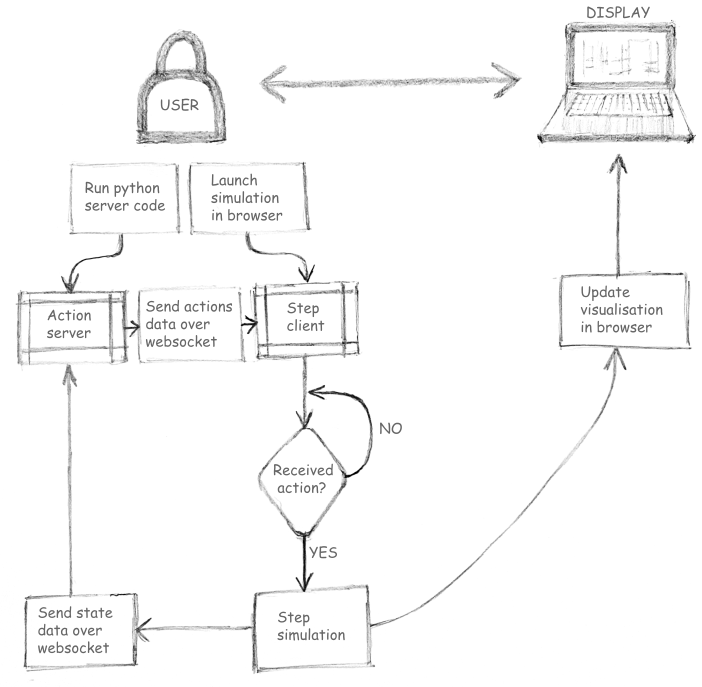

# Programmatic gaming with web simulations

## What is programmatic gaming?

'Programmatic Gaming' here describes the activity of playing a computer game using a prescriptive controller programmed as computer code.

In Programmatic Gaming, the gamer must write algorithms which are successful at playing the game itself. This indirectness sounds unusual at first, but yields interesting tactics for the gamer who may switch between algorithms depending on circumstances within the game.

Writing optimal gameplay algorithms also requires a very different skillset to that of more conventional gamers. So this kind of game may appeal to those with machine learning backgrounds, for instance.

## Creating a web simulation architecture for gaming

Let's assume we already have a framework for stepping simulations forward in time, which can be used to represent the game state and how it responds to controller actions.

We then need to specify a technical architecture for how the gamer's code will take actions within the simulation which allows for the code to all be run on the user's machine (and hence avoid hosting costs).

The architecture solution is a 'client-server' model where the user runs their server code to drive the game loop and the simulation step client runs the actions sent to the browser frontend with a local web worker.

Those interested in the code behind this post should check out the [dexetera project](https://github.com/umbralcalc/dexetera).

And those interested in playing the games should take a look at [dextera](https://umbralcalc.github.io/dexetera/).
