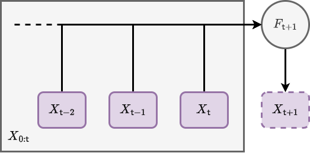
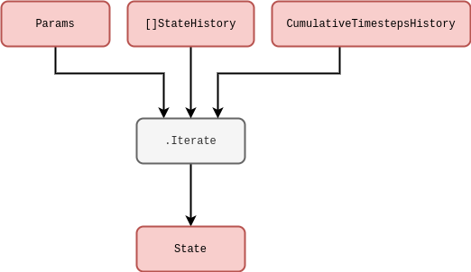
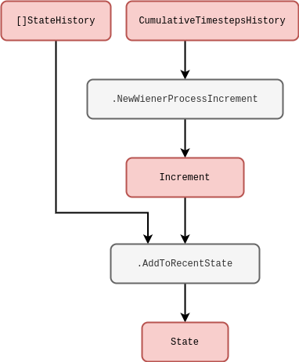
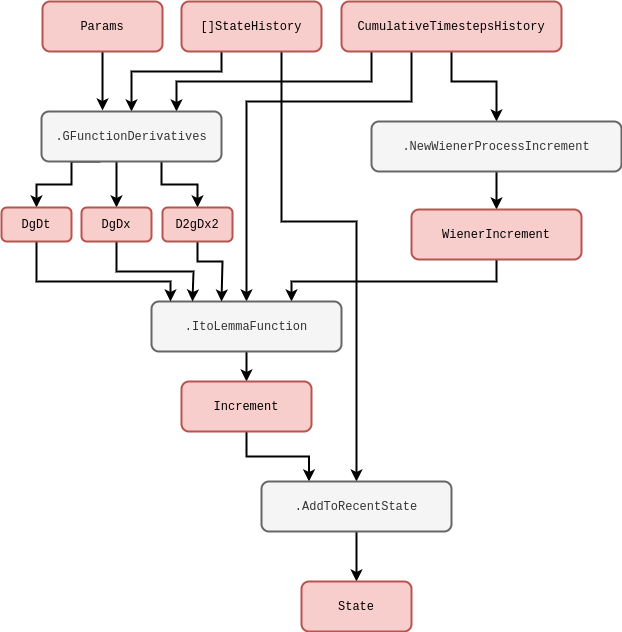
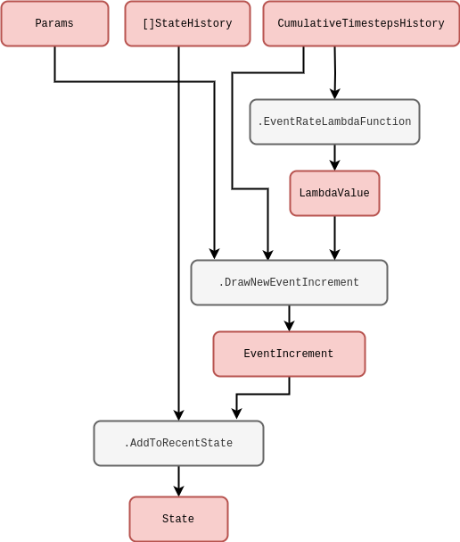
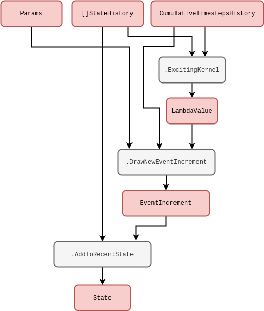
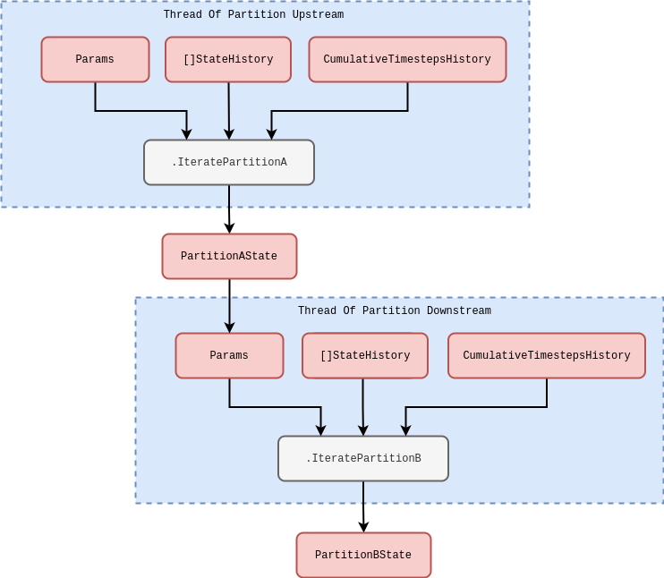
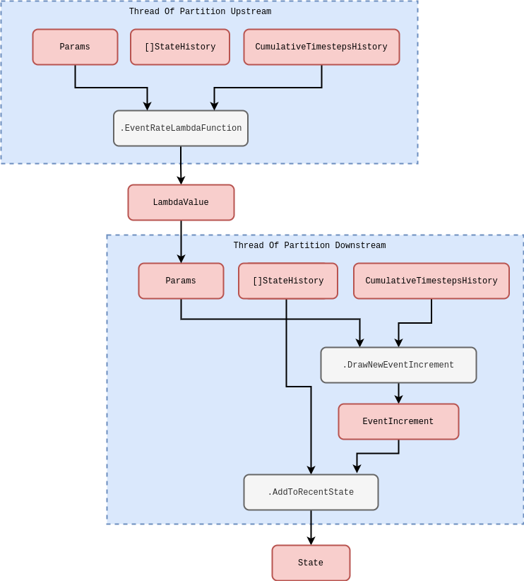
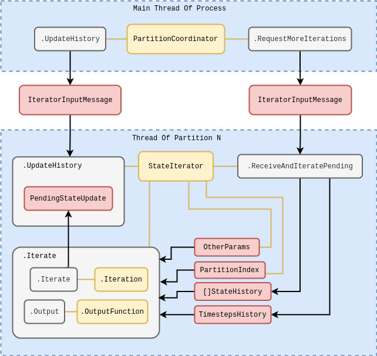
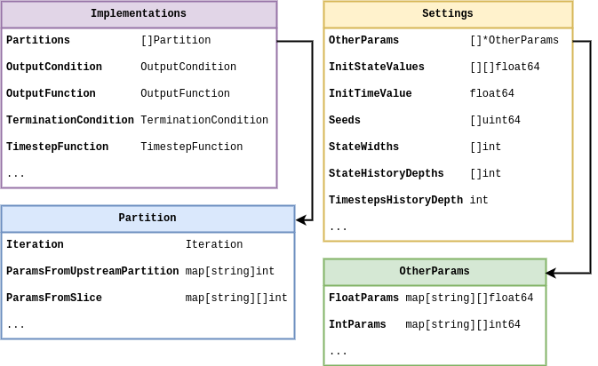

## Introduction and computational formalism

In this article we will be introducing a new generalised simulation engine (written in Go, but we'll get to that later). Before diving into the design of software we need to mathematically define the general computational approach that we are going to take. The language of all real-world phenomena is that of stochastic processes (at least for the non-quantum bits), and because the language of stochastic processes is primarily mathematics, this step is essential in validating a really general description. From experience, it seems reasonable to start by writing down the following formula which describes iterating some arbitrary process forward in time (by one finite step) and adding a new row each to some matrix $X_{0:{\sf t}} \rightarrow X_{0:{\sf t}+1}$

$$
\begin{align}
X^{i}_{{\sf t}+1} &= F^{i}_{{\sf t}+1}(X_{0:{\sf t}},z,{\sf t}) \,, \label{eq:x-step-def}
\end{align}
$$

where: $i$ is an index for the dimensions of the 'state' space; ${\sf t}$ is the current time index for either a discrete-time process or some discrete approximation to a continuous-time process; $X_{0:{\sf t}+1}$ is the next version of $X_{0:{\sf t}}$ after one timestep (and hence one new row has been added); $z$ is a vector of arbitrary size which contains the latent parameters that are necessary to iterate the process; and $F^i_{{\sf t}+1}(X_{0:{\sf t}},z,{\sf t})$ as the latest element of an arbitrary matrix-valued function.

The notation $A_{{{\sf b}:{\sf c}}}$ will always refer to a slice of rows from index ${\sf b}$ to ${\sf c}$ in a matrix (or row vector) $A$. As we shall discuss shortly, $F^i_{{\sf t}+1}(X_{0:{\sf t}},z,{\sf t})$ may represent not just operations on deterministic variables, but also on stochastic ones. There is also no requirement for the function to be continuous.

The basic computational idea here is illustrated above; we iterate the matrix forward in time by a row, and use its previous version $X_{0:{\sf t}}$ as an entire matrix input into a function which populates the elements of its latest rows. One can easily draw a rough schematic with the same idea in it, and it would probably look something like the one below.

In this diagram above, we have defined: $\texttt{Params}$ as corresponding to the $z$ parameters; $\texttt{[]StateHistory}$ as representing all of the truncated state history up to this point in time, i.e., $X_{{\sf t}-{\sf s}:{\sf t}}$ (in Go syntax we have also potentially partitioned this already into smaller sub-matrices, but this isn't important yet); and $\texttt{CumulativeTimestepsHistory}$ as representing all of the data we might need about the historic timesteps that have been taken (again, this will become more relevant shortly). In practice, $X_{{\sf t}-{\sf s}:{\sf t}}$ needs to be truncated up to some user-defined number of timesteps ${\sf s}$ (defining a windowed state history view into the past) due to finite limitations associated with computer memory and performance.

Pretty simple! But why go to all this trouble of storing matrix inputs for previous values of the same process? It's true that this is mostly redundant for _Markovian_ phenomena, i.e., processes where their only memory of their history is the most recent value they took. However, for a large class of stochastic processes a full memory (or memory at least within some window) of past values is essential to consistently construct the sample paths moving forward. This is true in particular for _non-Markovian_ phenomena, where the latest values don't just depend on the immediately previous ones but can depend on values which occured much earlier in the process as well.

For more complex physical models and integrators, the distinct notions of 'numerical timestep' and 'total elapsed continuous time' will crop up quite frequently. Hence, before moving on further details, it will be important to define the total elapsed time variable $t({\sf t})$ for processes which are defined in continuous time. Assuming that we have already defined some function $\delta t({\sf t})$ which returns the specific change in continuous time that corresponds to the step $({\sf t}-1) \rightarrow {\sf t}$, we will always be able to compute the total elapsed time through the relation

$$
\begin{align}
t({\sf t}) &= \sum^{{\sf t}}_{{\sf t}'=0}\delta t({\sf t}') \label{eq:t-steps-sum} \,.
\end{align}
$$

It's important to remember that our steps in continuous time may not be constant, so by defining the $\delta t({\sf t})$ function and summing over it we can enable this flexibility in the computation. With a truncated state history, we only need to store $\delta t$ value for the last ${\sf s}$ number of timesteps, i.e.,

$$
\begin{align}
t({\sf t}) &= t({\sf t}-{\sf s}-1) + \sum^{{\sf t}}_{{\sf t}'={\sf t}-{\sf s}}\delta t({\sf t}') \,.
\end{align}
$$

## Example phenomena

So, now that we've mathematically defined a really general notion of iterating the system process forward in time, it makes sense to discuss some simple examples. For instance, it is frequently possible to split $F$ up into deteministic (denoted $D$) and stochastic (denoted $S$) matrix-valued functions like so

$$
\begin{align}
& F^{i}_{{\sf t}+1}(X_{{\sf t}-{\sf s}:{\sf t}},z,{\sf t}) = D^{i}_{{\sf t}+1}(X_{{\sf t}-{\sf s}:{\sf t}},z,{\sf t}) + S^{i}_{{\sf t}+1}(X_{{\sf t}-{\sf s}:{\sf t}},z,{\sf t}) \,.
\end{align}
$$

Where we are using the truncated state history $X_{{\sf t}-{\sf s}:{\sf t}}$ as it is more representative of the computation one will actually be performing on a machine. In the case of stochastic processes with continuous sample paths, it's also nearly always the case with mathematical models of real-world systems that the deterministic part will at least contain the term $D^{i}_{{\sf t}+1}(X_{{\sf t}-{\sf s}:{\sf t}},z,{\sf t}) = X^i_{\sf t}$ because the overall system is described by some stochastic differential equation. This is not a really requirement in our general formalism, however.

What about the stochastic term? For example, if we wanted to consider a _Wiener process noise_, we can define $W^i_{{\sf t}}$ is a sample from a Wiener process for each of the state dimensions indexed by $i$ and our formalism becomes

$$
\begin{align}
& S^{i}_{{\sf t}+1}(X_{{\sf t}-{\sf s}:{\sf t}},z,{\sf t}) = W^i_{{\sf t}+1}-W^i_{\sf t} \label{eq:wiener}\,.
\end{align}
$$

One draws the increments $W^i_{{\sf t}+1}-W^i_{\sf t}$ from a normal distribution with a mean of $0$ and a variance equal to the length of continuous time that the step corresponded to $\delta t({\sf t}+1)$, i.e., the probability density $P_{{\sf t}+1}(x^i)$ of the increments $x^i=W^i_{{\sf t}+1}-W^i_{\sf t}$ is

$$
\begin{align}
P_{{\sf t}+1}(x^i) &= {\sf NormalPDF}[x^i;0,\delta t({\sf t}+1)] \,.
\end{align}
$$

Note that for state spaces with dimensions $>1$, we could also allow for non-trivial cross-correlations between the noises in each dimension. The Wiener process can be represented by the rough schematic below.

In another example, to model _geometric Brownian motion noise_ we would simply have to multiply $X^i_{\sf t}$ to the Wiener process like so

$$
\begin{align}
& S^{i}_{{\sf t}+1}(X_{{\sf t}-{\sf s}:{\sf t}},z,{\sf t}) = X^i_{\sf t}(W^i_{{\sf t}+1}-W^i_{\sf t})\label{eq:gbm} \,.
\end{align}
$$

Here we have implicitly adopted the Itô interpretation to describe this stochastic integration. Given a carefully-defined integration scheme other interpretations of the noise would also be possible with our formalism too, e.g., Stratonovich [which would implictly give $S^{i}_{{\sf t}+1}(X_{{\sf t}-{\sf s}:{\sf t}},z,{\sf t}) = (X^i_{{\sf t}+1}+X^i_{\sf t})(W^i_{{\sf t}+1}-W^i_{\sf t}) / 2$ for the equation above] or others within the more general '$\alpha$-family' --- see [@van1992stochastic], [@risken1996fokker] or [@rog-will-2000]. The schematic for any of these should hoepfully be fairly straightforward to deduce based on the lines we've already written above.

We can imagine even more general processes that are still Markovian. One example of these in a single-dimension state space would be to define the noise through some general function of the Wiener process like so

$$
\begin{align}
S^0_{{\sf t}+1}(X_{{\sf t}-{\sf s}:{\sf t}},z,{\sf t}) &= g[W^0_{{\sf t}+1},t({\sf t}+1)]-g[W^0_{\sf t}, t({\sf t})] \\
&= \bigg[ \frac{\partial g}{\partial t} + \frac{1}{2}\frac{\partial^2 g}{\partial x^2} \bigg] \delta t ({\sf t}+1) + \frac{\partial g}{\partial x} (W^0_{{\sf t}+1}-W^0_{\sf t}) \label{eq:general-wiener}\,,
\end{align}
$$

where $g(x,t)$ is some continuous function of its arguments which has been expanded out with Itô's Lemma on the second line. Note also that the computations in the relation above could be performed with numerical derivatives in principle, even if the function were extremely complicated. This is unlikely to be the best way to describe the process of interest, however, the mathematical expressions above can still be made a bit more meaningful to the programmer in this way. We have drawn another rough schematic for the corresponding code below.

So far we have mostly been discussing noises with continuous sample paths, but we can easily adapt our computation to discontinuous sample paths as well. For instance, _Poisson process noises_ would generally take the form

$$
\begin{align}
S^{i}_{{\sf t}+1}(X_{{\sf t}-{\sf s}:{\sf t}},z,{\sf t}) &= [N_{\lambda}]^i_{{\sf t}+1}-[N_{\lambda}]^i_{\sf t}\,,
\end{align}
$$

where $[N_{\lambda}]^i_{\sf t}$ is a sample from a Poisson process with rate $\lambda$. One can think of this process as counting the number of events which have occured up to the given interval of time, where the intervals between each succesive event are exponentially distributed with mean $1/\lambda$. Such a simple counting process could be simulated exactly by explicitly setting a newly-drawn exponential variate to the next continuous time jump ${\delta t}({\sf t}+1)$ and iterating the counter. Other exact methods exist to handle more complicated processes involving more than one type of 'event', such as the Gillespie algorithm [@gillespie1977exact] --- though these techniques are not always be applicable in every situation.

Is using step size variation always possible? If we consider a _time-inhomogeneous Poisson process noise_, which would generally take the form

$$
\begin{align}
S^{i}_{{\sf t}+1}(X_{{\sf t}-{\sf s}:{\sf t}},z,{\sf t}) &= [N_{\lambda ({\sf t}+1)}]^i_{{\sf t}+1}-[N_{\lambda ({\sf t})}]^i_{\sf t}\,,
\end{align}
$$

the rate $\lambda ({\sf t})$ has become a deterministically-varying function in time. In this instance, it likely not be accurate to simulate this process by drawing exponential intervals with a mean of $1/\lambda ({\sf t})$ because this mean could have changed by the end of the interval which was drawn. An alternative approach (which is more generally capable of simulating jump processes but is an approximation) first uses a small time interval $\tau$ such that the most likely thing to happen in this period is nothing, and then the probability of the event occuring is simply given by

$$
\begin{align}
p({\sf event}) &= \frac{\lambda ({\sf t})}{\lambda ({\sf t}) + \frac{1}{\tau}} \label{eq:rejection}\,.
\end{align}
$$

This idea can be applied to phenomena with an arbitrary number of events and works well as a generalised approach to event-based simulation, though its main limitation is worth remembering; in order to make the approximation good, $\tau$ often must be quite small and hence our simulator must churn through a lot of steps. From now on we'll refer to this well-known technique as the _rejection method_. The rough code schematic below may also help to understand this concept from the programmer's perspective.

There are a few extensions to the simple Poisson process that introduce additional stochastic processes. _Cox (doubly-stochastic) processes_, for instance, are basically where we replace the time-dependent rate $\lambda ({\sf t})$ with independent samples from some other stochastic process $\Lambda ({\sf t})$. For example, a Neyman-Scott process [@neyman1958statistical] can be mapped as a special case of this because it uses a Poisson process on top of another Poisson process to create maps of spatially-distributed points. In our formalism, a two-state implementation of the Cox process noise would look like

$$
\begin{align}
S^{0}_{{\sf t}+1}(X_{{\sf t}-{\sf s}:{\sf t}},z,{\sf t}) &= \Lambda ({\sf t}+1) \\
S^{1}_{{\sf t}+1}(X_{{\sf t}-{\sf s}:{\sf t}},z,{\sf t}) &= [N_{S^{0}_{{\sf t}+1}}]^i_{{\sf t}+1}-[N_{S^{0}_{{\sf t}}}]^i_{\sf t}\,.
\end{align}
$$

This process could be simulated using the schematic we drew for the time-inhomogeneous Poisson process previously --- where we would just replace $\texttt{EventRateLambdaFunction}$ with a method that generates the stochastic rate $\Lambda ({\sf t})$.

Another extension is _compound Poisson process noise_, where it's the count values $[N_{\lambda}]^i_{\sf t}$ which are replaced by independent samples $[J_{\lambda}]^i_{\sf t}$ from another probability distribution, i.e.,

$$
\begin{align}
S^{i}_{{\sf t}+1}(X_{{\sf t}-{\sf s}:{\sf t}},z,{\sf t}) &= [J_{\lambda}]^i_{{\sf t}+1}-[J_{\lambda}]^i_{\sf t}\,.
\end{align}
$$

Note that the rejection method described earlier can be employed effectively to simulate any of these extensions as long as a sufficiently small $\tau$ is chosen to make a good approximation. Once again, the schematic we drew previously would be sufficient to simulate this process with one tweak: add into the $\texttt{DrawNewEventIncrement}$ method the calling of a function which generates the $[J_{\lambda}]^i_{\sf t}$ samples and output these if the event occurs.

All of the examples we have discussed so far are Markovian. Given that we have explicitly constructed the formalism to handle non-Markovian phenomena as well, it would be worthwhile going some examples of this kind of process too. _Self-exciting process noises_ would generally take the form

$$
\begin{align}
S^{0}_{{\sf t}+1}(X_{{\sf t}-{\sf s}:{\sf t}},z,{\sf t}) &= {\cal I}_{{\sf t}+1} (X_{{\sf t}-{\sf s}:{\sf t}},z,{\sf t}) \\
S^{1}_{{\sf t}+1}(X_{{\sf t}-{\sf s}:{\sf t}},z,{\sf t}) &= [N_{S^{0}_{{\sf t}+1}}]^i_{{\sf t}+1}-[N_{S^{0}_{{\sf t}}}]^i_{\sf t} \,,
\end{align}
$$

where the stochastic rate ${\cal I}_{{\sf t}+1} (X_{{\sf t}-{\sf s}:{\sf t}},z,{\sf t})$ now depends on the history explicitly. Amongst other potential inputs we can see, e.g., Hawkes processes [@hawkes1971spectra] as an example of above by substituting

$$
\begin{align}
{\cal I}_{{\sf t}+1} (X_{{\sf t}-{\sf s}:{\sf t}},z,{\sf t}) &= \mu + \sum^{{\sf t}}_{{\sf t}'={\sf t}-{\sf s}}\phi [t({\sf t})-t({\sf t}')]S^{1}_{{\sf t}'} \,,
\end{align}
$$

where $\phi$ is the 'exciting kernel' and $\mu$ is some constant background rate. In order to simulate a Hawkes process using our formalism, we can draw the following rough code schematic.

Note that this idea of integration kernels could also be applied back to our Wiener process. For example, another type of non-Markovian phenomenon that frequently arises across physical and life systems integrates the Wiener process history like so

$$
\begin{align}
S^{0}_{{\sf t}+1}(X_{{\sf t}-{\sf s}:{\sf t}},z,{\sf t}) &= W^0_{{\sf t}+1}-W^0_{\sf t}\\
S^{1}_{{\sf t}+1}(X_{{\sf t}-{\sf s}:{\sf t}},z,{\sf t}) &= u\sum^{{\sf t}}_{{\sf t}'={\sf t}-{\sf s}}e^{-u[t({\sf t})-t({\sf t}')]} S^{0}_{{\sf t}'}\,,
\end{align}
$$

where $u$ is inversely proportional to the length of memory in continuous time.

## Software design and implementation

So we've proposed a computational formalism and then studied it in more detail to demonstrate that it can cope with simulating a wide variety of different systems. We're now ready to design a software package which uses this computational formalism to simulate any of these phenomena. Enter the 'stochadex' package! This will be our generalised simulation engine to generate samples from and statistically infer a 'Pokédex' of possible systems. A 'Pokédex' here is just a fanciful metaphor for the large range of simulations that might come in useful when taming the complex descriptions of real world systems... and kind of gives us the name 'stochadex'. Note that other generalised simulation frameworks exist as well --- such as SimPy [@simpy], StoSpa [@stospa] and FLAME GPU [@flamegpu] --- and all of these approach simulating systems with different software architectures and languages; though there are obvious similarities which can be drawn between them as they all must ultimately achieve the same goal. For the stochadex, we will choose Go for implementation, due to its powerful concurrency features.

Now we're ready to summarise what we want the stochadex software package to be able to do. But what's so complicated about the first iteration equation we wrote? Can't we just implement an iterative algorithm with a single function? It's true that the fundamental concept is very straightforward, but as we'll discuss in due course; we want to be able to design something which abstracts away many of the common features that sampling algorithms have for performing these computations behind a highly-configurable interface. And, ideally, it should be designed to try and maintain a balance between performance and flexibility of utilisation.

If we begin with the obvious first set of criteria; we want to be able to freely configure the vector-valued iteration function $F_{{\sf t}+1}(X_{{\sf t}-{\sf s}:{\sf t}},z,{\sf t})$ and the timestep function $t({\sf t})$ so that any process we want can be described. The point at which a simulation stops can also depend on some algorithm termination condition which the user should be able to specify up-front.

Once the user has written the code to create these functions for the stochadex, we want to then be able to recall them in future only with configuration files while maintaining the possibility of changing their simulation run parameters. This flexibility should facilitate our uses for the simulation later on, and from this perspective it also makes sense that the parameters should include the random seed and initial state value.

The state history matrix should be configurable in terms of its number of columns --- what we'll call the 'state width' --- and its number of rows --- what we'll call the 'state history depth'. If we were to keep increasing the state width up to millions of elements or more, it's likely that on most machines the algorithm performance would grind to a halt when trying to iterate over the resulting matrix within a single thread. Hence, before the algorithm or its performance in any more detail, we can pre-empt the requirement that $X_{{\sf t}-{\sf s}:{\sf t}}$ should represented in computer memory by a set of partitioned matrices which are all capable of communicating to one-another downstream in a via some configured messaging graph. In this paradigm, we'd like the user to be able to configure which state partitions are able to communicate with each other, i.e., freely reconfigure the graph topology, without having to write any new code.

To achieve this in a configurable way while maintaining threads for each state partition iteration, the stochadex can wrap any user-defined state partition iteration in functionality which passes the output state updates from computationally-upstream partitions into a set of params which are passed into any other computationally-downstream partition via thread communication channels (easily achievable in Go). This enables the user to define much simpler (and hence more resuable) iteration functions to use in configuring future projects, while letting the simulation engine handle the communication between these functions in a fully-configurable messaging graph. Note all partitions will _always_ have shared access to the full state history of all partitions, the corresponding timesteps and their own parameters, regardless of where they sit in this messaging graph. To avoid ambiguity in this description, let's consider a 'Partition Upstream' to be computationally-upstream from a 'Partition Downstream' in this messaging graph if both satisfy the connectivity implied in the schematic below.

The above schematic is quite general and so it might not be immediately obvious how to translate the computations we described in the previous section into these partitioned, but communicating, threads. In fact, some of the computations we described were so elementary (e.g., Wiener processes) that they correspond to irreducible iterating partitions that only make sense as individually running in their own threads. However, time-inhomogeneous Poisson processes are an example which _can_ be reduced into two simpler iterations. In this case, the new schematic for the computation would look roughly like this.

In the diagrams above we are considering the specifics of how threads communicate with one another in the stochadex simulator. But we can elaborate further on how the simulation loop should function as a whole. Due to the fact that all of the separate state partition threads must synchronise at the end of each simulation loop iteration it makes sense that this is managed by a centralised 'coordinator' struct. In this coordinator, each partition is handled by concurrently running execution threads within the same process (while a separate process may be used to handle the outputs from the algorithm itself). As the second schematic below roughly illustrates, the main sequence of each loop iteration follows the pattern:

- The $\texttt{PartitionCoordinator}$ requests more iterations from each state partition by sending an $\texttt{IteratorInputMessage}$ to a concurrently running goroutine.
- The $\texttt{StateIterator}$ in each goroutine executes the iteration and stores the resulting state update in a variable.
- Once all of the iterations have been completed, the $\texttt{PartitionCoordinator}$ then requests each goroutine to update its relevant partition of the state history by sending another $\texttt{IteratorInputMessage}$ to each.

This pattern ensures that synchronisation occurs between the separately running threads for each partition before the resulting state updates from each iteration are then applied globally to the state history, preventing anachronisms from occuring in the latter. It's also worth noting that while the diagram above illustrates only a single process; it's obviously true that we may run many of these whole diagrams at once to parallelise generating independent realisations of the simulation, if necessary.

For convenience, it seems sensible to also make the outputs from stochadex runs configurable. A user should be able to change the form of output that they want through, e.g., some specified function of the state history matrix at the time of outputting data. The times that the stochadex should output this data can also be decided by some user-specified condition so that the frequency of output is fully configurable as well. This flexibility can be useful when the user only requires a limited number of state snapshots at particular times.

Now let's look at the data types which make sense for the criteria we want to satisfy above. We've put together a schematic of configuration data types and their relationships in the figure below. In this diagram there is some indication of the data type that we propose to store each piece information in (in Go syntax), and the diagram as a whole should serve as a useful guide to the basic structure of configuration files for the stochadex.

As we stated at the beginning of this article: the full implementation of the stochadex can be found on GitHub by following this link: [https://github.com/umbralcalc/stochadex](https://github.com/umbralcalc/stochadex). Users can build the main binary executable of this repository and determine what configuration of the stochadex they would like to have through config at runtime (one can infer these configurations from the data types in the diagram above). As Go is a statically typed language, this level of flexibility has been achieved using code templating and generation proceeding runtime build and execution via $\texttt{go run}$ 'under-the-hood'. Users who find this particular execution pattern undesirable can also use all of the stochadex types, tools and methods as part of a standard Go package import.

## References
