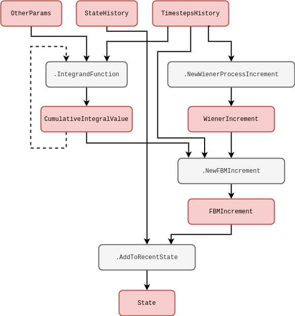

## Computational formalism

Before diving into the design of software we need to mathematically define the general computational approach that we're going to take. Because the language of stochastic processes is primarily mathematics, we'd argue this step is essential in enabling a really general description. From experience, it seems reasonable to start by writing down the following formula which describes iterating some arbitrary process forward in time (by one finite step) and adding a new row each to some matrix $X_{0:{\sf t}} \rightarrow X_{0:{\sf t}+1}$

$$
\begin{align}
X^{i}_{{\sf t}+1} &= F^{i}_{{\sf t}+1}(X_{0:{\sf t}},z,{\sf t}) \,, \label{eq:x-step-def}
\end{align}
$$

where: $i$ is an index for the dimensions of the 'state' space; ${\sf t}$ is the current time index for either a discrete-time process or some discrete approximation to a continuous-time process; $X_{0:{\sf t}+1}$ is the next version of $X_{0:{\sf t}}$ after one timestep (and hence one new row has been added); $z$ is a vector of arbitrary size which contains the 'hidden' other parameters that are necessary to iterate the process; and $F^i_{{\sf t}+1}(X_{0:{\sf t}},z,{\sf t})$ as the latest element of an arbitrary matrix-valued function.

Throughout this series of articles, the notation $A_{{{\sf b}:{\sf c}}}$ will always refer to a slice of rows from index ${\sf b}$ to ${\sf c}$ in a matrix (or row vector) $A$. As we shall discuss shortly, $F^i_{{\sf t}+1}(X_{0:{\sf t}},z,{\sf t})$ may represent not just operations on deterministic variables, but also on stochastic ones. There is also no requirement for the function to be continuous.

The basic computational idea here is illustrated above; we iterate the matrix $X$ forward in time by a row, and use its previous version $X_{0:{\sf t}}$ as an entire matrix input into a function which populates the elements of its latest rows. In pseudocode you could easily write something with the same idea in it, and it would probably look something like the method diagram below.

Pretty simple! But why go to all this trouble of storing matrix inputs for previous values of the same process? It's true that this is mostly redundant for _Markovian_ phenomena, i.e., processes where their only memory of their history is the most recent value they took. However, for a large class of stochastic processes a full memory (or memory at least within some window) of past values is essential to consistently construct the sample paths moving forward. This is true in particular for _non-Markovian_ phenomena, where the latest values don't just depend on the immediately previous ones but can depend on values which occured much earlier in the process as well.

For more complex physical models and integrators, the distinct notions of 'numerical timestep' and 'total elapsed continuous time' will crop up quite frequently. Hence, before moving on further details, it will be important to define the total elapsed time variable $t({\sf t})$ for processes which are defined in continuous time. Assuming that we have already defined some function $\delta t({\sf t})$ which returns the specific change in continuous time that corresponds to the step $({\sf t}-1) \rightarrow {\sf t}$, we will always be able to compute the total elapsed time through the relation

$$
\begin{align}
t({\sf t}) &= \sum^{{\sf t}}_{{\sf t}'=0}\delta t({\sf t}') \label{eq:t-steps-sum} \,.
\end{align}
$$

It's important to remember that our steps in continuous time may not be constant, so by defining the $\delta t({\sf t})$ function and summing over it we can enable this flexibility in the computation. In case the summation notation is no fun for programmers; we're simply adding up all of the differences in time to get a total.

## Example phenomena

So, now that we've mathematically defined a really general notion of iterating the stochastic process forward in time, it makes sense to discuss some simple examples. For instance, it is frequently possible to split $F$ up into deteministic (denoted $D$) and stochastic (denoted $S$) matrix-valued functions like so

$$
\begin{align}
& F^{i}_{{\sf t}+1}(X_{0:{\sf t}},z,{\sf t}) = D^{i}_{{\sf t}+1}(X_{0:{\sf t}},z,{\sf t}) + S^{i}_{{\sf t}+1}(X_{0:{\sf t}},z,{\sf t}) \,.
\end{align}
$$

In the case of stochastic processes with continuous sample paths, it's also nearly always the case with mathematical models of real-world systems that the deterministic part will at least contain the term $D^{i}_{{\sf t}+1}(X_{0:{\sf t}},z,{\sf t}) = X^i_{\sf t}$ because the overall system is described by some stochastic differential equation. This is not a really requirement in our general formalism, however.

What about the stochastic term? For example, if we wanted to consider a _Wiener process noise_, we can define $W^i_{{\sf t}}$ is a sample from a Wiener process for each of the state dimensions indexed by $i$ and our formalism becomes

$$
\begin{align}
& S^{i}_{{\sf t}+1}(X_{0:{\sf t}},z,{\sf t}) = W^i_{{\sf t}+1}-W^i_{\sf t} \label{eq:wiener}\,.
\end{align}
$$

One draws the increments $W^i_{{\sf t}+1}-W^i_{\sf t}$ from a normal distribution with a mean of $0$ and a variance equal to the length of continuous time that the step corresponded to $\delta t({\sf t}+1)$, i.e., the probability density $P_{{\sf t}+1}(x^i)$ of the increments $x^i=W^i_{{\sf t}+1}-W^i_{\sf t}$ is

$$
\begin{align}
P_{{\sf t}+1}(x^i) &= {\sf NormalPDF}[x^i;0,\delta t({\sf t}+1)] \,.
\end{align}
$$

Note that for state spaces with dimensions $>1$, we could also allow for non-trivial cross-correlations between the noises in each dimension. In pseudocode, the Wiener process is schematically represented below.

In another example, to model _geometric Brownian motion noise_ we would simply have to multiply $X^i_{\sf t}$ to the Wiener process like so

$$
\begin{align}
& S^{i}_{{\sf t}+1}(X_{0:{\sf t}},z,{\sf t}) = X^i_{\sf t}(W^i_{{\sf t}+1}-W^i_{\sf t})\label{eq:gbm} \,.
\end{align}
$$

Here we have implicitly adopted the Itô interpretation to describe this stochastic integration. Given a carefully-defined integration scheme other interpretations of the noise would also be possible with our formalism too, e.g., Stratonovich [which would implictly give $S^{i}_{{\sf t}+1}(X_{0:{\sf t}},z,{\sf t}) = (X^i_{{\sf t}+1}+X^i_{\sf t})(W^i_{{\sf t}+1}-W^i_{\sf t}) / 2$ for the equation above] or others within the more general '$\alpha$-family' --- see [@van1992stochastic], [@risken1996fokker] or [@rog-will-2000]. The pseudocode for any of these should hoepfully be fairly straightforward to deduce based on the lines we've already written above.

We can imagine even more general processes that are still Markovian. One example of these in a single-dimension state space would be to define the noise through some general function of the Wiener process like so

$$
\begin{align}
S^0_{{\sf t}+1}(X_{0:{\sf t}},z,{\sf t}) &= g[W^0_{{\sf t}+1},t({\sf t}+1)]-g[W^0_{\sf t}, t({\sf t})] \\
&= \bigg[ \frac{\partial g}{\partial t} + \frac{1}{2}\frac{\partial^2 g}{\partial x^2} \bigg] \delta t ({\sf t}+1) + \frac{\partial g}{\partial x} (W^0_{{\sf t}+1}-W^0_{\sf t}) \label{eq:general-wiener}\,,
\end{align}
$$

where $g(x,t)$ is some continuous function of its arguments which has been expanded out with Itô's Lemma on the second line. Note also that the computations in the relation above could be performed with numerical derivatives in principle, even if the function were extremely complicated. This is unlikely to be the best way to describe the process of interest, however, the mathematical expressions above can still be made a bit more meaningful to the programmer in this way. The pseudocode in general would look something like the diagram below.

Let's now look at a more complicated type of noise. For example, we might consider sampling from a _fractional Brownian motion_ process $[B_{H}]_{\sf t}$, where $H$ is known as the 'Hurst exponent'. Following [@decreusefond1999stochastic], we can simulate this process in one of our state space dimensions by modifying the standard Wiener process by a fairly complicated integral factor which looks like this

$$
\begin{align}
S^{0}_{{\sf t}+1}(X_{0:{\sf t}},z,{\sf t}) &= \frac{(W^0_{{\sf t}+1} - W^0_{\sf t})}{\delta t({\sf t})}\int^{t({\sf t}+1)}_{t({\sf t})}{\rm d}t' \frac{(t'-t)^{H-\frac{1}{2}}}{\Gamma (H+\frac{1}{2})} {}_2F_1 \bigg( H-\frac{1}{2};\frac{1}{2}-H;H+\frac{1}{2};1-\frac{t'}{t}\bigg) \label{eq:fbm} \,,
\end{align}
$$

where $S^{0}_{{\sf t}+1}(X_{0:{\sf t}},z,{\sf t})=[B_{H}]_{{\sf t}+1}-[B_{H}]_{{\sf t}}$. The integral in the equation above can be approximated using an appropriate numerical procedure (like the trapezium rule, for instance). In the expression above, we have used the symbols ${}_2F_1$ and $\Gamma$ to denote the ordinary hypergeometric and gamma functions, respectively. A computational form of this integral is illustrated below to try and disentangle some of the mathematics as a program.

So far we have mostly been discussing noises with continuous sample paths, but we can easily adapt our computation to discontinuous sample paths as well. For instance, _Poisson process noises_ would generally take the form

$$
\begin{align}
S^{i}_{{\sf t}+1}(X_{0:{\sf t}},z,{\sf t}) &= [N_{\lambda}]^i_{{\sf t}+1}-[N_{\lambda}]^i_{\sf t}\,,
\end{align}
$$

where $[N_{\lambda}]^i_{\sf t}$ is a sample from a Poisson process with rate $\lambda$. One can think of this process as counting the number of events which have occured up to the given interval of time, where the intervals between each succesive event are exponentially distributed with mean $1/\lambda$. Such a simple counting process could be simulated exactly by explicitly setting a newly-drawn exponential variate to the next continuous time jump ${\delta t}({\sf t}+1)$ and iterating the counter. Other exact methods exist to handle more complicated processes involving more than one type of 'event', such as the Gillespie algorithm [@gillespie1977exact] --- though these techniques are not always be applicable in every situation.

Is using step size variation always possible? If we consider a _time-inhomogeneous Poisson process noise_, which would generally take the form

$$
\begin{align}
S^{i}_{{\sf t}+1}(X_{0:{\sf t}},z,{\sf t}) &= [N_{\lambda ({\sf t}+1)}]^i_{{\sf t}+1}-[N_{\lambda ({\sf t})}]^i_{\sf t}\,,
\end{align}
$$

the rate $\lambda ({\sf t})$ has become a deterministically-varying function in time. In this instance, it likely not be accurate to simulate this process by drawing exponential intervals with a mean of $1/\lambda ({\sf t})$ because this mean could have changed by the end of the interval which was drawn. An alternative approach (which is more generally capable of simulating jump processes but is an approximation) first uses a small time interval $\tau$ such that the most likely thing to happen in this period is nothing, and then the probability of the event occuring is simply given by

$$
\begin{align}
p({\sf event}) &= \frac{\lambda ({\sf t})}{\lambda ({\sf t}) + \frac{1}{\tau}} \label{eq:rejection}\,.
\end{align}
$$

This idea can be applied to phenomena with an arbitrary number of events and works well as a generalised approach to event-based simulation, though its main limitation is worth remembering; in order to make the approximation good, $\tau$ often must be quite small and hence our simulator must churn through a lot of steps. From now on we'll refer to this well-known technique as the _rejection method_. The code schematic below may also help to understand this concept from the programmer's perspective.

There are a few extensions to the simple Poisson process that introduce additional stochastic processes. _Cox (doubly-stochastic) processes_, for instance, are basically where we replace the time-dependent rate $\lambda ({\sf t})$ with independent samples from some other stochastic process $\Lambda ({\sf t})$. For example, a Neyman-Scott process [@neyman1958statistical] can be mapped as a special case of this because it uses a Poisson process on top of another Poisson process to create maps of spatially-distributed points. In our formalism, a two-state implementation of the Cox process noise would look like

$$
\begin{align}
S^{0}_{{\sf t}+1}(X_{0:{\sf t}},z,{\sf t}) &= \Lambda ({\sf t}+1) \\
S^{1}_{{\sf t}+1}(X_{0:{\sf t}},z,{\sf t}) &= [N_{S^{0}_{{\sf t}+1}}]^i_{{\sf t}+1}-[N_{S^{0}_{{\sf t}}}]^i_{\sf t}\,.
\end{align}
$$

This process could be simulated using the pseudocode we wrote for the time-inhomogeneous Poisson process previously --- where we would just replace $\texttt{EventRateLambdaFunction}$ with a method that generates the stochastic rate $\Lambda ({\sf t})$.

Another extension is _compound Poisson process noise_, where it's the count values $[N_{\lambda}]^i_{\sf t}$ which are replaced by independent samples $[J_{\lambda}]^i_{\sf t}$ from another probability distribution, i.e.,

$$
\begin{align}
S^{i}_{{\sf t}+1}(X_{0:{\sf t}},z,{\sf t}) &= [J_{\lambda}]^i_{{\sf t}+1}-[J_{\lambda}]^i_{\sf t}\,.
\end{align}
$$

Note that the rejection method described earlier can be employed effectively to simulate any of these extensions as long as a sufficiently small $\tau$ is chosen to make a good approximation. Once again, the pseudocode we wrote previously would be sufficient to simulate this process with one tweak: add into the $\texttt{DrawNewEventIncrement}$ method the calling of a function which generates the $[J_{\lambda}]^i_{\sf t}$ samples and output these if the event occurs.

All of the examples we have discussed so far are Markovian. Given that we have explicitly constructed the formalism to handle non-Markovian phenomena as well, it would be worthwhile going some examples of this kind of process too. _Self-exciting process noises_ would generally take the form

$$
\begin{align}
S^{0}_{{\sf t}+1}(X_{0:{\sf t}},z,{\sf t}) &= {\cal I}_{{\sf t}+1} (X_{0:{\sf t}},z,{\sf t}) \\
S^{1}_{{\sf t}+1}(X_{0:{\sf t}},z,{\sf t}) &= [N_{S^{0}_{{\sf t}+1}}]^i_{{\sf t}+1}-[N_{S^{0}_{{\sf t}}}]^i_{\sf t} \,,
\end{align}
$$

where the stochastic rate ${\cal I}_{{\sf t}+1} (X_{0:{\sf t}},z,{\sf t})$ now depends on the history explicitly. Amongst other potential inputs we can see, e.g., Hawkes processes [@hawkes1971spectra] as an example of above by substituting

$$
\begin{align}
{\cal I}_{{\sf t}+1} (X_{0:{\sf t}},z,{\sf t}) &= \mu + \sum^{{\sf t}}_{{\sf t}'=0}\phi [t({\sf t})-t({\sf t}')]S^{1}_{{\sf t}'} \,,
\end{align}
$$

where $\phi$ is the 'exciting kernel' and $\mu$ is some constant background rate. In order to simulate a Hawkes process using our formalism, the pseudocode would be something like the diagram below.

Note that this idea of integration kernels could also be applied back to our Wiener process. For example, another type of non-Markovian phenomenon that frequently arises across physical and life systems integrates the Wiener process history like so

$$
\begin{align}
S^{0}_{{\sf t}+1}(X_{0:{\sf t}},z,{\sf t}) &= W^0_{{\sf t}+1}-W^0_{\sf t}\\
S^{1}_{{\sf t}+1}(X_{0:{\sf t}},z,{\sf t}) &= u\sum^{{\sf t}}_{{\sf t}'=0}e^{-u[t({\sf t})-t({\sf t}')]} S^{0}_{{\sf t}'}\,,
\end{align}
$$

where $u$ is inversely proportional to the length of memory in continuous time.

## Software design

So we've proposed a computational formalism and then studied it in more detail to demonstrate that it can cope with a variety of different stochastic phenomena. Now we're ready to summarise what we want the stochadex software package to be able to do. But what's so complicated about the first iteration equation we wrote? Can't we just implement an iterative algorithm with a single function? It's true that the fundamental concept is very straightforward, but as we'll discuss in due course; the stochadex needs to have a lot of configurable features so that it's applicable in different situations. Ideally, the stochadex sampler should be designed to try and maintain a balance between performance and flexibility of utilisation.

If we begin with the obvious first set of criteria; we want to be able to freely configure the iteration function $F$ of Eq.~(\ref{eq:x-step-def}) and the timestep function $t$ of Eq.~(\ref{eq:t-steps-sum}) so that any process we want can be described. The point at which a simulation stops can also depend on some algorithm termination condition which the user should be able to specify up-front.

\begin{figure}[h]
\centering
\includegraphics[width=13cm]{images/chapter-1-stochadex-parallel-serial.drawio.png}
\caption{A schematic illustrating the difference between parallel and serial partitions in for a single step of the simulation.}
\label{fig:parallel-serial-partitions}
\end{figure}

Once the user has written the code to create these functions for the stochadex, we want to then be able to recall them in future only with configuration files while maintaining the possibility of changing their simulation run parameters. This flexibility should facilitate our uses for the simulation later in the book, and from this perspective it also makes sense that the parameters should include the random seed and initial state value.

The state history matrix $X$ should be configurable in terms of its number of rows --- what we'll call the 'state width' --- and its number of columns --- what we'll call the 'state history depth'. If we were to keep increasing the state width up to millions of elements or more, it's likely that on most machines the algorithm performance would grind to a halt when trying to iterate over the resulting $X$ within a single thread. Hence, before the algorithm or its performance in any more detail, we can pre-empt the requirement that $X$ should represented in computer memory by a set of partitioned matrices which are all capable of communicating to one-another downstream. In this paradigm, we'd like the user to be able to configure which state partitions are able to communicate with each other without having to write any new code.

Within each parallel partition of the state history, the stochadex also enables further partitioning of state (and hence its corresponding update function) into serial blocks in memory. This enables the user to define much simpler (and hence more resuable) iteration functions to use in configuring future projects. During a simulation step, the key difference between parallel partitions and the serial partitions within each is that the former can only have shared access to the entire state history up to the last state values for the whole simulation. The latter, however, can also have access to the state values produced most recently by any partitions before it in the serial configuration. In Fig.~\ref{fig:parallel-serial-partitions} we have illustrated this difference between parallel and serial partitions in a simple schematic.

\begin{figure}[h]
\centering
\includegraphics[width=13cm]{images/chapter-1-stochadex-data-types.drawio.png}
\caption{A relational summary of the configuration data types in the stochadex.}
\label{fig:data-types-design}
\end{figure}

For convenience, it seems sensible to also make the outputs from stochadex runs configurable. A user should be able to change the form of output that they want through, e.g., some specified function of $X$ at the time of outputting data. The times that the stochadex should output this data can also be decided by some user-specified condition so that the frequency of output is fully configurable as well. This flexibility can be useful when the user only requires a limited number of state snapshots at particular times.

In summary, we've put together a schematic of configuration data types and their relationships in Fig.~\ref{fig:data-types-design}. In this diagram there is some indication of the data type that we propose to store each piece information in (in Go syntax), and the diagram as a whole should serve as a useful guide to the basic structure of configuration files for the stochadex.

It's clear that in order to simulate Eq.~(\ref{eq:x-step-def}), we need an interative algorithm which reapplies a user-specified function to the continually-updated history. But let's now return to the point we made earlier about how the performance of such an algorithm will depend on the size of the state history matrix $X$. The key bit of the algorithm design that isn't so straightforward is: how do we sucessfully split this state history up into separate partitions in memory while still enabling them to communicate effectively with each other? Other generalised simulation frameworks --- such as SimPy~\cite{simpy}, StoSpa~\cite{stospa} and FLAME GPU~\cite{flamegpu} --- have all approached this problem in different ways, and with different software architectures. 

In Fig.~\ref{fig:loop-design} we've illustrated what a loop involving separate state partitions looks like in the stochadex simulator. Each partition is handled by concurrently running execution threads of the same process, while a separate process may be used to handle the outputs from the algorithm. As the diagram shows, the main sequence of each loop iteration follows the pattern: 
%%
\begin{enumerate}
\item{The \texttt{PartitionCoordinator} requests more iterations from each state partition by sending an \texttt{IteratorInputMessage} to a concurrently running goroutine.}
\item{The \texttt{StateIterator} in each goroutine executes the iteration and stores the resulting state update in a variable.}
\item{Once all of the iterations have been completed, the \texttt{PartitionCoordinator} then requests each goroutine to update its relevant partition of the state history by sending another \texttt{IteratorInputMessage} to each.}
\end{enumerate}
%%
This pattern ensures that no partition has access to values in the state history which are out of sync with its current state in time, and hence prevents anachronisms from occuring in the overall simulation state iteration. 

\begin{figure}[h]
\centering
\includegraphics[width=13cm]{images/chapter-1-stochadex-loop.drawio.png}
\caption{Schematic for a step of the stochadex simulation algorithm.}
\label{fig:loop-design}
\end{figure}

It's also worth noting that while Fig.~\ref{fig:loop-design} illustrates only a single process; it's obviously true that we may run many of these whole diagrams at once to parallelise generating independent realisations of the simulation, if necessary.

As we stated at the beginning of this chapter: the full implementation of the stochadex can be found on GitHub by following this link: \href{https://github.com/umbralcalc/stochadex}{https://github.com/umbralcalc/stochadex}. Users can build the main binary executable of this repository and determine what configuration of the stochadex they would like to have through config at runtime (one can infer these configurations from Fig.~\ref{fig:data-types-design}). As Go is a statically typed language, this level of flexibility has been achieved using code templating and generation proceeding runtime build and execution via \texttt{go run} 'under-the-hood'. Users who find this particular execution pattern undesirable can also use all of the stochadex types, tools and methods as part of a standard Go package import.

In order to debug the simulation code and gain a more intuitive understanding of the outputs from a model as it is being developed, we have also written a lightweight frontend dashboard React~\cite{react} app in TypeScript to visualise any stochadex simulation as it is running. This dashboard can be launched by passing config at runtime to the main stochadex executable, and we have illustrated how all this fits together in a flowchart shown in Fig.~\ref{fig:stochadex-main}.

\begin{figure}[h]
\centering
\includegraphics[width=9cm]{images/chapter-1-stochadex-main.drawio.png}
\caption{A diagram of the main stochadex binary executable.}
\label{fig:stochadex-main}
\end{figure}

\chapter{\sffamily Environment archetypes}

{\bfseries\sffamily Concept.} To define and develop an archetype simulation environment for simple state transitions. In our classification scheme, this archetype is defined by a trivial state partition graph topology and would make sense for simulations of sequential design problems, sports matches and other simple gameplay domains. We will also discuss the typical ways in which the state of the system may only partially be observed in realistic examples, and analyse how best to deal with each situation. For the mathematically-inclined, this chapter will define the mapping of our formalism to simple state transitions. For the programmers, the software which is designed and described in this chapter can be found in the public Git respository here: \href{https://github.com/worldsoop/worldsoop}{https://github.com/worldsoop/worldsoop}.

\section{\sffamily Simple state transitions}

The simple state transition archetype refers to simulation environments where there is no obvious computational benefit to partitioning the state into concurrently updating or acting on separate components. There may even be performance benefits from keeping state information all within the same common data structure in memory, but this can depend on the specific problem of study. 

In the interest of completeness with respect to the chapters which follow on from this one, we have illustrated the trivial state partition graph topology for this archetype in Fig.~\ref{fig:state-partition-graph-simple-state-transitions}.

In order to understand what sorts of data might be collected about this archetype in realistic scenarios, let's begin by considering the types of real-world problem domain which have leveraged simulation environments to train control algorithms in the literature. The subset of these which may best suit the simple state transition environment archetype are:
%%
\begin{itemize}
\item{Event-based simulations of sports matches, e.g., football~\cite{pulis2022reinforcement}, rugby~\cite{sawczuk2022markov}, tennis~\cite{ding2022deep}, etc., and other forms of game --- all of which typically define a relatively simple global match/gameplay context as their 'state'.}
\item{Sequential design simulations to change the configuration or data collection strategies of, e.g., astronomical telescopes~\cite{jia2023observation,yatawatta2021deep}, biological experiments~\cite{treloar2022deep} and user interfaces~\cite{lomas2016interface}, which typically define a relatively simple and finite set of possible actions that can be taken.}
\end{itemize}
%%

\begin{figure}[h]
\centering
\includegraphics[width=2cm]{images/chapter-6-state-partition-graph.drawio.png}
\caption{State partition graph topology for simple state transition archetypes.}
\label{fig:state-partition-graph-simple-state-transitions}
\end{figure}

Based on the examples given above, what kinds of data may be available to infer the state and parameters of a simulation environment using this archetype? 

In the case of team sports matches, a team manager could have access to a large body of data which assesses the capabilities of their players before a game, but they must rely on more subjective or limited data to assess the performance of their team (and the opposition) in the middle of a match. The 'state' of the whole system in this case can be not only the state of play, but also information about, e.g., fatigue or on-the-day performance of each player for both teams and sets of substitutes. 

\textcolor{red}{Talk about sequential design data here...}

In a general offline learning setting, realistic historical data collected about the state values for this archetype will typically provide an important mechanism for model determination. Users of this archetype in the real world also typically have access to independent datasets that can be used offline to better determine some parameters of the simulation environment which are not observed directly. In the online learning setting, one typically directly observes some portion of the state values, and may only indirectly observe the other state values, if at all.

\textcolor{red}{Within this topological archetype there will also be other categories to think are applicable:
\begin{itemize}
\item{Types of observation that can be made about the state.}
\item{Types of action that can be taken by an agent.}
\item{Types of agent? How frequently do these actions get taken? On what part of the state?}
\end{itemize}
}

\textcolor{red}{Types of actor in this archetype:
\begin{itemize}
\item{sports team manager and other game player 1. substitute players 2. changes to tactics}
\end{itemize}}

\section{\sffamily Dynamic spatial fields}

The dynamic spatial field archetype refers to simulation environments which have highly-structured, bidirectional communication between state partitions. The graph toplogy of this archetype is totally connected, but some connections matter more than others. As a helpful analogy, you can think of these partitions as being structured topologically in a kind of 'lattice' configuration, where connections to other partitions over different distances in the lattice can contribute different importance weights in affecting each local state partition. This lattice structure can be best intuited from a visual discription, so we have illustrated an example graph topology for the dynamic spatial field archetype in Fig.~\ref{fig:state-partition-graph-dynamic-spatial-fields}.

\begin{figure}[h]
\centering
\includegraphics[width=11cm]{images/chapter-7-state-partition-graph.drawio.png}
\caption{State partition graph topology for dynamic spatial field archetypes. The graph should be totally connected but we only show some of the possible connections for simplicity.}
\label{fig:state-partition-graph-dynamic-spatial-fields}
\end{figure}

Depending on the spatial dimensionality of the field, we might need to visualise the lattice in Fig.~\ref{fig:state-partition-graph-dynamic-spatial-fields} as existing in more spatial dimensions than the 2-dimensional example we have illustrated. However, as it turns out, there are many important real-world examples of 2-dimensional spatial systems to control anyway. 

Before we move onto a discussion of data, we can study spatial systems which follow this archetype a little more mathematically by adapting the probabilistic formalism we developed in the first part of this book. 

\textcolor{red}{Need to give more recall to the reader here about the probabilistic formalism...}

Let's return to this probabilistic formalism that we introduced earlier and note that the covariance matrix estimate with elements $C^{ij}_{{\sf t}+1}(z)$ represents a matrix that could get very large, depending on the problem. For example; if we encoded the state of a 2-dimensional spatial field of values into the elements $X^i_{\sf t}$, the number of elements in the covariance matrix $C^{ij}_{{\sf t}+1}(z)$ would scale as $4N^2$ --- where $N$ here is the number of spatial points we wanted to encode. 

One solution to this scaling problem is to exploit the fact that, in many spatial processes, the proximity of points can strongly determine how correlated they are. Hence, for pairwise distances further than some threshold, the covariance matrix elements should tend towards 0. If we were to place points along the diagonal of $C^{ij}_{{\sf t}+1}(z)$ in order of how close they are to each other, this threshold would then be represented as a \emph{banded matrix}. We have illustrated such a matrix in Fig.~\ref{fig:banded-matrix} in which the 'bandwidth' is defined as the number of diagonals one needs to traverse from the main diagonal before encountering a diagonal of 0s.

\begin{figure}[h]
\centering
\includegraphics[width=9cm]{images/chapter-7-banded-matrix.drawio.png}
\caption{An illustration of a banded covariance matrix with a bandwidth of 2.}
\label{fig:banded-matrix}
\end{figure}

\textcolor{red}{
\begin{itemize}
\item{At some point it might be sensible to move into the Fourier domain here --- at least for derivations and calculations. Probably more intuitive for the reader to keep it mostly in real space though if possible.} 
\item{The extra detail that's also needed here is to consider how we encode a 2-dimensional spatial process into our state vector, and how the elements of the resulting state vector might be correlated to one another depending on their spatial proximity. If we start with a Markovian Gaussian random field, we can derive the Mat\'{e}rn kernel over these spatial coordinates in order to correlate the state vectors in such a way.} 
\item{Also look into the Radial Basis Function (RBF) and higher-order derived kernels based on DALI expansion~\cite{sellentin2014breaking} in order to try and capture non-Gaussianity.}
\end{itemize}
}

To begin our discussion of data, let's start by considering the subset of real-world problem domains which fit well within the dynamic spatial field archetype. These would be:
%%
\begin{itemize}
\item{Spatial simulations of population disease spread and control in the context of global disease outbreaks~\cite{ohi2020exploring} or endemic, spatially-clustered infections like malaria~\cite{carter2000spatial}.}
\item{Spatial ecosystem management environments to infer forest wildfire dynamics~\cite{ganapathi2018using} or improve conservation decision-making~\cite{lapeyrolerie2022deep}.}
\item{Weather system simulations to improve decision-making for agricultural yields~\cite{chen2021reinforcement} or enhance stormwater flood mitigations~\cite{saliba2020deep}.}
\end{itemize}
%%

\textcolor{red}{Within this topological archetype there will also be other categories to think are applicable:
\begin{itemize}
\item{Types of observation that can be made about the state.}
\item{Types of action that can be taken by an agent.}
\item{Types of agent? How frequently do these actions get taken? On what part of the state?}
\end{itemize}
}

\textcolor{red}{Types of actor in this archetype:
\begin{itemize}
\item{public health authority and wildlife/national park control authority and livestock/crop farmer 1. spatially detect disease or damage 2. change state of a subset of the population}
\end{itemize}}

\section{\sffamily Distributed state networks}

The distributed state network archetype refers to simulation environments whose bidirectional state partition graph topology is completely arbitrary, requiring no particular connectivity structure at all. Each state partition in this archetype typically refers to the same type of real-world node, object or sub-model. Due to the flexibility in topological structure, this archetype is well-suited to 'network' models of realistic phenomena. We have illustrated the state partition graph which fits into this category in Fig.~\ref{fig:state-partition-graph-distributed-state-networks}.

\begin{figure}[h]
\centering
\includegraphics[width=12cm]{images/chapter-8-state-partition-graph.drawio.png}
\caption{State partition graph topology for distributed state network archetypes.}
\label{fig:state-partition-graph-distributed-state-networks}
\end{figure}

Before discussing what kinds of data are typically available to infer states and parameters of environments in this archetype, it will be informative to consider the various real-world problem domains which apply. The particular subset of these domains which seem to fit well within this classification include:
%%
\begin{itemize}
\item{Computational models of human brain conditions, e.g., Parkinson's disease~\cite{lu2019application}, epilepsy~\cite{pineau2009treating}, Alzheimer's~\cite{saboo2021reinforcement}, etc., for deep brain stimulation control and other forms of treatment.}
\item{Simulations of complex urban infrastructure networks to target various kinds of optimisation, e.g., traffic signal control~\cite{yau2017survey}, power dispatch~\cite{li2021integrating} and water pipe maintainance~\cite{bukhsh2023maintenance}.}
\end{itemize}
%%

\textcolor{red}{Within this topological archetype there will also be other categories to think are applicable:
\begin{itemize}
\item{Types of observation that can be made about the state.}
\item{Types of action that can be taken by an agent.}
\item{Types of agent? How frequently do these actions get taken? On what part of the state?}
\end{itemize}
}

\textcolor{red}{Types of actor in this archetype:
\begin{itemize}
\item{brain doctor and traffic light controller and city infrastructure maintainer 1. change the state of a subset of nodes in the network}
\end{itemize}}

\section{\sffamily Multi-stage pipelines}

The multi-stage pipeline archetype refers to simulation environments with a directional state partition graph with arbitrary connection topology. In this case, each state partition corresponds to a separate stage in some pipeline model of the real-world phenomenon. Directionality in the connection structure is the key distinction between this archetype and the others in our classification scheme. We've provided one illustrated example of a multi-stage pipeline state partition graph in Fig.~\ref{fig:state-partition-graph-multi-stage-pipelines}.

\begin{figure}[h]
\centering
\includegraphics[width=12cm]{images/chapter-9-state-partition-graph.drawio.png}
\caption{State partition graph topology for multi-stage pipeline archetypes.}
\label{fig:state-partition-graph-multi-stage-pipelines}
\end{figure}

We're now ready to discuss how multi-stage pipelines are typically observed with data from realistic scenarios. To do this, it will help to first consider which real-world problem domains are best-suited to this archetype structure. From the literature, we can identify these as:
%%
\begin{itemize}
\item{Simulations of human logistics pipelines, e.g., organised supply chains~\cite{yan2022reinforcement}, humanitarian aid distribution pipelines~\cite{yu2021reinforcement}, hospital capacity planning~\cite{shuvo2021deep}, etc. }
\item{Environments which emulate data pipeline optimisation problems~\cite{nagrecha2023intune}.}
\end{itemize}
%%

\textcolor{red}{Within this topological archetype there will also be other categories to think are applicable:
\begin{itemize}
\item{Types of observation that can be made about the state.}
\item{Types of action that can be taken by an agent.}
\item{Types of agent? How frequently do these actions get taken? On what part of the state?}
\end{itemize}
}

\textcolor{red}{Types of actor in this archetype:
\begin{itemize}
\item{supply/relief chain controller and hospital logistics manager and data pipeline controller 1. modify the relative flows between different pipeline stages}
\end{itemize}}

\section{\sffamily Centralised exchanges}

The centralised exchange archetype refers to simulation environments with a very specific bidirectional state partition graph topology. The graph connection structure is a star configuration where every state partition is connected to the same, centralised state partition which itself has a unique function in the model. In case this description isn't that clear, we've added an illustration of the graph for this archetype in Fig.~\ref{fig:state-partition-graph-centralised-exchanges}.

\begin{figure}[h]
\centering
\includegraphics[width=9cm]{images/chapter-10-state-partition-graph.drawio.png}
\caption{State partition graph topology for centralised exchange archetypes.}
\label{fig:state-partition-graph-centralised-exchanges}
\end{figure}

Before moving on to discuss how data is typically collected for centralised exchanges, it will be informative to list the examples of phenomena where this archetype can be found in the real-world. These problem domains are:
%%
\begin{itemize}
\item{Financial~\cite{fischer2018reinforcement,meng2019reinforcement} and sports betting~\cite{cliff2021bbe} market simulations for developing algo-trading strategies and portfolio optimisation~\cite{dangi2013financial}, as well as housing market simulations~\cite{yilmaz2018stochastic,carro2023heterogeneous} to evaluate government policies.}
\item{Simulations of other forms of resource exchange through centralised mediation, such as in prosumer energy markets~\cite{may2023multi}.} 
\end{itemize}
%%

\textcolor{red}{Within this topological archetype there will also be other categories to think are applicable:
\begin{itemize}
\item{Types of observation that can be made about the state.}
\item{Types of action that can be taken by an agent.}
\item{Types of agent? How frequently do these actions get taken? On what part of the state?}
\end{itemize}
}

\textcolor{red}{Types of actor in this archetype:
\begin{itemize}
\item{financial/betting/other market trader and market exchange mediator 1. interact with the market using an agent or collection of agents}
\end{itemize}}

## References
