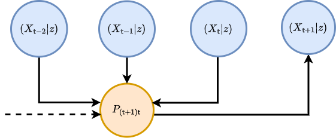
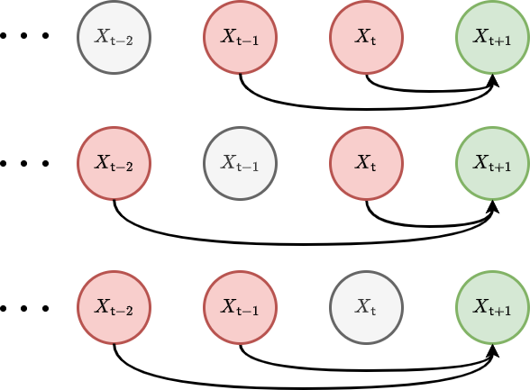
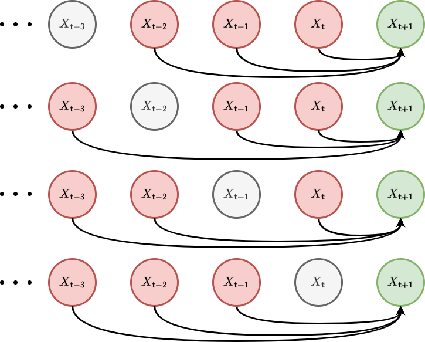
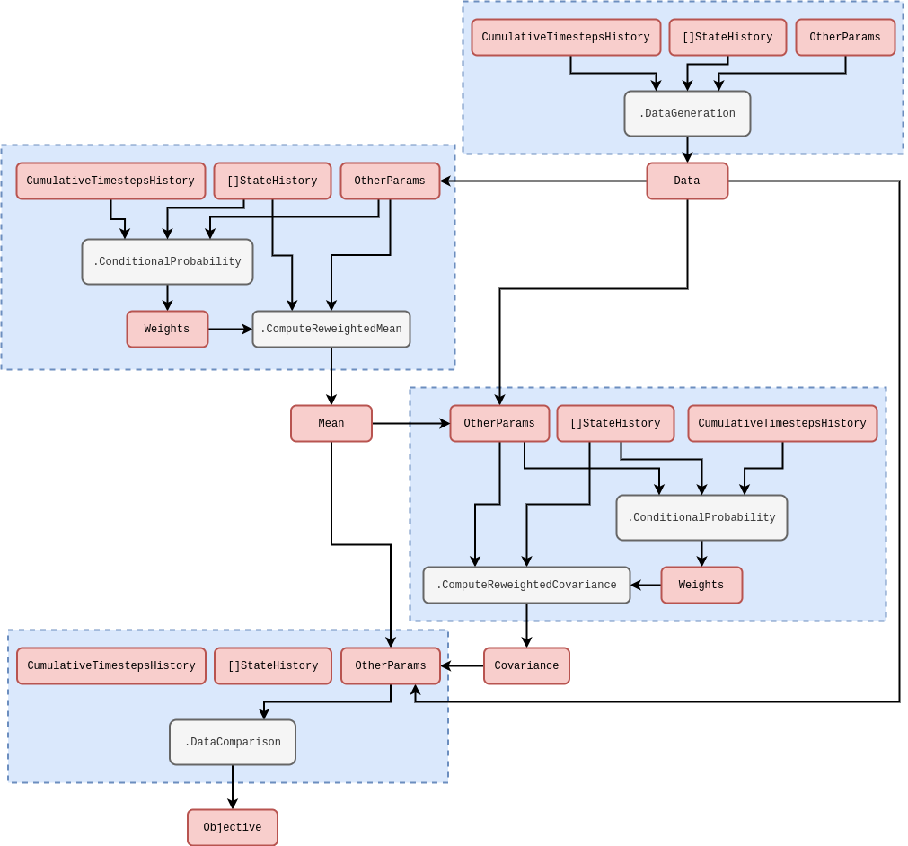

## Probabilistic formalism

Let's start by returning to the mathematical formalism that we introduced in [@stochadexI-2024]. This formalism is appropriate for sampling from nearly every stochastic phenomenon that one can think of. We are going to extend this description to consider what happens to the probability that the state history matrix takes a particular set of values over time.

So, how do we begin? Previously, we defined the general stochastic process with the formula $X^{i}_{{\sf t}+1} = F^{i}_{{\sf t}+1}(X_{0:{\sf t}},z,{\sf t})$. Further, we note that in [@stochadexI-2024], it was more practical to truncate the state history depth up to some number of timesteps ${\sf s}$ in the past such that this formula now becomes $X^{i}_{{\sf t}+1} = F^{i}_{{\sf t}+1}(X_{{\sf t}-{\sf s}:{\sf t}},z,{\sf t})$. This equation also has an implicit _master equation_ associated to it that fully describes the time evolution of the _probability density function_ $P_{{\sf t}+1}(X\vert z)$ of $X_{({\sf t}+1)-{\sf s}:({\sf t}+1)}=X$ given that the parameters of the process are $z$. This can be written as

$$
\begin{align}
P_{{\sf t}+1}(X\vert z) &= P_{{\sf t}}(X'\vert z) P_{({\sf t}+1){\sf t}}(x\vert X',z) \label{eq:master-x-cont}\,,
\end{align}
$$

where for the time being we are assuming the state space is continuous in each of the matrix elements and $P_{({\sf t}+1){\sf t}}(x\vert X',z)$ is the conditional probability that $X_{{\sf t}+1}=x$ given that $X_{{\sf t}-{\sf s}:{\sf t}}=X'$ at timestep ${\sf t}$ and the parameters of the process are $z$. To try and understand what the equation above is saying, we find it's helpful to think of an iterative relationship between probabilities; each of which is connected by their relative conditional probabilities. We've also illustrated this kind of thinking in the diagram below.

Consider what happens when we extend the chain of conditional probabilities in the master equation back in time by one step. In doing so, we retrieve a joint probability of rows $X_{{\sf t}+1}=x$ and $X_{{\sf t}}=x'$ on the right hand side of the expression

$$
\begin{align}
P_{{\sf t}+1}(X\vert z) &= P_{{\sf t}-1}(X''\vert z) P_{({\sf t}+1){\sf t}({\sf t}-1)}(x,x'\vert X'',z) \label{eq:master-x-pairwise-joint}\,.
\end{align}
$$

Since both of these equations are valid ways to obtain $P_{{\sf t}+1}(X\vert z)$ we can average between them without loss of generality in the original expression, like this

$$
\begin{align}
P_{{\sf t}+1}(X\vert z) &= \frac{1}{2}\big[ P_{{\sf t}}(X'\vert z) P_{({\sf t}+1){\sf t}}(x\vert X',z) + P_{{\sf t}-1}(X''\vert z) P_{({\sf t}+1){\sf t}({\sf t}-1)}(x,x'\vert X'',z) \big]\,.
\end{align}
$$

Following this line of reasoning to its natural conclusion, the equation above can hence be generalised to consider all possible joint distributions of rows at different timesteps like this

$$
\begin{align}
P_{{\sf t}+1}(X\vert z) &= \frac{1}{{\sf t}}\sum_{{\sf t}''={\sf t}-{\sf s}}^{{\sf t}}P_{{\sf t}''}(X''\vert z) P_{({\sf t}+1){\sf t}\dots{\sf t}''}(x,x',\dots \vert X'',z) \label{eq:master-x-cont-sum-gen}\,.
\end{align}
$$

If we wanted to just look at the distribution over the latest row $X_{{\sf t}+1}=x$, we could achieve this through marginalisation over all of the previous matrix rows in the original master equation like this

$$
\begin{align}
P_{{\sf t}+1}(x\vert z) = \int_{\Omega_{{\sf t}}}{\rm d}X' P_{{\sf t}+1}(X\vert z) &= \int_{\Omega_{{\sf t}}}{\rm d}X' P_{{\sf t}}(X'\vert z) P_{({\sf t}+1){\sf t}}(x\vert X',z) \label{eq:master-x-cont-latest-row} \,.
\end{align}
$$

But what is $\Omega_{\sf t}$? You can think of this as just the domain of possible matrix $X'$ inputs into the integral which will depend on the specific stochastic process we are looking at.

The symbol ${\rm d}X'$ in the integral above is our shorthand notation for computing the sum of integrals over previous state history matrices which can further be reduced via the generalised joint distribution summation into a product of sub-domain integrals over each matrix row

$$
\begin{align}
P_{{\sf t}+1}(x\vert z) &= \frac{1}{{\sf t}}\sum_{{\sf t}''={\sf t}-{\sf s}}^{{\sf t}} \bigg\lbrace \int_{\omega_{{\sf t}'}}{\rm d}^nx'...\int_{\Omega_{{\sf t}''}}{\rm d}X'' \bigg\rbrace \,P_{{\sf t}''}(X''\vert z) P_{({\sf t}+1){\sf t}\dots{\sf t}''}(x,x',... \vert X'',z) \\
&= \frac{1}{{\sf t}}\sum_{{\sf t}''={\sf t}-{\sf s}}^{{\sf t}} \int_{\Omega_{{\sf t}''}}{\rm d}X'' P_{{\sf t}''}(X''\vert z) P_{({\sf t}+1){\sf t}''}(x \vert X'',z) \label{eq:master-x-cont-latest-row-gen} \,,
\end{align}
$$

where each row measure is a Cartesian product of $n$ elements (a Lebesgue measure), i.e.,

$$
\begin{align}
{\rm d}^nx = \prod_{i=0}^n{\rm d}x^i \,,
\end{align}
$$

and lowercase $x, x', \dots$ values will always refer to individual rows within the state matrices. Note that $1/{\sf t}$ here is a normalisation factor --- this just normalises the sum of all probabilities to 1 given that there is a sum over ${\sf t}'$. Note also that, if the process is defined over continuous time, we would need to replace

$$
\begin{align}
\frac{1}{{\sf t}}\sum_{{\sf t}'={\sf t}-{\sf s}}^{{\sf t}} \rightarrow \frac{1}{t({\sf t})}\bigg[ t({\sf t}-{\sf s}-1) + \sum_{{\sf t}'={\sf t}-{\sf s}}^{{\sf t}}\delta t({\sf t}')\bigg] \,.
\end{align}
$$

Let's go through some examples. Non-Markovian phenomena with continuous state spaces can have quite complex master equations. A relatively simple example is that of pure diffusion processes which exhibit stochastic resetting at a rate $r$ to a remembered location from the trajectory history [@boyer2017long]

$$
\begin{align}
P_{{\sf t}+1}(x\vert z) &= (1-r)P_{{\sf t}}(x\vert z) + \sum_{i=0}^n\sum_{j=0}^n\frac{\partial}{\partial x^i}\frac{\partial}{\partial x^j}\bigg[ D_{{\sf t}}(x,z)P_{{\sf t}}(x\vert z) \bigg] + r\sum_{{\sf t}'={\sf t}-{\sf s}}^{{\sf t}}\delta t ({\sf t}')K[t({\sf t}){-}t({\sf t}')]P_{{\sf t}'}(x\vert z) \,,
\end{align}
$$

where here $K$ is some memory kernel. For Markovian phenomena which have a continuous state space, both forms of the master equation no longer depend on timesteps older than the immediately previous one, hence, e.g., the one for the latest row $x$ reduces to just

$$
\begin{align}
P_{{\sf t}+1}(x\vert z) &= \int_{\omega_{\sf t}}{\rm d}^nx' \, P_{\sf t}(x'\vert z) P_{({\sf t}+1){\sf t}}(x\vert x',z) \label{eq:master-x-cont-markov} \,.
\end{align}
$$

A famous example of this kind of phenomenon arises from approximating this Markovian master equation with a Kramers-Moyal expansion (see [@kramers1940brownian] and [@moyal1949stochastic]) up to second-order, yielding the Fokker-Planck equation

$$
\begin{align}
P_{{\sf t}+1}(x\vert z) &= P_{{\sf t}}(x\vert z) - \sum_{i=0}^n\frac{\partial}{\partial x^i}\bigg[ \mu_{{\sf t}}(x,z)P_{{\sf t}}(x\vert z)\bigg] + \sum_{i=0}^n\sum_{j=0}^n\frac{\partial}{\partial x^i}\frac{\partial}{\partial x^j}\bigg[ D_{{\sf t}}(x,z)P_{{\sf t}}(x\vert z) \bigg] \,,
\end{align}
$$

which describes a process undergoing drift-diffusion.

An analog of continuous master equation for the latest row exists for discrete state spaces as well. We just need to replace the integral with a sum and the schematic would look something like this

$$
\begin{align}
P_{{\sf t}+1}(x\vert z) &= \sum_{\Omega_{{\sf t}}} P_{{\sf t}}(X'\vert z) P_{({\sf t}+1){\sf t}}(x \vert X', z) \label{eq:master-x-disc} \,,
\end{align}
$$

where we note that the $P$'s in the expression above all now refer to _probability mass functions_. In what follows, discrete state space can always be considered by replacing the integrals with summations over probability masses in this manner; we only use the continuous state space formulation for our notation because one could argue it's a little more general.

Analogously to continuous state spaces, we can give some examples of master equations for phenomena with a discrete state space as well. In the Markovian case, we need look no further than a simple time-dependent Poisson process

$$
\begin{align}
P_{{\sf t}+1}(x\vert z) &= \lambda ({\sf t}) \delta t({\sf t}{+}1)P_{{\sf t}}(x{-}1\vert z) + \big[1-\lambda ({\sf t}) \delta t({\sf t}{+}1)\big] P_{{\sf t}}(x\vert z) \,.
\end{align}
$$

For such an example of a non-Markovian system, a Hawkes process [@hawkes1971spectra] master equation would look something like this

$$
\begin{align}
P_{{\sf t}+1}(x\vert z) &= \mu \delta t({\sf t}{+}1)P_{{\sf t}}(x{-}1\vert z) + \big[ 1-\mu \delta t({\sf t}{+}1)\big] P_{{\sf t}}(x\vert z) \nonumber \\
& + \sum_{x'=0}^{x-1}\sum_{{\sf t}'={\sf t}-{\sf s}}^{{\sf t}} \phi [t({\sf t})-t({\sf t}')] \delta t({\sf t}{+}1)P_{{\sf t}{\sf t}'({\sf t}'-1)}(x{-}1,x',x'{-}1\vert z) \nonumber \\
&+ \sum_{x'=0}^{x}\bigg\lbrace 1-\sum_{{\sf t}'={\sf t}-{\sf s}}^{{\sf t}} \phi [t({\sf t})-t({\sf t}')] \delta t({\sf t}{+}1)\bigg\rbrace P_{{\sf t}{\sf t}'({\sf t}'-1)}(x, x', x'{-}1\vert z) \,,
\end{align}
$$

where we note the complexity in this expression arises because it has to include a coupling between the rate at which events occur and an explicit memory of when the previous ones did occur (recorded by differencing the count between adjacent timesteps by 1).

## Probabilistic reweighting

So now that we are more familiar with the notation used by the previous section, we're now going use it to motivate a useful probabilistic estimation method. The method is straightforward (and quite obvious when implemented) but it's worth understanding it within the probabilistic formalism we introduced above because it will help us clarify its limitations. You could argue it draws on influences from Empirical Dynamical Modeling (EDM) [@sugihara1990nonlinear], some classic nonparametric local regression techniques --- such as LOWESS/Savitzky-Golay filtering [@savitzky1964smoothing] --- and also Gaussian processes (see [@williams2006gaussian] or [@murphy2012machine]), but it's not even that sophisticated.  

Let's begin by integrating the master equation for the latest row over $x$ to obtain a relation for the mean of the distribution

$$
\begin{align}
M_{{\sf t}+1}(z) &= \int_{\omega_{{\sf t}+1}}{\rm d}^nx \,x\, P_{{\sf t}+1}(x\vert z) = \frac{1}{{\sf t}}\sum_{{\sf t}''={\sf t}-{\sf s}}^{{\sf t}} \int_{\Omega_{{\sf t}''}}{\rm d}X'' P_{{\sf t}''}(X''\vert z) M_{({\sf t}+1){\sf t}''}(X'',z) \label{eq:mean-field-master}\,,
\end{align}
$$

where you can view the $M_{({\sf t}+1){\sf t}''}(X'',z)$ values as either terms in some regression model, or derivable explicitly from a known master equation. The latter of these provides one approach to statistically infer the states and parameters of stochastic simulations from data: one begins by knowing what the master equation is, uses this to compute the time evolution of the mean (and potentially higher-order statistics) and then connects these ${\sf t}$ and $z$-dependent statistics back to the likelihood of observing the data. This is what is commonly known as the 'mean-field' inference approach; averaging over the available degrees of freedom in the statistical moments of distributions. Though, knowing what the master equation is for an arbitrarily-defined stochastic phenomenon can be very difficult indeed, and the resulting equations typically require some form of approximation.

Let's now consider how the temporal correlation structure within $P_{{\sf t}+1}(X\vert z)$ might be approximated. If we approximated this structure up to pairwise correlations, we would get

$$
\begin{align}
P_{{\sf t}+1}(X\vert z) &\rightarrow \prod_{{\sf t}'={\sf t}-{\sf s}}^{{\sf t}}P_{({\sf t}+1){\sf t}'}(x,x'\vert z) = \prod_{{\sf t}'={\sf t}-{\sf s}}^{{\sf t}}P_{{\sf t}'}(x'\vert z)P_{({\sf t}+1){\sf t}'}(x\vert x', z) \,.
\end{align}
$$

Given this pairwise temporal correlation structure, the master equation for the latest row reduces to this simpler sum of integrals

$$
\begin{align}
P_{{\sf t}+1}(x\vert z) &= \frac{1}{{\sf t}}\sum_{{\sf t}'={\sf t}-{\sf s}}^{{\sf t}}\int_{\omega_{{\sf t}'}}{\rm d}^nx' P_{{\sf t}'}(x'\vert z)P_{({\sf t}+1){\sf t}'}(x\vert x',z) \label{eq:second-order-correl} \,.
\end{align}
$$

We have illustrated these second-order correlations with a graph visualisation below.

In a similar fashion, we can increase the order of the approximation to include three-point temporal correlations

$$
\begin{align}
P_{{\sf t}+1}(X\vert z) &\rightarrow \prod_{{\sf t}'={\sf t}-{\sf s}}^{{\sf t}}\prod_{{\sf t}''={\sf t}-{\sf s}}^{{\sf t}'-1} P_{{\sf t}'{\sf t}''}(x',x''\vert z)P_{({\sf t}+1){\sf t}'{\sf t}''}(x\vert x',x'',z) \,,
\end{align}
$$

and, in this instance, one can show that the master equation reduces to

$$
\begin{align}
P_{{\sf t}+1}(x\vert z) &= \frac{1}{{\sf t}}\sum_{{\sf t}'={\sf t}-{\sf s}}^{{\sf t}}\frac{1}{{\sf t}'-1}\sum_{{\sf t}''={\sf t}-{\sf s}}^{{\sf t}'-1}\int_{\omega_{{\sf t}'}}{\rm d}^nx'\int_{\omega_{{\sf t}''}}{\rm d}^nx'' P_{{\sf t}'{\sf t}''}(x',x''\vert z)P_{({\sf t}+1){\sf t}'{\sf t}''}(x\vert x',x'',z) \label{eq:third-order-correl} \,.
\end{align}
$$

We have also illustrated these third-order correlations with another graph visualisation in the figure below.

Using $P_{{\sf t}'{\sf t}''}(x',x''\vert z) = P_{{\sf t}''}(x''\vert z) P_{{\sf t}'{\sf t}''}(x'\vert x'', z)$ one can also show that this integral is a marginalisation of this expression

$$
\begin{align}
P_{({\sf t}+1){\sf t}''}(x\vert x'', z) &= \frac{1}{{\sf t}}\sum_{{\sf t}'={\sf t}''}^{{\sf t}}\int_{\omega_{{\sf t}'}}{\rm d}^nx'P_{{\sf t}'{\sf t}''}(x'\vert x'',z)P_{({\sf t}+1){\sf t}'{\sf t}''}(x\vert x',x'',z) \,,
\end{align}
$$

which describes the time evolution of the conditional probabilities.

With the expression for second-order correlations in hand, there is another expression for the mean of the distribution that we can derive under certain conditions. If the probability distribution over each row of the state history matrix is _stationary_ --- meaning that $P_{{\sf t}+1}(x\vert z)=P_{{\sf t}'}(x\vert z)$ --- it's possible to go one step further than mean field master equation and assert that

$$
\begin{align}
M_{{\sf t}+1}(z) &= \int_{\omega_{{\sf t}+1}}{\rm d}^nx \,x\,P_{{\sf t}+1}(x\vert z) = \frac{1}{{\sf t}}\sum_{{\sf t}'={\sf t}-{\sf s}}^{{\sf t}}\int_{\omega_{{\sf t}'}}{\rm d}^nx' \,x'\, P_{{\sf t}'}(x'\vert z) \int_{\omega_{{\sf t}+1}}{\rm d}^nx\, P_{({\sf t}+1){\sf t}'}(x\vert x',z) \label{eq:stationary-mean-estimator}\,.
\end{align}
$$

To see that this equation is true under the stationarity condition, first note that a joint distribution over both $x$ and $x'$ can be derived like this $P_{({\sf t}+1){\sf t}'}(x,x'\vert z)=P_{({\sf t}+1){\sf t}'}(x\vert x',z)P_{{\sf t}'}(x'\vert z)$. Secondly, note that this joint distribution will always allow variable swaps trivially like this $P_{({\sf t}+1){\sf t}'}(x,x'\vert z)=P_{{\sf t}'({\sf t}+1)}(x',x\vert z)$. Then, lastly, note that stationarity of $P_{{\sf t}+1}(x\vert z)=P_{{\sf t}'}(x\vert z)$ means

$$
\begin{align}
\frac{1}{{\sf t}}\sum_{{\sf t}'={\sf t}-{\sf s}}^{{\sf t}}\int_{\omega_{{\sf t}+1}} {\rm d}^nx\int_{\omega_{{\sf t}'}} {\rm d}^nx' \,x\, P_{({\sf t}+1){\sf t}'}(x,x'\vert z)&=\frac{1}{{\sf t}}\sum_{{\sf t}'={\sf t}-{\sf s}}^{{\sf t}}\int_{\omega_{{\sf t}'}} {\rm d}^nx\int_{\omega_{{\sf t}+1}} {\rm d}^nx' \,x\, P_{{\sf t}'({\sf t}+1)}(x,x'\vert z)\nonumber \\
&=\frac{1}{{\sf t}}\sum_{{\sf t}'={\sf t}-{\sf s}}^{{\sf t}}\int_{\omega_{{\sf t}'}} {\rm d}^nx'\int_{\omega_{{\sf t}+1}} {\rm d}^nx \,x'\, P_{({\sf t}+1){\sf t}'}(x,x'\vert z) \nonumber \\
&=\frac{1}{{\sf t}}\sum_{{\sf t}'={\sf t}-{\sf s}}^{{\sf t}}\int_{\omega_{{\sf t}'}}{\rm d}^nx' \,x'\, P_{{\sf t}'}(x'\vert z) \int_{\omega_{{\sf t}+1}}{\rm d}^nx\, P_{({\sf t}+1){\sf t}'}(x\vert x',z)\nonumber \,,
\end{align}
$$

where we've used the trivial variable swap and integration variable relabelling to arrive at the second equality in the expressions above.

The standard covariance matrix elements can also be computed in a similar fashion

$$
\begin{align}
C^{ij}_{{\sf t}+1}(z) &= \int_{\omega_{{\sf t}+1}}{\rm d}^nx \,[x-M_{{\sf t}+1}(z)
]^i[x-M_{{\sf t}+1}(z)]^jP_{{\sf t}+1}(x\vert z) \nonumber \\
&= \frac{1}{{\sf t}}\sum_{{\sf t}'={\sf t}-{\sf s}}^{{\sf t}}\int_{\omega_{{\sf t}'}}{\rm d}^nx' \, [x'-M_{{\sf t}+1}(z)]^i[x'-M_{{\sf t}+1}(z)]^j \,P_{{\sf t}'}(x'\vert z) \int_{\omega_{{\sf t}+1}}{\rm d}^nx \, P_{({\sf t}+1){\sf t}'}(x\vert x',z) \label{eq:stationary-covariance-estimator}\,.
\end{align}
$$

While they look quite abstract, the equations for the mean and covariance above express the core idea behind how a 'probabilistic reweighting' algorithm could function. By assuming a stationary distribution, we gain the ability to directly estimate the statistics of the probability distribution of the next sample from the stochastic process $P_{{\sf t}+1}(x\vert z)$ from past samples it may have in empirical data; which are represented here by $P_{{\sf t}'}(x'\vert z)$. This is the estimation method that we've been leading the calculations towards, and one might call this technique 'empirical probabilistic reweighting'.

Probabilistic reweighting depends on the stationarity of $P_{{\sf t}+1}(x\vert z)=P_{{\sf t}'}(x\vert z)$ such that, e.g., the relation for the covariance above is applicable. The core idea behind it is to represent the past distribution of state values $P_{{\sf t}'}(x'\vert z)$ with the samples from a real time series dataset. If the user then specifies a good model for the relationships in this data by providing a weighting function which returns the conditional probability mass

$$
\begin{align}
{\sf w}_{{\sf t}'}(y,z) = \int_{\omega_{{\sf t}+1}} {\rm d}^nx \, P_{({\sf t}+1){\sf t}'}(x\vert x'{=}y,z) \,,  
\end{align}
$$

we can apply this as a _reweighting_ of the historical time series samples to estimate any statistics of interest. Taking the equations for the mean and covariance above as the examples; we are essentially approximating these integrals through weighted sample estimations like this

$$
\begin{align}
M_{{\sf t}+1}(z) &\simeq \frac{1}{{\sf t}}\sum^{{\sf t}}_{{\sf t}'={\sf t}-{\sf s}}Y_{{\sf t}'} {\sf w}_{{\sf t}'}(Y_{{\sf t}'},z) \label{eq:mean-reweighting} \\
C^{ij}_{{\sf t}+1}(z) &\simeq \frac{1}{{\sf t}}\sum^{{\sf t}}_{{\sf t}'={\sf t}-{\sf s}}[Y_{{\sf t}'}-M_{{\sf t}+1}(z)]^i[Y_{{\sf t}'}-M_{{\sf t}+1}(z)]^j \, {\sf w}_{{\sf t}'}(Y_{{\sf t}'},z) \label{eq:covariance-reweighting} \,,
\end{align}
$$

where we have defined the data matrix $Y$ with rows $Y_{{\sf t}+1}, Y_{{\sf t}}, \dots$, each of which representing specific observations of the rows in $X$ at each point in time from a real dataset.

The goal of a learning algorithm for probabilistic reweighting would be to learn the optimal reweighting function ${\sf w}_{{\sf t}'}(Y_{{\sf t}'},z)$ with respect to $z$, i.e., the ones which most accurately represent a provided dataset. But before thinking about the various kinds of conditional probability we could use, we need to think about how to connect the post-reweighting statistics to the data by defining an objective function. We will return to learning methods for parameters in follow-up articles.

If the mean is a sufficient statistic for the distribution which describes the data, a choice of, e.g., Exponential, Poisson or Binomial distribution could be used where the mean is estimated directly from the time series, given a conditional probability $P_{({\sf t}+1){\sf t}'}(x\vert x',z)$. Extending this idea further to include distributions which also require a variance to be known, e.g., the Normal, Gamma or Negative Binomial distributions could be used where the variance (and/or covariance) could be estimated using the covariance expression. These are just a few simple examples of distributions that can link the estimated statistics from the equations above to a time series dataset. However, the algorithmic framework is very general to whatever choice of 'data linking' distribution that a researcher might need.

We should probably make what we've just said a little more mathematically concrete. We can define $P_{{\sf t}+1}[y;M_{{\sf t}+1}(z),C_{{\sf t}+1}(z),\dots ]$ as representing the likelihood of $y = Y_{{\sf t}+1}$ given the estimated statistics up to second order (with the potential for maybe higher-orders later). Note that in order to do this, we need to identify the $x'$ and ${\sf t}'$ values that are used to estimate, e.g., $M_{{\sf t}+1}(z)$ with the past data values which are observed in the dataset time series itself. Now that we have this likelihood, we can immediately evaluate an objective function (a cumulative log-likelihood) that we might seek to optimise over for a given dataset

$$
\begin{align}
\ln {\cal L}_{{\sf t}+1}(Y\vert z) &= \sum_{{\sf t}'=({\sf t}+1)-{\sf s}}^{({\sf t}+1)} \ln P_{{\sf t}'}[y;M_{{\sf t}'}(z),C_{{\sf t}'}(z),\dots ] \,, \label{eq:log-likelihood-reweighting}
\end{align}
$$

where the summation continues until all of the past measurements $Y_{{\sf t}+1}, Y_{{\sf t}}, \dots$ which exist as rows in the data matrix $Y$ have been taken into account. The multi-threaded code to compute this objective function within the stochadex computational graph iteration structure follows the rough schematic below (see [@stochadexI-2024] for more on how this diagram structure is designed to work in the simulation package).

In order to specify what $P_{({\sf t}+1){\sf t}'}(x\vert x',z)$ is, it's quite natural to define a set of hyperparameters for the elements of $z$. To get a sense of how the data-linking function relates to these hyperparameters, it's instructive to consider an example. One generally-applicable option for the conditional probability could be a purely time-dependent kernel

$$
\begin{align}
P_{({\sf t}+1){\sf t}'}(x\vert x',z) &\propto {\cal K}(z, {\sf t}+1,{\sf t}')  \label{eq:time-dependent-kernel} \,,
\end{align}
$$

and the data-linking distribution, e.g., could be a Gaussian

$$
\begin{align}
P_{{\sf t}+1}[y;M_{{\sf t}+1}(z),C_{{\sf t}+1}(z),\dots ] = {\sf MultivariateNormalPDF}[y;M_{{\sf t}+1}(z),C_{{\sf t}+1}(z)] \label{eq:gaussian-data-prob}\,.
\end{align}
$$

As a final thought, it's worth pointing out that other machine learning frameworks could easily be used to model these conditional probabilities. For example, neural networks could be used to infer the optimal reweighting scheme and this would still allow us to use the data-linking distribution. One can think of using this neural network-based reweighting scheme as similar to constructing a normalising flow model [@kobyzev2020normalizing] with an autoregressive layer. Invertibility and further network structural constraints mean that these are not exactly equivalent, however. In this instance, it would still be desirable to keep the data-linking distribution as it can usually be sampled from very easily --- something that can be quite difficult to achieve with a purely machine learning-based representation of the distribution. Sampling could be made more flexible, however, by leveraging a Variational Autoencoder (VAE) [@pinheiro2021variational]; these use neural networks not just on the compression (or 'encode') step to estimate the statistics but also use them as a layer between the sample from the data distribution model and the output (the 'decode' step).

## References
