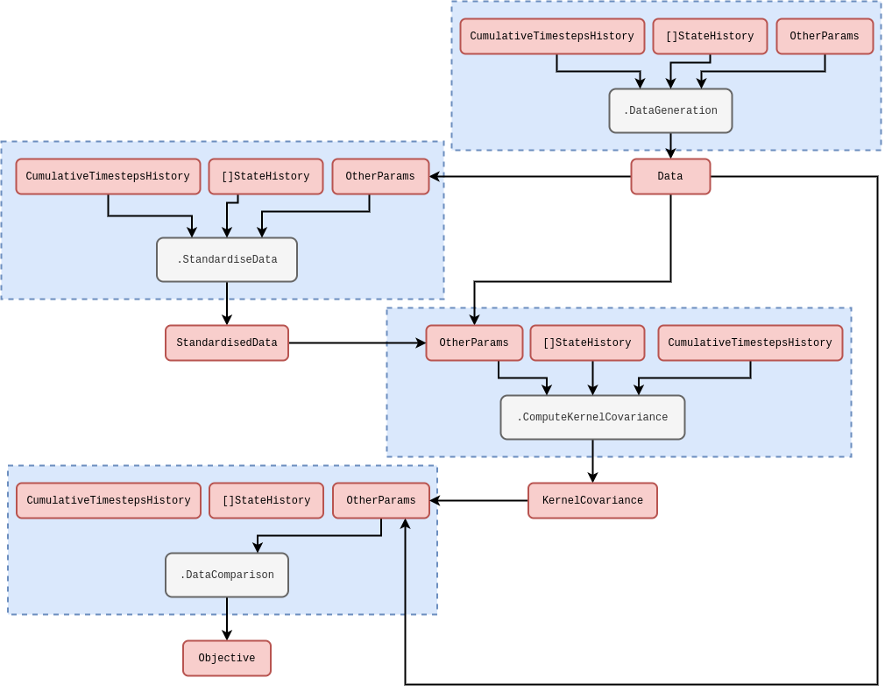
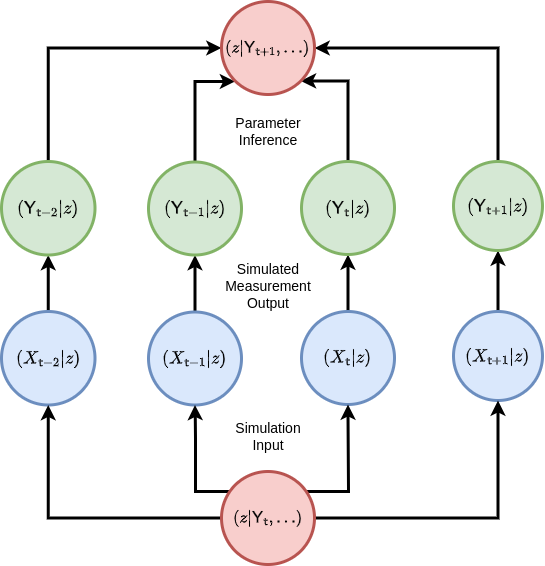
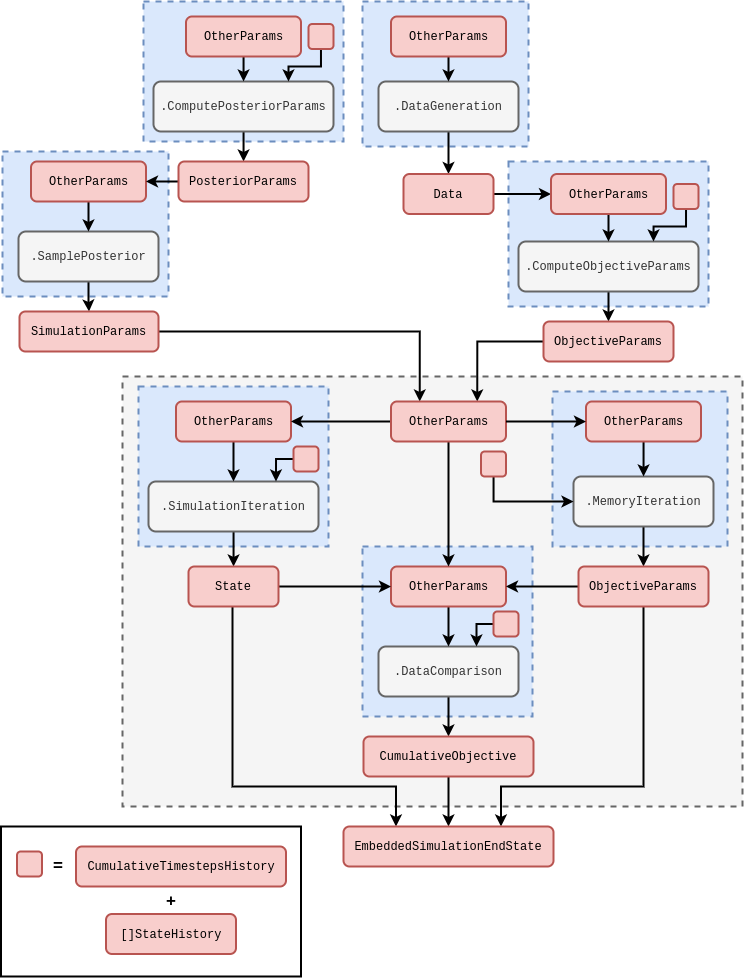

## Introduction and probabilistic formalism

In this second article of the series we will be introducing a new online simulation inference framework, enabling us to realise the idea of a generalised 'self-learning simulation'. Before tackling the design and implementation of the technique, it will be important to outline the technical foundations for it within our mathematical formalism. So, we're going to begin by discussing the formal connections between some probabilistic learning methods and the simulation formalism we introduced in the previous article in this series [@stochadexI-2024] --- which introduced the publicly-available stochadex package: [https://github.com/umbralcalc/stochadex](https://github.com/umbralcalc/stochadex). Let's start by returning to the formalism that we introduced in that article. As we discussed in that article; this formalism is appropriate for sampling from nearly every stochastic phenomenon that one can think of. We are going to extend this description to consider what happens to the probability that the state history matrix takes a particular set of values over time.

So, how do we begin? Previously, we defined the general stochastic process with the formula $X^{i}_{{\sf t}+1} = F^{i}_{{\sf t}+1}(X_{0:{\sf t}},z,{\sf t})$. Further, we note that in [@stochadexI-2024], it was more practical to truncate the state history depth up to some number of timesteps ${\sf s}$ in the past such that this formula now becomes $X^{i}_{{\sf t}+1} = F^{i}_{{\sf t}+1}(X_{{\sf t}-{\sf s}:{\sf t}},z,{\sf t})$. This equation also has an implicit _master equation_ associated to it that fully describes the time evolution of the _probability density function_ $P_{{\sf t}+1}(X\vert z)$ of $X_{({\sf t}+1)-{\sf s}:({\sf t}+1)}=X$ given that the parameters of the process are $z$. This can be written as

$$
\begin{align}
P_{{\sf t}+1}(X\vert z) &= P_{{\sf t}}(X'\vert z) P_{({\sf t}+1){\sf t}}(x\vert X',z) \label{eq:master-x-cont}\,,
\end{align}
$$

where for the time being we are assuming the state space is continuous in each of the matrix elements and $P_{({\sf t}+1){\sf t}}(x\vert X',z)$ is the conditional probability that $X_{{\sf t}+1}=x$ given that $X_{{\sf t}-{\sf s}:{\sf t}}=X'$ at timestep ${\sf t}$ and the parameters of the process are $z$. To try and understand what the equation above is saying, we find it's helpful to think of an iterative relationship between probabilities; each of which is connected by their relative conditional probabilities. We've also illustrated this kind of thinking in the diagram below.

Consider what happens when we extend the chain of conditional probabilities in the master equation back in time by one step. In doing so, we retrieve a joint probability of rows $X_{{\sf t}+1}=x$ and $X_{{\sf t}}=x'$ on the right hand side of the expression

$$
\begin{align}
P_{{\sf t}+1}(X\vert z) &= P_{{\sf t}-1}(X''\vert z) P_{({\sf t}+1){\sf t}({\sf t}-1)}(x,x'\vert X'',z) \label{eq:master-x-pairwise-joint}\,.
\end{align}
$$

Since both of these equations are valid ways to obtain $P_{{\sf t}+1}(X\vert z)$ we can average between them without loss of generality in the original expression, like this

$$
\begin{align}
P_{{\sf t}+1}(X\vert z) &= \frac{1}{2}\big[ P_{{\sf t}}(X'\vert z) P_{({\sf t}+1){\sf t}}(x\vert X',z) + P_{{\sf t}-1}(X''\vert z) P_{({\sf t}+1){\sf t}({\sf t}-1)}(x,x'\vert X'',z) \big]\,.
\end{align}
$$

Following this line of reasoning to its natural conclusion, the equation above can hence be generalised to consider all possible joint distributions of rows at different timesteps like this

$$
\begin{align}
P_{{\sf t}+1}(X\vert z) &= \frac{1}{{\sf t}}\sum_{{\sf t}''={\sf t}-{\sf s}}^{{\sf t}}P_{{\sf t}''}(X''\vert z) P_{({\sf t}+1){\sf t}\dots{\sf t}''}(x,x',\dots \vert X'',z) \label{eq:master-x-cont-sum-gen}\,.
\end{align}
$$

If we wanted to just look at the distribution over the latest row $X_{{\sf t}+1}=x$, we could achieve this through marginalisation over all of the previous matrix rows in the original master equation like this

$$
\begin{align}
P_{{\sf t}+1}(x\vert z) = \int_{\Omega_{{\sf t}}}{\rm d}X' P_{{\sf t}+1}(X\vert z) &= \int_{\Omega_{{\sf t}}}{\rm d}X' P_{{\sf t}}(X'\vert z) P_{({\sf t}+1){\sf t}}(x\vert X',z) \label{eq:master-x-cont-latest-row} \,.
\end{align}
$$

But what is $\Omega_{\sf t}$? You can think of this as just the domain of possible matrix $X'$ inputs into the integral which will depend on the specific stochastic process we are looking at.

The symbol ${\rm d}X'$ in the integral above is our shorthand notation for computing the sum of integrals over previous state history matrices which can further be reduced via the generalised joint distribution summation into a product of sub-domain integrals over each matrix row

$$
\begin{align}
P_{{\sf t}+1}(x\vert z) &= \frac{1}{{\sf t}}\sum_{{\sf t}''={\sf t}-{\sf s}}^{{\sf t}} \bigg\lbrace \int_{\omega_{{\sf t}'}}{\rm d}^nx'...\int_{\Omega_{{\sf t}''}}{\rm d}X'' \bigg\rbrace \,P_{{\sf t}''}(X''\vert z) P_{({\sf t}+1){\sf t}\dots{\sf t}''}(x,x',... \vert X'',z) \\
&= \frac{1}{{\sf t}}\sum_{{\sf t}''={\sf t}-{\sf s}}^{{\sf t}} \int_{\Omega_{{\sf t}''}}{\rm d}X'' P_{{\sf t}''}(X''\vert z) P_{({\sf t}+1){\sf t}''}(x \vert X'',z) \label{eq:master-x-cont-latest-row-gen} \,,
\end{align}
$$

where each row measure is a Cartesian product of $n$ elements (a Lebesgue measure), i.e.,

$$
\begin{align}
{\rm d}^nx = \prod_{i=0}^n{\rm d}x^i \,,
\end{align}
$$

and lowercase $x, x', \dots$ values will always refer to individual rows within the state matrices. Note that $1/{\sf t}$ here is a normalisation factor --- this just normalises the sum of all probabilities to 1 given that there is a sum over ${\sf t}'$. Note also that, if the process is defined over continuous time, we would need to replace

$$
\begin{align}
\frac{1}{{\sf t}}\sum_{{\sf t}'={\sf t}-{\sf s}}^{{\sf t}} \rightarrow \frac{1}{t({\sf t})}\bigg[ t({\sf t}-{\sf s}-1) + \sum_{{\sf t}'={\sf t}-{\sf s}}^{{\sf t}}\delta t({\sf t}')\bigg] \,.
\end{align}
$$

Let's go through some examples. Non-Markovian phenomena with continuous state spaces can have quite complex master equations. A relatively simple example is that of pure diffusion processes which exhibit stochastic resetting at a rate $r$ to a remembered location from the trajectory history [@boyer2017long]

$$
\begin{align}
P_{{\sf t}+1}(x\vert z) &= (1-r)P_{{\sf t}}(x\vert z) + \sum_{i=0}^n\sum_{j=0}^n\frac{\partial}{\partial x^i}\frac{\partial}{\partial x^j}\bigg[ D_{{\sf t}}(x,z)P_{{\sf t}}(x\vert z) \bigg] + r\sum_{{\sf t}'={\sf t}-{\sf s}}^{{\sf t}}\delta t ({\sf t}')K[t({\sf t}){-}t({\sf t}')]P_{{\sf t}'}(x\vert z) \,,
\end{align}
$$

where here $K$ is some memory kernel. For Markovian phenomena which have a continuous state space, both forms of the master equation no longer depend on timesteps older than the immediately previous one, hence, e.g., the one for the latest row $x$ reduces to just

$$
\begin{align}
P_{{\sf t}+1}(x\vert z) &= \int_{\omega_{\sf t}}{\rm d}^nx' \, P_{\sf t}(x'\vert z) P_{({\sf t}+1){\sf t}}(x\vert x',z) \label{eq:master-x-cont-markov} \,.
\end{align}
$$

A famous example of this kind of phenomenon arises from approximating this Markovian master equation with a Kramers-Moyal expansion (see [@kramers1940brownian] and [@moyal1949stochastic]) up to second-order, yielding the Fokker-Planck equation

$$
\begin{align}
P_{{\sf t}+1}(x\vert z) &= P_{{\sf t}}(x\vert z) - \sum_{i=0}^n\frac{\partial}{\partial x^i}\bigg[ \mu_{{\sf t}}(x,z)P_{{\sf t}}(x\vert z)\bigg] + \sum_{i=0}^n\sum_{j=0}^n\frac{\partial}{\partial x^i}\frac{\partial}{\partial x^j}\bigg[ D_{{\sf t}}(x,z)P_{{\sf t}}(x\vert z) \bigg] \,,
\end{align}
$$

which describes a process undergoing drift-diffusion.

An analog of continuous master equation for the latest row exists for discrete state spaces as well. We just need to replace the integral with a sum and the schematic would look something like this

$$
\begin{align}
P_{{\sf t}+1}(x\vert z) &= \sum_{\Omega_{{\sf t}}} P_{{\sf t}}(X'\vert z) P_{({\sf t}+1){\sf t}}(x \vert X', z) \label{eq:master-x-disc} \,,
\end{align}
$$

where we note that the $P$'s in the expression above all now refer to _probability mass functions_. In what follows, discrete state space can always be considered by replacing the integrals with summations over probability masses in this manner; we only use the continuous state space formulation for our notation because one could argue it's a little more general.

Analogously to continuous state spaces, we can give some examples of master equations for phenomena with a discrete state space as well. In the Markovian case, we need look no further than a simple time-dependent Poisson process

$$
\begin{align}
P_{{\sf t}+1}(x\vert z) &= \lambda ({\sf t}) \delta t({\sf t}{+}1)P_{{\sf t}}(x{-}1\vert z) + \big[1-\lambda ({\sf t}) \delta t({\sf t}{+}1)\big] P_{{\sf t}}(x\vert z) \,.
\end{align}
$$

For such an example of a non-Markovian system, a Hawkes process [@hawkes1971spectra] master equation would look something like this

$$
\begin{align}
P_{{\sf t}+1}(x\vert z) &= \mu \delta t({\sf t}{+}1)P_{{\sf t}}(x{-}1\vert z) + \big[ 1-\mu \delta t({\sf t}{+}1)\big] P_{{\sf t}}(x\vert z) \nonumber \\
& + \sum_{x'=0}^\infty\sum_{{\sf t}'={\sf t}-{\sf s}}^{{\sf t}} \phi [t({\sf t})-t({\sf t}')] \delta t({\sf t}{+}1)P_{{\sf t}{\sf t}'({\sf t}'-1)}(x{-}1,x',x'{-}1\vert z) \nonumber \\
&+ \sum_{x'=0}^\infty\bigg\lbrace 1-\sum_{{\sf t}'={\sf t}-{\sf s}}^{{\sf t}} \phi [t({\sf t})-t({\sf t}')] \delta t({\sf t}{+}1)\bigg\rbrace P_{{\sf t}{\sf t}'({\sf t}'-1)}(x, x', x'{-}1\vert z) \,,
\end{align}
$$

where we note the complexity in this expression arises because it has to include a coupling between the rate at which events occur and an explicit memory of when the previous ones did occur (recorded by differencing the count between adjacent timesteps by 1).

## Probabilistic learning algorithms

So now that we are more familiar with the notation used by the previous section, we can use it to motivate some useful probabilistic learning methods. While it's worth going into some mathematical detail to give a better sense of where each technique comes from, we should emphasise that the methodologies we discuss here are not new to the technical literature at all. We draw on influences from Empirical Dynamical Modeling (EDM) [@sugihara1990nonlinear], some classic nonparametric local regression techniques --- such as LOWESS/Savitzky-Golay filtering [@savitzky1964smoothing] --- and also Gaussian processes [@murphy2012machine].  

Let's begin our discussion of algorithms by integrating the master equation for the latest row over $x$ to obtain a relation for the mean of the distribution

$$
\begin{align}
M_{{\sf t}+1}(z) &= \int_{\omega_{{\sf t}+1}}{\rm d}^nx \,x\, P_{{\sf t}+1}(x\vert z) = \frac{1}{{\sf t}}\sum_{{\sf t}''={\sf t}-{\sf s}}^{{\sf t}} \int_{\Omega_{{\sf t}''}}{\rm d}X'' P_{{\sf t}''}(X''\vert z) M_{({\sf t}+1){\sf t}''}(X'',z) \label{eq:mean-field-master}\,,
\end{align}
$$

where you can view the $M_{({\sf t}+1){\sf t}''}(X'',z)$ values as either terms in some regression model, or derivable explicitly from a known master equation. The latter of these provides one approach to statistically infer the states and parameters of stochastic simulations from data: one begins by knowing what the master equation is, uses this to compute the time evolution of the mean (and potentially higher-order statistics) and then connects these ${\sf t}$ and $z$-dependent statistics back to the likelihood of observing the data. This is what is commonly known as the 'mean-field' inference approach; averaging over the available degrees of freedom in the statistical moments of distributions. Though, knowing what the master equation is for an arbitrarily-defined stochastic phenomenon can be very difficult indeed, and the resulting equations typically require some form of approximation.

Given that the mean-field approach isn't always going to be viable as an inference method, we should also consider other ways to describe the shape and time evolution characteristics of $P_{{\sf t}+1}(X\vert z)$. For continuous state spaces, it's possible to approximate this whole distribution with a logarithmic expansion like so

$$
\begin{align}
\ln P_{{\sf t}+1}(X\vert z) &\simeq \ln P_{{\sf t}+1}(X_*\vert z) + \frac{1}{2}\sum_{{\sf t}'=({\sf t}+1)-{\sf s}}^{({\sf t}+1)}\sum_{i=0}^{n}\sum_{j=0}^{n} (x-x_*)^i {\cal H}^{ij}_{({\sf t}+1){\sf t}'}(z) (x'-x'_*)^j \label{eq:second-order-log-expansion} \\
{\cal H}^{ij}_{({\sf t}+1){\sf t}'}(z) &= \frac{\partial}{\partial x^i}\frac{\partial}{\partial (x')^j}\ln P_{{\sf t}+1}(X\vert z) \bigg\vert_{X=X_*} \label{eq:second-order-log-expansion-kernel} \,,
\end{align}
$$

where the values for $X_*$ (and its rows $x_*, x_*', \dots$) are defined by the vanishing of the first derivative, i.e., these are chosen such that

$$
\begin{align}
\frac{\partial}{\partial x^i}\ln P_{{\sf t}+1}(X\vert z) \bigg\vert_{X=X_*} &= 0 \,.
\end{align}
$$

This logarithmic expansion is one way to see how a Gaussian process regression is able to approximate $X_{{\sf t}}$ evolving in time for many different processes. By selecting the appropriate function for the kernel above, a Gaussian process regression can be fully specified.

If we keep the truncation up to second order in the expansion, note that this expression implies a pairwise correlation structure of the form

$$
\begin{align}
P_{{\sf t}+1}(X\vert z) &\rightarrow \prod_{{\sf t}'={\sf t}-{\sf s}}^{{\sf t}}P_{({\sf t}+1){\sf t}'}(x,x'\vert z) = \prod_{{\sf t}'={\sf t}-{\sf s}}^{{\sf t}}P_{{\sf t}'}(x'\vert z)P_{({\sf t}+1){\sf t}'}(x\vert x', z) \,.
\end{align}
$$

Given this pairwise temporal correlation structure, the master equation for the latest row reduces to this simpler sum of integrals

$$
\begin{align}
P_{{\sf t}+1}(x\vert z) &= \frac{1}{{\sf t}}\sum_{{\sf t}'={\sf t}-{\sf s}}^{{\sf t}}\int_{\omega_{{\sf t}'}}{\rm d}^nx' P_{{\sf t}'}(x'\vert z)P_{({\sf t}+1){\sf t}'}(x\vert x',z) \label{eq:second-order-correl} \,.
\end{align}
$$

We have illustrated these second-order correlations with a graph visualisation below.

In a similar fashion, we can increase the expansion order of the log expansion to include third-order correlations such that

$$
\begin{align}
P_{{\sf t}+1}(X\vert z) &\rightarrow \prod_{{\sf t}'={\sf t}-{\sf s}}^{{\sf t}}\prod_{{\sf t}''={\sf t}-{\sf s}}^{{\sf t}'-1} P_{{\sf t}'{\sf t}''}(x',x''\vert z)P_{({\sf t}+1){\sf t}'{\sf t}''}(x\vert x',x'',z) \,,
\end{align}
$$

and, in this instance, one can show that the master equation reduces to

$$
\begin{align}
P_{{\sf t}+1}(x\vert z) &= \frac{1}{{\sf t}}\sum_{{\sf t}'={\sf t}-{\sf s}}^{{\sf t}}\frac{1}{{\sf t}'-1}\sum_{{\sf t}''={\sf t}-{\sf s}}^{{\sf t}'-1}\int_{\omega_{{\sf t}'}}{\rm d}^nx'\int_{\omega_{{\sf t}''}}{\rm d}^nx'' P_{{\sf t}'{\sf t}''}(x',x''\vert z)P_{({\sf t}+1){\sf t}'{\sf t}''}(x\vert x',x'',z) \label{eq:third-order-correl} \,.
\end{align}
$$

We have also illustrated these third-order correlations with another graph visualisation in the figure below.

Using $P_{{\sf t}'{\sf t}''}(x',x''\vert z) = P_{{\sf t}''}(x''\vert z) P_{{\sf t}'{\sf t}''}(x'\vert x'', z)$ one can also show that this integral is a marginalisation of this expression

$$
\begin{align}
P_{({\sf t}+1){\sf t}''}(x\vert x'', z) &= \frac{1}{{\sf t}}\sum_{{\sf t}'={\sf t}-{\sf s}}^{{\sf t}}\int_{\omega_{{\sf t}'}}{\rm d}^nx'P_{{\sf t}'{\sf t}''}(x'\vert x'',z)P_{({\sf t}+1){\sf t}'{\sf t}''}(x\vert x',x'',z) \,,
\end{align}
$$

which describes the time evolution of the conditional probabilities. Note how this implies that the Gaussian process kernel itself can be evolved through time to replicate these higher-order temporal correlations for a regression problem, if desired.

Another probabilistic learning algorithm that we can consider is what we shall call 'empirical probabilistic reweighting'. There is another expression for the mean of the distribution, that we can derive under certain conditions, which will be valuable to motivating this algorithm. If the probability distribution over each row of the state history matrix is _stationary_ --- meaning that $P_{{\sf t}+1}(x\vert z)=P_{{\sf t}'}(x\vert z)$ --- it's possible to go one step further than mean field master equation and assert that

$$
\begin{align}
M_{{\sf t}+1}(z) &= \int_{\omega_{{\sf t}+1}}{\rm d}^nx \,x\,P_{{\sf t}+1}(x\vert z) = \frac{1}{{\sf t}}\sum_{{\sf t}'={\sf t}-{\sf s}}^{{\sf t}}\int_{\omega_{{\sf t}'}}{\rm d}^nx' \,x'\, P_{{\sf t}'}(x'\vert z) \int_{\omega_{{\sf t}+1}}{\rm d}^nx\, P_{({\sf t}+1){\sf t}'}(x\vert x',z) \label{eq:stationary-mean-estimator}\,.
\end{align}
$$

To see that this equation is true under the stationarity condition, first note that a joint distribution over both $x$ and $x'$ can be derived like this $P_{({\sf t}+1){\sf t}'}(x,x'\vert z)=P_{({\sf t}+1){\sf t}'}(x\vert x',z)P_{{\sf t}'}(x'\vert z)$. Secondly, note that this joint distribution will always allow variable swaps trivially like this $P_{({\sf t}+1){\sf t}'}(x,x'\vert z)=P_{{\sf t}'({\sf t}+1)}(x',x\vert z)$. Then, lastly, note that stationarity of $P_{{\sf t}+1}(x\vert z)=P_{{\sf t}'}(x\vert z)$ means

$$
\begin{align}
\frac{1}{{\sf t}}\sum_{{\sf t}'={\sf t}-{\sf s}}^{{\sf t}}\int_{\omega_{{\sf t}+1}} {\rm d}^nx\int_{\omega_{{\sf t}'}} {\rm d}^nx' \,x\, P_{({\sf t}+1){\sf t}'}(x,x'\vert z)&=\frac{1}{{\sf t}}\sum_{{\sf t}'={\sf t}-{\sf s}}^{{\sf t}}\int_{\omega_{{\sf t}'}} {\rm d}^nx\int_{\omega_{{\sf t}+1}} {\rm d}^nx' \,x\, P_{{\sf t}'({\sf t}+1)}(x,x'\vert z)\nonumber \\
&=\frac{1}{{\sf t}}\sum_{{\sf t}'={\sf t}-{\sf s}}^{{\sf t}}\int_{\omega_{{\sf t}'}} {\rm d}^nx'\int_{\omega_{{\sf t}+1}} {\rm d}^nx \,x'\, P_{({\sf t}+1){\sf t}'}(x,x'\vert z) \nonumber \\
&=\frac{1}{{\sf t}}\sum_{{\sf t}'={\sf t}-{\sf s}}^{{\sf t}}\int_{\omega_{{\sf t}'}}{\rm d}^nx' \,x'\, P_{{\sf t}'}(x'\vert z) \int_{\omega_{{\sf t}+1}}{\rm d}^nx\, P_{({\sf t}+1){\sf t}'}(x\vert x',z)\nonumber \,,
\end{align}
$$

where we've used the trivial variable swap and integration variable relabelling to arrive at the second equality in the expressions above.

The standard covariance matrix elements can also be computed in a similar fashion

$$
\begin{align}
C^{ij}_{{\sf t}+1}(z) &= \int_{\omega_{{\sf t}+1}}{\rm d}^nx \,[x-M_{{\sf t}+1}(z)
]^i[x-M_{{\sf t}+1}(z)]^jP_{{\sf t}+1}(x\vert z) \nonumber \\
&= \frac{1}{{\sf t}}\sum_{{\sf t}'={\sf t}-{\sf s}}^{{\sf t}}\int_{\omega_{{\sf t}'}}{\rm d}^nx' \, [x'-M_{{\sf t}+1}(z)]^i[x'-M_{{\sf t}+1}(z)]^j \,P_{{\sf t}'}(x'\vert z) \int_{\omega_{{\sf t}+1}}{\rm d}^nx \, P_{({\sf t}+1){\sf t}'}(x\vert x',z) \label{eq:stationary-covariance-estimator}\,.
\end{align}
$$

While they look quite abstract, the equations for the mean and covariance above express the core idea behind how the probabilistic reweighting will function. By assuming a stationary distribution, we gain the ability to directly estimate the statistics of the probability distribution of the next sample from the stochastic process $P_{{\sf t}+1}(x\vert z)$ from past samples it may have in empirical data; which are represented here by $P_{{\sf t}'}(x'\vert z)$.

Probabilistic reweighting depends on the stationarity of $P_{{\sf t}+1}(x\vert z)=P_{{\sf t}'}(x\vert z)$ such that, e.g., the relation for the covariance above is applicable. The core idea behind it is to represent the past distribution of state values $P_{{\sf t}'}(x'\vert z)$ with the samples from a real time series dataset. If the user then specifies a good model for the relationships in this data by providing a weighting function which returns the conditional probability mass

$$
\begin{align}
{\sf w}_{{\sf t}'}(y,z) = \int_{\omega_{{\sf t}+1}} {\rm d}^nx \, P_{({\sf t}+1){\sf t}'}(x\vert x'{=}y,z) \,,  
\end{align}
$$

we can apply this as a _reweighting_ of the historical time series samples to estimate any statistics of interest. Taking the equations for the mean and covariance above as the examples; we are essentially approximating these integrals through weighted sample estimations like this

$$
\begin{align}
M_{{\sf t}+1}(z) &\simeq \frac{1}{{\sf t}}\sum^{{\sf t}}_{{\sf t}'={\sf t}-{\sf s}}Y_{{\sf t}'} {\sf w}_{{\sf t}'}(Y_{{\sf t}'},z) \label{eq:mean-reweighting} \\
C^{ij}_{{\sf t}+1}(z) &\simeq \frac{1}{{\sf t}}\sum^{{\sf t}}_{{\sf t}'={\sf t}-{\sf s}}[Y_{{\sf t}'}-M_{{\sf t}+1}(z)]^i[Y_{{\sf t}'}-M_{{\sf t}+1}(z)]^j \, {\sf w}_{{\sf t}'}(Y_{{\sf t}'},z) \label{eq:covariance-reweighting} \,,
\end{align}
$$

where we have defined the data matrix $Y$ with rows $Y_{{\sf t}+1}, Y_{{\sf t}}, \dots$, each of which representing specific observations of the rows in $X$ at each point in time from a real dataset.

The goal of a learning algorithm for probabilistic reweighting would be to learn the optimal reweighting function ${\sf w}_{{\sf t}'}(Y_{{\sf t}'},z)$ with respect to $z$, i.e., the ones which most accurately represent a provided dataset. But before we think about the various kinds of conditional probability we could use, we need to think about how to connect the post-reweighting statistics to the data by defining an objective function.

If the mean is a sufficient statistic for the distribution which describes the data, a choice of, e.g., Exponential, Poisson or Binomial distribution could be used where the mean is estimated directly from the time series, given a conditional probability $P_{({\sf t}+1){\sf t}'}(x\vert x',z)$. Extending this idea further to include distributions which also require a variance to be known, e.g., the Normal, Gamma or Negative Binomial distributions could be used where the variance (and/or covariance) could be estimated using the covariance expression. These are just a few simple examples of distributions that can link the estimated statistics from the equations above to a time series dataset. However, the algorithmic framework is very general to whatever choice of 'data linking' distribution that a researcher might need.

We should probably make what we've just said a little more mathematically concrete. We can define $P_{{\sf t}+1}[y;M_{{\sf t}+1}(z),C_{{\sf t}+1}(z),\dots ]$ as representing the likelihood of $y = Y_{{\sf t}+1}$ given the estimated statistics up to second order (with the potential for maybe higher-orders later). Note that in order to do this, we need to identify the $x'$ and ${\sf t}'$ values that are used to estimate, e.g., $M_{{\sf t}+1}(z)$ with the past data values which are observed in the dataset time series itself. Now that we have this likelihood, we can immediately evaluate an objective function (a cumulative log-likelihood) that we might seek to optimise over for a given dataset

$$
\begin{align}
\ln {\cal L}_{{\sf t}+1}(Y\vert z) &= \sum_{{\sf t}'=({\sf t}+1)-{\sf s}}^{({\sf t}+1)} \ln P_{{\sf t}'}[y;M_{{\sf t}'}(z),C_{{\sf t}'}(z),\dots ] \,, \label{eq:log-likelihood-reweighting}
\end{align}
$$

where the summation continues until all of the past measurements $Y_{{\sf t}+1}, Y_{{\sf t}}, \dots$ which exist as rows in the data matrix $Y$ have been taken into account. The multi-threaded code to compute this objective function within the stochadex computational graph iteration structure follows the rough schematic below (see [@stochadexI-2024] for more on how this diagram structure designed to work in simulation package).

In order to specify what $P_{({\sf t}+1){\sf t}'}(x\vert x',z)$ is, it's quite natural to define a set of hyperparameters for the elements of $z$. To get a sense of how the data-linking function relates to these hyperparameters, it's instructive to consider an example. One generally-applicable option for the conditional probability could be a purely time-dependent kernel

$$
\begin{align}
P_{({\sf t}+1){\sf t}'}(x\vert x',z) &\propto {\cal K}(z, {\sf t}+1,{\sf t}')  \label{eq:time-dependent-kernel} \,,
\end{align}
$$

and the data-linking distribution, e.g., could be a Gaussian

$$
\begin{align}
P_{{\sf t}+1}[y;M_{{\sf t}+1}(z),C_{{\sf t}+1}(z),\dots ] = {\sf MultivariateNormalPDF}[y;M_{{\sf t}+1}(z),C_{{\sf t}+1}(z)] \label{eq:gaussian-data-prob}\,.
\end{align}
$$

It's worth pointing out that other machine learning frameworks could easily be used to model these conditional probabilities. For example, neural networks could be used to infer the optimal reweighting scheme and this would still allow us to use the data-linking distribution. One can think of using this neural network-based reweighting scheme as similar to constructing a normalising flow model [@kobyzev2020normalizing] with an autoregressive layer. Invertibility and further network structural constraints mean that these are not exactly equivalent, however. In this instance, it would still be desirable to keep the data-linking distribution as it can usually be sampled from very easily --- something that can be quite difficult to achieve with a purely machine learning-based representation of the distribution. Sampling could be made more flexible, however, by leveraging a Variational Autoencoder (VAE) [@pinheiro2021variational]; these use neural networks not just on the compression (or 'encode') step to estimate the statistics but also use them as a layer between the sample from the data distribution model and the output (the 'decode' step).

In the case of the purely time-dependent kernel with a choice of Gaussian data linking distribution above, the hyperparameters that would be optimised could relate to the kernel in a wide variety of ways. Optimising them would make our optimised reweighting similar to (but very much _not_ the same as) evaluating maximum a posteriori (MAP) of a Gaussian process regression. In a Gaussian process regression, one is concerned with inferring the the whole of $X_{{\sf t}}$ as a function of time using the pairwise correlations implied by the second-order log expansion we wrote earlier. Based on this expression, the cumulative log-likelihood for a Gaussian process can be calculated as follows

$$
\begin{align}
\ln {\cal L}_{{\sf t}+1}(Y\vert z) &= -\frac{1}{2}\sum_{{\sf t}'=({\sf t}+1)-{\sf s}}^{({\sf t}+1)}\sum_{{\sf t}''=({\sf t}+1)-{\sf s}}^{{\sf t}'} \bigg[ n\ln (2\pi ) + \ln \big\vert {\cal H}_{{\sf t}'{\sf t}''}(z)\big\vert + \sum_{i=0}^{n}\sum_{j=0}^{n} Y^i_{{\sf t}'} {\cal H}^{ij}_{{\sf t}'{\sf t}''}(z) Y^j_{{\sf t}''} \bigg] \,. \label{eq:log-likelihood-gaussian-proc}
\end{align}
$$

As we did for the reweighting algorithm, we have illustrated another rough schematic below for the multi-threaded code needed to compute the objective function of a learning algorithm in the stochadex, based on the equation above. Note that, in this diagram, we have assumed that the data has already been shifted such that its values are positioned around the distribution peak. Knowing where this peak will be a priori is not possible. However, for Gaussian data, an unbiased estimator for this peak will be the sample mean and so we have included an initial data standardisation in the steps outlined by the schematic.

The optimisation approach that we choose to use for obtaining the best hyperparameters in the conditional probability of the reweighting approach will depend on a few factors. For example, if the number of hyperparameters is relatively low, but their gradients are difficult to calculate exactly; then a gradient-free optimiser (such as the Nelder-Mead [@nelder1965simplex] method or something like a particle swarm; see [@kennedy1995particle] or [@shi1998modified]) would likely be the most effective choice. On the other hand, when the number of hyperparameters ends up being relatively large, it's usually quite desirable to utilise the gradients in algorithms like vanilla Stochastic Gradient Descent [@robbins1951stochastic] (SGD) or Adam [@kingma2014adam].

Before moving on to simulation inference, it's important to consider how we want to structure learning by optimisation of an objective with respect to a stream of time series data. One of the issues that can arise when learning streams of data is 'concept drift'. In our context, this would be when the optimal value for $z$ does not match the optimal value at some later point in time. In order to mitigate this, our learning algorithms should be able to track an up-to-date optimal value for $z$ as data is continually passed into them. Iteratively updating the optimal parameters as new data is ingested into the objective function is typically called 'online learning' --- see, e.g., [@hazan2016introduction], [@sutton2018reinforcement], [@river] and [@vowpalwabbit] --- in contrast to 'offline learning' which would correspond to learning an optimal $z$ only once with the entire dataset provided upfront.

This article series is about getting to the point where we can leave a simulation to 'learn itself' from an injested stream (or streams) of data. In order to do this learning in a robust manner, we must ensure _adaptability to new data_. In addition to this, stochastic processes are inherently sequential. Many types of system evolve not just their states, but also dynamical description, over time. Online learning is the natural framework to use in this context.

To get online learning working for a simulation in the general case, we need to contend with more issues that just the number of hyperparameters. In addition, the objective functions are typically stochastic and gradients are not directly available. Hence, in the next section on generalised simulation inference, it will be necessary to develop our own online learning concepts which work robustly even in this challenging optimisation environment.

## Online learning a generalised simulation

So far we have motivated the use of some specific probabilistic learning methods, and these will be useful to develop comparison methods between any simulation and a data stream in due course. However, we haven't yet discussed how we might implement a learning algorithm for simulations. There are many examples demonstrating how to do this in the literature [@cranmer2020frontier], however, in this section we are going to derive one which works in the online learning context.

Since simulations are a kind of causal model which we would like to infer from the data, we will begin by reviewing the basics of Bayesian inference in the present context. Following Bayes' rule, one can relate the prior probability distribution over a parameter set ${\cal P}(z)$ and the likelihood ${\cal L}_{{\sf t}+1}(Y\vert z)$  of some data matrix $Y$ up to timestep ${\sf t}+1$ given the parameters $z$ of a model to the posterior probability distribution of parameters given the data ${\cal P}_{{\sf t}+1}(z \vert Y)$ up to some proportionality constant, i.e.,

$$
\begin{align}
{\cal P}_{{\sf t}+1}(z \vert Y) \propto {\cal L}_{{\sf t}+1}(Y\vert z){\cal P} (z) \label{eq:bayes-rule} \,.
\end{align}
$$

All this may sound a bit technical in statistical language, so it can also be helpful to summarise what the formula above states verbally as follows: the initial (prior) state of knowledge about the parameters $z$ we want to learn can be updated by some likelihood function of the data to give a new state of knowledge about the values for $z$ (the 'posterior' probability).

From the point of view of statistical inference, if we seek to maximise ${\cal P}_{{\sf t}+1}(z \vert Y)$ --- or its logarithm --- in the equation above with respect to $z$, we will obtain what is known as a maximum posteriori (MAP) estimate of the parameters. In fact, we have already encountered this methodology in the previous section when discussing the algorithm which obtains the best fit parameters for the empirical probabilistic reweighting. In that case, while it looked as though we just optimised the log-likelihood directly as our objective function, one can easily show that this is also technically equivalent obtaining a MAP estimate where one chooses a specfic prior ${\cal P} (z) \propto 1$ (typically known as a 'flat prior').

How might we calulate the posterior in practice with some arbitrary stochastic process model that has been defined in the stochadex? In order to make the comparison to a real dataset, any stochadex model of interest will always need to be able to generate observations which can be directly compared to the data. To formalise this a little; a stochadex model could be represented as a map from $z$ to a set of stochastic measurements ${\sf Y}_{{\sf t}+1}(z), {\sf Y}_{{\sf t}}(z), \dots$ that are directly comparable to the rows in the real data matrix $Y$. The values in $Y$ may only represent a noisy or partial measurement of the latent states of the simulation $X$, so a more complete picture can be provided by the following probabilistic relation

$$
\begin{align}
P_{{\sf t}+1}({\sf y} \vert z) = \int_{\omega_{{\sf t}+1}}{\rm d}^nx\, P_{{\sf t}+1}({\sf y} \vert x)P_{{\sf t}+1}(x \vert z) \,, \label{eq:simulation-measurement}
\end{align}
$$

where, in practical terms, the measurement probability $P_{{\sf t}+1}({\sf y} \vert x)$ of ${\sf Y}_{{\sf t}+1}={\sf y}$ given $X_{{\sf t}+1}=x$ can be represented by sampling from another stochastic process which takes the state of the stochadex simulation as input. Given that we have this capability to compare like-for-like between the data and the simulation; the next problem is to figure out how this comparison between two sequences of vectors can be done in a way which ensures the the statistics of the posterior are ultimately respected. Another way of seeing this is we need a mechanism to perform the 'Parameter Inference' step in the diagram below where the simulated measurements effectively match the real measurements (at least to a good approximation).

For an arbitrary simulation model which is defined by the stochadex, the likelihood in Bayes' rule is typically not describable as a simple function or distribution. While we could train the probability reweighting we derived in the previous section to match the simulation; to do this well would require having an exact formula for the conditional probability, and this is not always easy to derive in the general case. Instead, there is a class of Bayesian inference methods which we shall lean on to help us compute the posterior distribution (and hence the MAP), which are known as 'Likelihood-Free' methods --- see, e.g., [@sisson2018handbook], [@price2018bayesian], [@wood2010statistical] and [@drovandi2022comparison].

'Likelihood-Free' methods work by separating out the components of the posterior which relate to the closeness of rows in ${\sf Y}$ to the rows in $Y$ from the components which relate the states $X$ and parameters $z$ of the simulation stochastically to ${\sf Y}$. To achieve this separation, we can make use of chaining conditional probability like this

$$
\begin{align}
{\cal P}_{{\sf t}+1}(X,z\vert Y)=\int_{\Upsilon_{{\sf t}+1}} {\rm d}{\sf Y} \, {\cal P}_{{\sf t}+1}({\sf Y}\vert Y) P_{{\sf t}+1}(X,z \vert {\sf Y}) \label{eq:likelihood-free-posterior} \,,
\end{align}
$$

where $\Upsilon_{{\sf t}+1}$ here corresponds to the domain of the simulated measurements matrix ${\sf Y}$ at timestep ${\sf t}+1$.

As we demonstrated in the previous section, it's possible for us to also optimise a probability distribution ${\cal P}_{{\sf t}'}({\sf y}\vert Y) = P_{{\sf t}'}({\sf y};{\cal M}_{{\sf t}'},{\cal C}_{{\sf t}'},\dots )$ for each step in time to match the statistics of the measurements in $Y$ as well as possible, given some statistics ${\cal M}_{{\sf t}'}={\cal M}_{{\sf t}'}(Y)$ and ${\cal C}_{{\sf t}'}={\cal C}_{{\sf t}'}(Y)$. Assuming the independence of samples (rows) in $Y$, this distribution can be used to construct the distribution over all of $Y$ through the following product

$$
\begin{align}
{\cal P}_{{\sf t}+1}({\sf Y}\vert Y) = \prod_{{\sf t}'=({\sf t}+1)-{\sf s}}^{({\sf t}+1)}P_{{\sf t}'}({\sf y};{\cal M}_{{\sf t}'},{\cal C}_{{\sf t}'},\dots ) \,.
\end{align}
$$

We do not necessarily need to obtain these statistics from the probability reweighting method, but could instead try to fit them via some other objective function, e.g., that of Gaussian processes. Either way, this represents a lossy _compression_ of the data we want to fit the simulation to, and so the best possible fit is desirable; regardless of overfitting. Note that this choice to summarise the data with statistics means we are using what is known as a Bayesian Synthetic Likelihood (BSL) method (see [@price2018bayesian] or [@wood2010statistical]) instead of another class of methods which approximate an objective function directly using a proximity kernel --- known as Approximate Bayesian Computation (ABC) methods [@sisson2018handbook].

Let's consider a few concrete examples of $P_{{\sf t}'}({\sf y};{\cal M}_{{\sf t}'},{\cal C}_{{\sf t}'}, \dots )$. If the data measurements were well-described by a multivariate normal distribution, then

$$
\begin{align}
P_{{\sf t}'}({\sf y};{\cal M}_{{\sf t}'},{\cal C}_{{\sf t}'}, \dots ) = {\sf MultivariateNormalPDF}({\sf y};{\cal M}_{{\sf t}'},{\cal C}_{{\sf t}'})\,,
\end{align}
$$

Similarly, if the data measurements were instead better described by a Poisson distribution, we might disregard the need for a covariance matrix statistic ${\cal C}_{{\sf t}'}$ and instead use

$$
\begin{align}
P_{{\sf t}'}({\sf y};{\cal M}_{{\sf t}'},{\cal C}_{{\sf t}'}, \dots ) = {\sf PoissonPMF}({\sf y};{\cal M}_{{\sf t}'})\,.
\end{align}
$$

The more statistically-inclined readers may notice that the probability mass function here would require the integrals in the likelihood-free posterior to be replaced with summations over the relevant domains.

The likelihood-free posterior demonstrates how one can construct a statistically meaningful way to compare the sequence of real data measurements $Y_{{\sf t}+1}, Y_{{\sf t}}, \dots$ to their modelled equivalents ${\sf Y}_{{\sf t}+1}(z), {\sf Y}_{{\sf t}}(z), \dots$. But we still haven't shown how to compute $P_{{\sf t}+1}(X,z\vert {\sf Y})$ for a given simulation, and this can be the most challenging part. To begin with, we can reapply Bayes' rule and the chaining of conditional probability to find

$$
\begin{align}
P_{{\sf t}+1}(x,z\vert {\sf Y}) \propto P_{{\sf t}+1}({\sf y}\vert x)P_{{\sf t}+1}(x\vert z)P_{{\sf t}}(z\vert {\sf Y}') \,,
\end{align}
$$

where here $P_{{\sf t}}(z\vert {\sf Y}')$ is the probability of ${\sf Y}_{{\sf t}}={\sf Y}'$.

The relationship between $P_{{\sf t}+1}(X\vert z)$ and previous timesteps can be directly inferred from the probabilistic iteration formula that we introduced in the previous section. So we can map probabilities of $X_{({\sf t}+1)-{\sf s}:({\sf t}+1)} = X$ throughout time and learned information about the state of the system can be applied from previous values, given $z$. But is there a similar relationship we might consider for $P_{{\sf t}+1}(z\vert {\sf Y})$? Yes there is! The marginalisation

$$
\begin{align} 
P_{{\sf t}+1}(z\vert {\sf Y}) &\propto \bigg[ \int_{\Omega_{{\sf t}+1}} {\rm d}^nx \,P_{{\sf t}+1}({\sf y}\vert x) P_{{\sf t}+1}(x\vert z) \bigg] P_{{\sf t}}(z\vert {\sf Y}') \label{eq:z-update}\,,
\end{align}
$$

shows how the $z$ updates can occur in an iterative fashion. The reader may also recognize the factor above in brackets as the simulation measurement integral we wrote earlier. To complete the picture, one can combine the $X$ and $z$ updates into a joint distribution update which takes the following form

$$
\begin{align} 
P_{{\sf t}+1}(X,z\vert {\sf Y}) &\propto P_{{\sf t}+1}({\sf y}\vert x) P_{({\sf t}+1){\sf t}}(x\vert X', z) P_{{\sf t}}(X',z\vert {\sf Y}') \label{eq:x-z-update}\,.
\end{align}
$$

Note that by calculating the overall normalisation of the right hand side of this expression, we are computing the Bayesian evidence ${\cal E}_{{\sf t}+1}$ (or 'Bayes factor') for the joint distribution update at timestep ${\sf t}+1$, i.e.,

$$
\begin{align}
{\cal E}_{{\sf t}+1} = \int_{\zeta_{{\sf t}+1}} {\rm d}z \int_{\Omega_{{\sf t}+1}} {\rm d}X\, P_{{\sf t}+1}({\sf y}\vert x) P_{({\sf t}+1){\sf t}}(x\vert X', z) P_{{\sf t}}(X',z\vert {\sf Y}') \,,
\end{align}
$$

where $\zeta_{{\sf t}+1}$ just corresponds to the integration domain over $z$ at timestep ${\sf t}+1$.

To understand how all of this translates to online learning it will be important to consider what happens if the model changes over time and $z$ needs to change in order to better represent the real data. Note that the relation above only considers $z$ to be _constant_ throughout the truncated state history of $X_{{\sf t}-{\sf s}:{\sf t}}=X'$, and so ideally we we'd want some way of updating $z$ for the next computational step without invalidating this relationship.

One might initially consider solutions to this problem which involve correlated sampling of $z$ to keep its value approximately constant over this defined window of interest while still managing to evolve its value over some timescale. The main problem with this idea is that the 'reactiveness' of $z$ to changes in the statistical properties of the incoming data is then fixed by the timescale implied by this window --- which might be undesirable in many situations.

If we, instead, note that the joint distribution that we want to sample from (and ultimately optimise) can be obtained by chaining together past iterations of the simulation like so

$$
\begin{align}
P_{{\sf t}+1}(X,z\vert {\sf Y}) \simeq P_{({\sf t}+1)({\sf t}-{\sf s})}(X,z\vert X',{\sf Y}) = P_{({\sf t}+1){\sf t}}(z\vert X',{\sf Y})\prod_{{\sf t}'={\sf t}-{\sf s}}^{{\sf t}}P_{({\sf t}'+1){\sf t}'}(x\vert X'', z) \,,
\end{align}
$$

this implies that by sampling new histories of the simulation from the past window edge up to the present point in time, we may use some model for $P_{({\sf t}+1){\sf t}}(z\vert X',{\sf Y})$ to obtain samples from the joint distribution $P_{{\sf t}+1}(X,z\vert {\sf Y})$. Note that the expression we have written above is only approximate up to the exclusion of the initial condition in the state history on the left hand side, i.e., $P_{{\sf t}+1}(X,z\vert {\sf Y}) \simeq P_{({\sf t}+1)({\sf t}-{\sf s})}(X,z\vert X',{\sf Y})$. We are ignoring this initial condition as we will assume that the window is sufficiently long to cause any influence of this initial history on the final state to be negligible --- at least after a sufficient burn-in period.

So the more computationally-intensive solution to the original problem (which works much more generally) is to simply rerun the past steps of the simulation from the timestep at the edge of the window $({\sf t}+1)-{\sf s}$ up to ${\sf t}+1$ for each new timestep. This method ensures that $z$ is constant throughout the past time window and we may also update the value of $z$ on any timescale of reactiveness. In order to facilitate this solution, we will need to be able to run a simulation for a fixed number of steps _inside_ the step of another simulation. We will discuss how this new concept of 'embedded simulations' should work within the stochadex package in the next section.

How might we deliberately control how reactive this $z$-learning framework is to changes in the data? One possibility is to impose an evidence normalisation ansatz which applies a 'past-discounting factor' between the distribution over $(X,z)$ in the present moment and the distributions evaluated in the past, like this

$$
\begin{align}
{\cal E}_{{\sf t}+1} = \beta {\cal E}_{{\sf t}} \,\, \Longleftrightarrow \,\, {\cal E}_{{\sf t}+1} = \frac{1}{{\sf t}+1}\sum_{{\sf t}'=({\sf t}+1)-{\sf s}}^{({\sf t}+1)} \beta^{{\sf t}+1-{\sf t}'} {\cal E}_{{\sf t}'} \,.
\end{align}
$$

One might also call this a 'past-discounted' version of the distribution where $0 < \beta < 1$. Note that in the continuous-time version, this past-discounting factor could depend on the stepsize such that we replace

$$
\begin{align}
\beta^{{\sf t}+1-{\sf t}'} \longrightarrow \frac{1}{\beta [\delta t({\sf t}+1)]}\prod_{{\sf t}''={\sf t}'}^{{\sf t}+1} \beta [\delta t({\sf t}'')] \,.
\end{align}
$$

The discount factor $\beta$ reduces the dependence of the update on data which is much further in the past, providing some control over the responsiveness in the simulation inference algorithm. This responsiveness would have to be balanced with the tradeoffs associated with discounting potentially valuable data that may offer greater long-term stability. Readers who are familiar with Reinforcement Learning may be starting to feel in familiar territory here --- but they will have to wait for the next article to see more on discounting!

The update equation for the joint distribution tells us how to probabilistically translate the current state of knowledge about $(X,z)$ forward through time in response to the arrival of new data --- where we may also apply our discounted distribution ansatz to control the responsiveness of this update. We also know how to connect the simulated measurements to the real data because the BSL techniques we discussed earlier essentially give us an objective function to maximise for each step in time. Lastly, by rerunning the simulation from the past window edge up to the present moment for each new timestep of the data stream, we have the last piece of the puzzle which connects the inference of the simulation posterior to some form of online learning framework. It's now time to discuss the algorithm in more detail.

## Algorithm design and implementation

The inference algorithm which we will now introduce is a variant of recursive Bayes estimation [@arulampalam2002tutorial] that also uses a Monte Carlo form of Expectation-Maximisation to sample new simulation parameters --- see [@hartley1958maximum], [@dempster1977maximum] and also [@murphy2012machine]. The main idea is use some approximation for the conditional density of $P_{({\sf t}+1){\sf t}}(z\vert X',{\sf Y})$, use this approximation to sample new values for $z$ as time progresses forward (i.e., the 'Maximisation' step with some Monte Carlo exploration) and update the $P_{({\sf t}+1){\sf t}}(z\vert X',{\sf Y})$ approximation as new data is received using the discounted distribution ansatz and one of our data comparison objectives from the previous section (i.e., the 'Expectation' step).

There are a number of choices we could make for approximating the density of $P_{({\sf t}+1){\sf t}}(z\vert X',{\sf Y})$ such that we are able to both update its shape with the arrival of new data as well as sample new values from it --- in both cases being able to incorporate the discounted distribution ansatz into the model. The simplest would be to estimate this distribution through just its mean and covariance statistics, updating them through standard objective-weighted estimation and sampling new values with a Gaussian shape approximation; and this is what we will focus on for an initial implementation in this article. Note, however, that applying Gaussian processes or neural networks (e.g., via some amortized inference mechanism [@radev2020bayesflow]) or generalising the sampling step to a sequential Monte Carlo/particle filter [@wills2023sequential] in this situation could yield much more accurate approximations, especially if the distribution is multi-modal.

Before we discuss how we will implement the online inference algorithm within the stochadex simulation engine, we need to consider a necessary extension to the latter which will allow us to run a fixed number of steps of an 'embedded simulation' for each step of another simulation. The reader will recall that we needed this capability in the previous section to enable more reactive changes in the distribution over $z$.

GOT TO HERE...

Conceptually, the simulation inference algorithm is designed to separate out components of work into small computational units that fit nicely within the stochadex engine formalism. The rough general schematic for this code is given below.

The schematic above should be general enough to apply (with only minor tweaks at most) regardless of our choice of data generating process, data comparison objective or model for the posterior distribution. All of the computational blocks in this diagram can be expanded out into more complex sub-blocks with the same I/O signature, e.g., the $\texttt{.SimulationIteration}$ block could represent a much larger collection of inter-dependent threads in the simulation engine.

Readers with some machine learning experience may be familiar with the classic exploration vs exploitation tradeoffs. It's clear that these tradeoffs will manifest in our case here when trying to strike a balance between iterating the posterior distribution and optimizing the current posterior with respect to $(X,z)$ to compute the MAP.

Let's now take a step back from the specifics of the probabilistic reweighting algorithm to introduce our new software package for this part of the book: the 'learnadex'. At its core, the learnadex algorithm adapts the stochadex iteration engine to iterate through streams of data in order to accumulate a global objective function value with respect to that data. The user may then choose which optimisation algorithm (or write their own) to use in order to leverage this objective for learning a better representation of the data.

As we discussed at the end of the last section, the algorithms in the learnadex are all applied in an 'online' fashion --- refitting for the optimal hyperparameters $z$ as new data is streamed into them. A challenging aspect of online learning is in managing the computational expense of recomputing the optimal value for $z$ after each new datapoint is sent. To help with this; the user may configure the algorithm recompute the optimum value after larger batches of data have been ingested. The last value of optimum $z$ will also frequently be close to the next optimum in the sequence, so using the former as the initial input into the optimisation routine for the latter is typically very valuable for aiding efficiency.

Reusing the $\texttt{PartitionCoordinator}$ code of the stochadex to facilitate online learning makes neat use of software which has already been designed in the previous article. However, in order to fully achieve this, an additional configuration type is necessary; as we show in Fig.~\ref{fig:learnadex-data-types-design}. To start with, we separate out 'learning' from the kind of optimiser in the overall config so as to enable multiple optimisation algorithms to be used for the same learning problem. The hyperparameters that define that optimisation problem domain can be determined by the user with an extension to the \texttt{OtherParams} object in the stochadex so that it includes some optional Boolean masks over the parameters, i.e., \texttt{OtherParams.FloatParamMask} and \texttt{OtherParams.IntParamMask}. These masks are used to extract the parameters of interest, which can then be flattened and formatted to fit into any generic optimisation algorithm.

\begin{figure}[h]
\centering
\includegraphics[width=7cm]{images/chapter-3-learnadex-data-types.drawio.png}
\caption{The learning config data type.}
\label{fig:learnadex-data-types-design}
\end{figure}

On the learning side; in order to define a specific objective for each data iterator to compute while the data streams through it, we have abstracted a 'log-likelihood' type. Each data iterator is defined as a standard stochadex iteration, hence it can stream data into the learning algorithm from any user-defined source --- e.g., from a file on disk, from a local database instance or maybe via a network socket. In Fig.~\ref{fig:learnadex-data-iterator} below, we provide a schematic of the method calls of (and within) each data iterator.

\textcolor{red}{\begin{itemize}
\item{refactor the code and integrate the reweighting algorithm with Libtorch models for the conditional probabilities --- describe how this is supported}
\item{describe the method calls diagram in more detail --- in particular, point out how it can replace the \texttt{Iteration.Iterate} method which is called when the \texttt{StateIterator} is asked for another iteration from the \texttt{PartitionCoordinator} of the stochadex}
\item{then talk about the optimiser! starting with non-gradient-based: the two packages that are supported out of the box are gonum and eaopt (still need to do gago --- see here: github.com/maxhalford/eaopt) }
\item{also need to then support gradient-based algorithms (like vanilla SGD) by implementing Eq.~(\ref{eq:log-likelihood-reweighting-grad}) for the current basic implementations in the learnadex --- shouldn't be too difficult!}
\item{then talk about the output - talk about the possibilities for output and what the default setting to json logs is for}
\item{could also be written to, e.g., a locally-hosted database server and the best-suited would be a NoSQL document database, e.g., MongoDB~\cite{mongodb}, but building something bespoke and simpler is more aligned with the use-case here and with the principles of this book}
\item{describe the need for log exploration and visualisation and then introduce logsplorer - a REST API for querying the json logs (with basic filtering and selection capabilities but could be extended to more advanced options) and optionally also launches a visualisation React app written in Typescript}
\item{note how this could be scaled to cloud services easily and remotely queried through the logsplorer API and visualised} 
\end{itemize}}

\begin{figure}[h]
\centering
\includegraphics[width=14cm]{images/chapter-3-learnadex-data-iterator.drawio.png}
\caption{A schematic of an iteration with an objective function evaluation.}
\label{fig:learnadex-data-iterator}
\end{figure}

As with the software we wrote for the stochadex, the learnadex main binary executable leverages templating to enable full configurability of all the implementations and settings of Fig.~\ref{fig:learnadex-data-types-design} through passing configs at runtime. Users can alternatively use the learnadex as a library for import, if they desire more control over the code execution. 

\begin{figure}[h]
\centering
\includegraphics[width=13cm]{images/chapter-3-learnadex-main.drawio.png}
\caption{A diagram of the main learnadex and logsplorer executables.}
\label{fig:learnadex-main}
\end{figure}

\textcolor{red}{Take a step back at this point and consider all the use-cases for the learnadex:
\begin{itemize}
\item{Core functionality is to enable iterative updates to the $P_{\sf t}(X,z)$ distribution at every timestep. There must also be flexibility in how this distribution can represented, i.e., either:
\begin{itemize}
\item{a set of Monte Carlo samples, or}
\item{a set of distribution parameters}
\end{itemize}
}
\item{For Monte Carlo samples, we must also keep the flexibility to use either a BSL or ABC-style data-to-sim comparison in order to facilitate the update}
\item{For distribution parameters, the update can be custom-built by the user with online likelihood-based inference/Bayes estimator methods}
\item{Separate thread context runs of online learning methods using an update method, e.g.,}
\begin{itemize}
\item{Gradient-free batch optimisation with any chosen learning algorithm}
\item{Gradient-based parameter updates}
\item{Arbitrary parameter updates from a different method}
\end{itemize}
\end{itemize}}

## References
