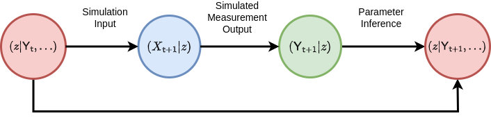
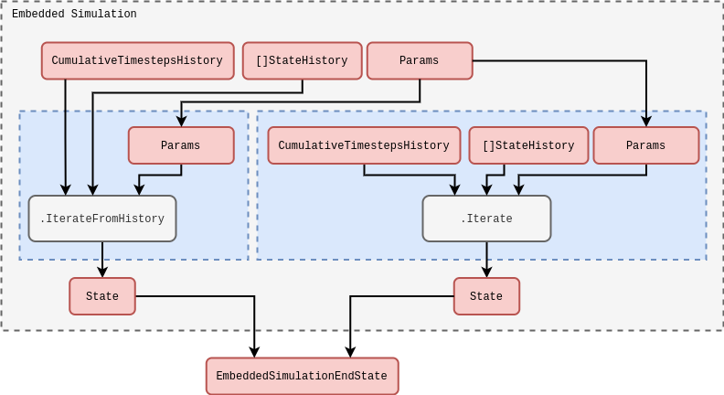
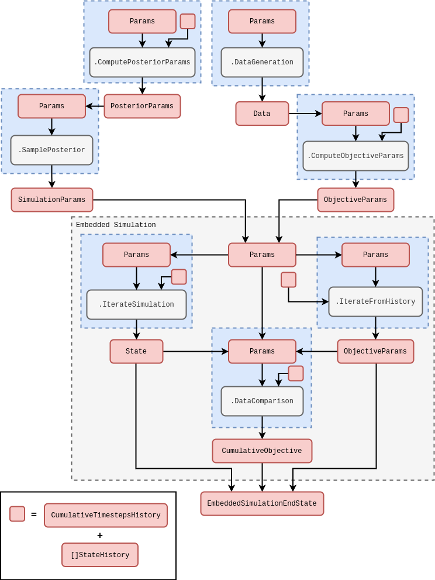

## Introduction

Let's begin by considering how one might structure the learning of an objective with respect to a stream of time series data. One of the issues that can arise when learning streams of data is 'concept drift'. In our context, this would be when the optimal value for $z$ (the latent parameters of our process, see [@stochadexI-2024] and [@stochadexII-2024] for context) does not match the optimal value at some later point in time. In order to mitigate this, our learning algorithms should be able to track an up-to-date optimal value for $z$ as data is continually passed into them. Iteratively updating the optimal parameters as new data is ingested into the objective function is typically called 'online learning' --- see, e.g., [@hazan2016introduction], [@sutton2018reinforcement], [@river] and [@vowpalwabbit] --- in contrast to 'offline learning' which would correspond to learning an optimal $z$ only once with the entire dataset provided upfront.

This article is about getting to the point where we can leave a simulation to 'learn itself' from an injested stream (or streams) of data. In order to do this learning in a robust manner, we must ensure the resulting framework has adaptability to _new data_. Stochastic processes are inherently sequential, and many types of system evolve not just their states, but also dynamical description, over time. Online learning is the natural framework to use in this context. But note that a framework which can learn 'online' can typically be adapted to an 'offline' scenario, if desired. So one might argue we're really only extending the scope of applicability beyond offline learning.

To get online learning working for a simulation in the general case, we need to contend with more issues that just the number of parameters. Furthermore, the objective functions are typically stochastic and gradients are not directly available. Hence, in the next section on generalised simulation inference, it will be necessary to develop our own online learning concepts which work robustly even in this challenging optimisation environment.

## Online learning a generalised simulation

Since simulations are a kind of causal model which we would like to infer from the data, we will begin by reviewing the basics of Bayesian inference in the present context. Following Bayes' rule, one can relate the prior probability distribution over a parameter set ${\cal P}(z)$ and the likelihood ${\cal L}_{{\sf t}+1}(Y\vert z)$  of some data matrix $Y$ up to timestep ${\sf t}+1$ given the parameters $z$ of a model to the posterior probability distribution of parameters given the data ${\cal P}_{{\sf t}+1}(z \vert Y)$ up to some proportionality constant, i.e.,

$$
\begin{align}
{\cal P}_{{\sf t}+1}(z \vert Y) \propto {\cal L}_{{\sf t}+1}(Y\vert z){\cal P} (z) \label{eq:bayes-rule} \,.
\end{align}
$$

All of this statistical language can get overly formal, so it can also be helpful to summarise what the formula above states verbally as follows: the initial (prior) state of knowledge about the parameters $z$ we want to learn can be updated by some likelihood function of the data to give a new state of knowledge about the values for $z$ (the 'posterior' probability).

From the point of view of statistical inference, if we seek to maximise ${\cal P}_{{\sf t}+1}(z \vert Y)$ --- or its logarithm --- in the equation above with respect to $z$, we will obtain what is known as a maximum posteriori (MAP) estimate of the parameters. In fact, we have already encountered this methodology in [@stochadexII-2024] when discussing the algorithm which obtains the best fit parameters for the empirical probabilistic reweighting. In that case we had the log-likelihood directly as our objective function, but this is also technically equivalent to obtaining a MAP estimate where one chooses a specfic prior ${\cal P} (z) \propto 1$ (typically known as a 'flat prior').

How might we calulate the posterior in practice with some arbitrary stochastic process model that has been defined in the stochadex? In order to make the comparison to a real dataset, any stochadex model of interest will always need to be able to generate observations which can be directly compared to the data. To formalise this a little; a stochadex model could be represented as a map from $z$ to a set of stochastic measurements ${\sf Y}_{{\sf t}+1}(z), {\sf Y}_{{\sf t}}(z), \dots$ that are directly comparable to the rows in the real data matrix $Y$. The values in $Y$ may only represent a noisy or partial measurement of the latent states of the simulation $X$, so a more complete picture can be provided by the following probabilistic relation

$$
\begin{align}
P_{{\sf t}+1}({\sf y} \vert z) = \int_{\omega_{{\sf t}+1}}{\rm d}^nx\, P_{{\sf t}+1}({\sf y} \vert x)P_{{\sf t}+1}(x \vert z) \,, \label{eq:simulation-measurement}
\end{align}
$$

where, in practical terms, the measurement probability $P_{{\sf t}+1}({\sf y} \vert x)$ of ${\sf Y}_{{\sf t}+1}={\sf y}$ given $X_{{\sf t}+1}=x$ can be represented by sampling from another stochastic process which takes the state of the stochadex simulation as input. Given that we have this capability to compare like-for-like between the data and the simulation; the next problem is to figure out how this comparison between two sequences of vectors can be done in a way which ensures the the statistics of the posterior are ultimately respected. Another way of seeing this is we need a mechanism to perform the 'Parameter Inference' step in the diagram below where the simulated measurements effectively match the real measurements (at least to a good approximation).

For an arbitrary simulation model which is defined by the stochadex, the likelihood in Bayes' rule is typically not describable as a simple function or distribution. While we could train the probability reweighting we derived in [@stochadexII-2024] to match the simulation; to do this well would require having an exact formula for the conditional probability, and this is not always easy to derive in the general case. Instead, there is a class of Bayesian inference methods which we shall lean on to help us compute the posterior distribution (and hence the MAP), which are known as 'Likelihood-Free' methods --- see, e.g., [@sisson2018handbook], [@price2018bayesian], [@wood2010statistical] and [@drovandi2022comparison].

'Likelihood-Free' methods work by separating out the components of the posterior which relate to the closeness of rows in ${\sf Y}$ to the rows in $Y$ from the components which relate the states $X$ and parameters $z$ of the simulation stochastically to ${\sf Y}$. To achieve this separation, we can make use of chaining conditional probability like this

$$
\begin{align}
{\cal P}_{{\sf t}+1}(X,z\vert Y)=\int_{\Upsilon_{{\sf t}+1}} {\rm d}{\sf Y} \, {\cal P}_{{\sf t}+1}({\sf Y}\vert Y) P_{{\sf t}+1}(X,z \vert {\sf Y}) \label{eq:likelihood-free-posterior} \,,
\end{align}
$$

where $\Upsilon_{{\sf t}+1}$ here corresponds to the domain of the simulated measurements matrix ${\sf Y}$ at timestep ${\sf t}+1$.

It's possible for us to also optimise a probability distribution ${\cal P}_{{\sf t}'}({\sf y}\vert Y) = P_{{\sf t}'}({\sf y};{\cal M}_{{\sf t}'},{\cal C}_{{\sf t}'},\dots )$ for each step in time to match the statistics of the measurements in $Y$ as well as possible, given some statistics ${\cal M}_{{\sf t}'}={\cal M}_{{\sf t}'}(Y)$ and ${\cal C}_{{\sf t}'}={\cal C}_{{\sf t}'}(Y)$. Assuming the independence of samples (rows) in $Y$, this distribution can be used to construct the distribution over all of $Y$ through the following product

$$
\begin{align}
{\cal P}_{{\sf t}+1}({\sf Y}\vert Y) = \prod_{{\sf t}'=({\sf t}+1)-{\sf s}}^{({\sf t}+1)}P_{{\sf t}'}({\sf y};{\cal M}_{{\sf t}'},{\cal C}_{{\sf t}'},\dots ) \,.
\end{align}
$$

We do not necessarily need to obtain these statistics from the probability reweighting method, but could instead try to fit them via some other objective function, e.g., that of Gaussian processes. Either way, this represents a lossy _compression_ of the data we want to fit the simulation to, and so the best possible fit is desirable; regardless of overfitting. Note that this choice to summarise the data with statistics means we are using what is known as a Bayesian Synthetic Likelihood (BSL) method (see [@price2018bayesian] or [@wood2010statistical]) instead of another class of methods which approximate an objective function directly using a proximity kernel --- known as Approximate Bayesian Computation (ABC) methods [@sisson2018handbook].

Let's consider a few concrete examples of $P_{{\sf t}'}({\sf y};{\cal M}_{{\sf t}'},{\cal C}_{{\sf t}'}, \dots )$. If the data measurements were well-described by a multivariate normal distribution, then

$$
\begin{align}
P_{{\sf t}'}({\sf y};{\cal M}_{{\sf t}'},{\cal C}_{{\sf t}'}, \dots ) = {\sf MultivariateNormalPDF}({\sf y};{\cal M}_{{\sf t}'},{\cal C}_{{\sf t}'})\,,
\end{align}
$$

Similarly, if the data measurements were instead better described by a Poisson distribution, we might disregard the need for a covariance matrix statistic ${\cal C}_{{\sf t}'}$ and instead use

$$
\begin{align}
P_{{\sf t}'}({\sf y};{\cal M}_{{\sf t}'},{\cal C}_{{\sf t}'}, \dots ) = {\sf PoissonPMF}({\sf y};{\cal M}_{{\sf t}'})\,.
\end{align}
$$

The more statistically-inclined readers may notice that the probability mass function here would require the integrals in the likelihood-free posterior to be replaced with summations over the relevant domains.

The likelihood-free posterior demonstrates how one can construct a statistically meaningful way to compare the sequence of real data measurements $Y_{{\sf t}+1}, Y_{{\sf t}}, \dots$ to their modelled equivalents ${\sf Y}_{{\sf t}+1}(z), {\sf Y}_{{\sf t}}(z), \dots$. But we still haven't shown how to compute $P_{{\sf t}+1}(X,z\vert {\sf Y})$ for a given simulation, and this can be the most challenging part. To begin with, we can reapply Bayes' rule and the chaining of conditional probability to find

$$
\begin{align}
P_{{\sf t}+1}(x,z\vert {\sf Y}) \propto P_{{\sf t}+1}({\sf y}\vert x)P_{{\sf t}+1}(x\vert z)P_{{\sf t}}(z\vert {\sf Y}') \,,
\end{align}
$$

where here $P_{{\sf t}}(z\vert {\sf Y}')$ is the probability of ${\sf Y}_{{\sf t}}={\sf Y}'$.

The relationship between $P_{{\sf t}+1}(X\vert z)$ and previous timesteps can be directly inferred from the probabilistic iteration formula that we introduced in [@stochadexII-2024]. So we can map probabilities of $X_{({\sf t}+1)-{\sf s}:({\sf t}+1)} = X$ throughout time and learned information about the state of the system can be applied from previous values, given $z$. But is there a similar relationship we might consider for $P_{{\sf t}+1}(z\vert {\sf Y})$? Yes there is! The marginalisation

$$
\begin{align} 
P_{{\sf t}+1}(z\vert {\sf Y}) &\propto \bigg[ \int_{\Omega_{{\sf t}+1}} {\rm d}^nx \,P_{{\sf t}+1}({\sf y}\vert x) P_{{\sf t}+1}(x\vert z) \bigg] P_{{\sf t}}(z\vert {\sf Y}') \label{eq:z-update}\,,
\end{align}
$$

shows how the $z$ updates can occur in an iterative fashion. The reader may also recognize the factor above in brackets as the simulation measurement integral we wrote earlier. To complete the picture, one can combine the $X$ and $z$ updates into a joint distribution update which takes the following form

$$
\begin{align} 
P_{{\sf t}+1}(X,z\vert {\sf Y}) &\propto P_{{\sf t}+1}({\sf y}\vert x) P_{({\sf t}+1){\sf t}}(x\vert X', z) P_{{\sf t}}(X',z\vert {\sf Y}') \label{eq:x-z-update}\,.
\end{align}
$$

Note that by calculating the overall normalisation of the right hand side of this expression, we are computing the synthetic Bayesian evidence ${\sf e}_{{\sf t}+1}({\sf y}\vert {\sf Y}')$ (the value typically used in constructing the 'Bayes factor' for model selection) for updating the joint distribution update at timestep ${\sf t}+1$, i.e.,

$$
\begin{align}
{\sf e}_{{\sf t}+1}({\sf y}\vert {\sf Y}') = \int_{\zeta_{{\sf t}+1}} {\rm d}z \int_{\Omega_{{\sf t}+1}} {\rm d}X\, P_{{\sf t}+1}({\sf y}\vert x) P_{({\sf t}+1){\sf t}}(x\vert X', z) P_{{\sf t}}(X',z\vert {\sf Y}') \,,
\end{align}
$$

where $\zeta_{{\sf t}+1}$ just corresponds to the integration domain over $z$ at timestep ${\sf t}+1$.

To understand how all of this translates to online learning it will be important to consider what happens if the model changes over time and $z$ needs to change in order to better represent the real data. Note that the relation above only considers $z$ to be _constant_ throughout the truncated state history of $X_{{\sf t}-{\sf s}:{\sf t}}=X'$, and so ideally we we'd want some way of updating $z$ for the next computational step without invalidating this relationship.

One might initially consider solutions to this problem which involve correlated sampling of $z$ to keep its value approximately constant over this defined window of interest while still managing to evolve its value over some timescale. The main problem with this idea is that the 'reactiveness' of $z$ to changes in the statistical properties of the incoming data is then fixed by the timescale implied by this window --- which might be undesirable in many situations.

If we, instead, note that the joint distribution that we want to sample from (and ultimately optimise) can be obtained by chaining together past iterations of the simulation like so

$$
\begin{align}
P_{{\sf t}+1}(X,z\vert {\sf Y}) \simeq P_{({\sf t}+1)({\sf t}-{\sf s})}(X,z\vert X',{\sf Y}) = P_{({\sf t}+1){\sf t}}(z\vert X',{\sf Y})\prod_{{\sf t}'={\sf t}-{\sf s}}^{{\sf t}}P_{({\sf t}'+1){\sf t}'}(x\vert X'', z) \,,
\end{align}
$$

this implies that by sampling new histories of the simulation from the past window edge up to the present point in time, we may use some model for $P_{({\sf t}+1){\sf t}}(z\vert X',{\sf Y})$ to obtain samples from the joint distribution $P_{{\sf t}+1}(X,z\vert {\sf Y})$. Note that the expression we have written above is only approximate up to the exclusion of the initial condition in the state history on the left hand side, i.e., $P_{{\sf t}+1}(X,z\vert {\sf Y}) \simeq P_{({\sf t}+1)({\sf t}-{\sf s})}(X,z\vert X',{\sf Y})$. We are ignoring this initial condition as we will assume that the window is sufficiently long to cause any influence of this initial history on the final state to be negligible --- at least after a sufficient burn-in period.

So the more computationally-intensive solution to the original problem (which works much more generally) is to simply rerun the past steps of the simulation from the timestep at the edge of the window $({\sf t}+1)-{\sf s}$ up to ${\sf t}+1$ for each new timestep. This method ensures that $z$ is constant throughout the past time window and we may also update the value of $z$ on any timescale of reactiveness. In order to facilitate this solution, we will need to be able to run a simulation for a fixed number of steps _inside_ the step of another simulation. We will discuss how this new concept of 'embedded simulations' should work within the stochadex package in the next section.

How might we deliberately control how reactive this $z$-learning framework is to changes in the data? One possibility is to impose an evidence normalisation ansatz which applies a 'past-discounting factor' between the distribution over $(X,z)$ in the present moment and the distributions evaluated in the past, like this

$$
\begin{align}
{\sf e}_{{\sf t}+1}({\sf y}\vert {\sf Y}') = \beta {\sf e}_{{\sf t}}({\sf y}'\vert {\sf Y}'') \,\, \Longleftrightarrow \,\, {\sf e}_{{\sf t}+1}({\sf y}\vert {\sf Y}') = \beta^{{\sf s}+1}{\sf e}_{{\sf t}-{\sf s}}({\sf y}''\vert {\sf Y}''') + \sum_{{\sf t}'=({\sf t}+1)-{\sf s}}^{({\sf t}+1)} \beta^{{\sf t}+1-{\sf t}'} {\sf e}_{{\sf t}'}({\sf y}'\vert {\sf Y}'') \,.
\end{align}
$$

One might also call this a 'past-discounted' version of the distribution where $0 < \beta < 1$. Note that in the continuous-time version, this past-discounting factor could depend on the stepsize such that we replace

$$
\begin{align}
\beta^{{\sf t}+1-{\sf t}'} \longrightarrow \frac{1}{\beta [\delta t({\sf t}+1)]}\prod_{{\sf t}''={\sf t}'}^{{\sf t}+1} \beta [\delta t({\sf t}'')] \,.
\end{align}
$$

The discount factor $\beta$ reduces the dependence of the update on data which is much further in the past, providing some control over the responsiveness in the simulation inference algorithm. This responsiveness would have to be balanced with the tradeoffs associated with discounting potentially valuable data that may offer greater long-term stability. Readers who are familiar with Reinforcement Learning may be starting to feel in familiar territory here --- but they will have to wait for a future article to see more on discounting!

The update equation for the joint distribution tells us how to probabilistically translate the current state of knowledge about $(X,z)$ forward through time in response to the arrival of new data --- where we may also apply our discounted distribution ansatz to control the responsiveness of this update. We also know how to connect the simulated measurements to the real data because the BSL techniques we discussed earlier essentially give us an objective function to maximise for each step in time. Lastly, by rerunning the simulation from the past window edge up to the present moment for each new timestep of the data stream, we have the last piece of the puzzle which connects the inference of the simulation posterior to some form of online learning framework. It's now time to discuss the algorithm in more detail.

## Algorithm design and implementation

The inference algorithm which we will now introduce is a variant of recursive Bayes estimation [@arulampalam2002tutorial] that also uses a Monte Carlo kind of Expectation-Maximisation to sample new simulation parameters --- see [@hartley1958maximum], [@dempster1977maximum] and also [@murphy2012machine]. The main idea is use some approximation for the conditional density of $P_{({\sf t}+1){\sf t}}(z\vert X',{\sf Y})$, use this approximation to sample new values for $z$ as time progresses forward (i.e., the 'Maximisation' step which is actually more of a Monte Carlo sampling/exploration) and update the $P_{({\sf t}+1){\sf t}}(z\vert X',{\sf Y})$ approximation as new data is received using the discounted distribution ansatz and one of our data comparison objectives (i.e., the 'Expectation' step). Readers with some machine learning experience may be familiar with the classic exploration vs exploitation tradeoffs within this proposed inference framework. These are issues are likely to arise regardless of the algorithm we choose.

There are a number of choices we could make for approximating the density of $P_{({\sf t}+1){\sf t}}(z\vert X',{\sf Y})$ such that we are able to both update its shape with the arrival of new data as well as sample new values from it --- in both cases being able to incorporate the discounted distribution ansatz into the model. The simplest would be to estimate this distribution through just its mean and covariance statistics, updating them through standard objective-weighted estimation and sampling new values with a Gaussian shape approximation; and this is the implementation we shall focus on in this article. Note, however, that applying Gaussian processes or neural networks (e.g., via some amortized inference mechanism [@radev2020bayesflow]) or generalising the sampling step to a sequential Monte Carlo/particle filter [@wills2023sequential] in this situation could yield much more accurate approximations, especially if the distribution is multi-modal.

Before we discuss how we will implement the online inference algorithm within the stochadex simulation engine, we need to consider a necessary extension to the latter which will allow us to run a fixed number of steps of an 'embedded simulation' for each step of a broader simulation run. The easiest way to do this is to implement a new kind of embedded simulation iteration, which takes the same inputs as any other iteration in the engine, and outputs the combined end state of the simulation within as its iteration output. We have illustrated this idea in a rough schematic below.

In the schematic above, note how we have also illustrated the different kinds of iteration which can be supported inside the embedded simulation iteration. The standard iteration on the right needs no additional description, but the $\texttt{.IterateFromHistory}$ one is a special feature which allows us to define iterations that output values from a stored memory of the state history accessible from the outside of the embedded simulation. This latter type of iteration is especially useful in avoiding having to recalculate values which already exist in the state history of the broader simulation for every run instance of the embedded simulation; enabling more performant code configurations.

Now that we have introduced the concept of embedded simulations within the stochadex in more detail, we're ready to discuss the specific implementation of our simulation inference framework. Conceptually, the simulation inference algorithm is designed to separate out components of work into small computational units that fit nicely within the stochadex engine formalism. The rough general schematic for this code is given below.

The schematic above should be general enough to apply (with only minor tweaks at most) regardless of our choice of data generating process, data comparison objective or model for the posterior distribution. All of the computational blocks in this diagram can be expanded out into more complex sub-blocks with the same I/O signature, e.g., the $\texttt{.IterateSimulation}$ block could represent a much larger collection of inter-dependent threads within the embedded simulation. The $\texttt{.DataGeneration}$ block could also represent streaming data into the simulation from any user-defined source, e.g., from a file on disk, from a local database instance or maybe via a network socket. Note also how we are making use of an $\texttt{.IterateFromHistory}$ block to run through the past objective parameters (i.e., the ${\cal M}_{{\sf t}'},{\cal C}_{{\sf t}'}, \dots$ distribution parameters used to define the BSL) which are obtained from the computed state history outside of the embedded simulation.

The schematic above also shows how an simulation inference algorithm can itself be run as a simulation within the same stochadex framework. This illustrates the flexibility of configuration that this available to the user in the latter, but also gives rise to the idea of a generalised 'self-learning simulation' which dynamically updates its parameters in response to new data being ingested from a variety of sources. The reader may also find exploring configs in [https://github.com/umbralcalc/stochadex/tree/main/cfg](https://github.com/umbralcalc/stochadex/tree/main/cfg) useful in understanding how the description above translates into specific configuration files.

## References
