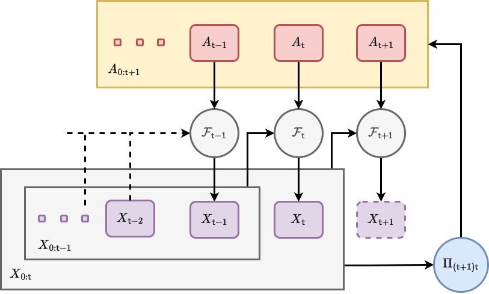

## Action formalism

Let's start by considering how we might adapt the mathematical formalism we introduced in [@stochadexI-2024] to be able to take actions which can manipulate the state at each timestep. Using the mathematical notation from that article, we may extend the formula for updating the state history matrix $X_{0:{\sf t}}\rightarrow X_{0:{\sf t}+1}$ to include a new layer of possible interactions which is facilitated by a new vector-valued 'action-taking' function $G_{{\sf t}}$.

During a timestep over which actions are taken, the stochadex state update formula can be extended to include interactions by composition with the original state update function like so

$$
\begin{align}
X_{{\sf t}+1}^i &= G^i_{{\sf t}+1}[F_{{\sf t}+1}(X_{0:{\sf t}}, z, {\sf t}), A_{{\sf t}+1}] = {\cal F}^i_{{\sf t}+1}(X_{0:{\sf t}}, z, A_{{\sf t}+1}, {\sf t}) \,,
\end{align}
$$

where we have also introduced the concept of the 'actions' performed $A_{{\sf t}+1}$ on the system; some vector of parameters which define what actions are taken at timestep ${\sf t}+1$.

So far, the equation we wrote above on its own will allow us to _take_ actions. So what's next? Generating them. Since generating actions will typically require knowledge of the system state, we need to develop a formalism which 'closes the loop' by feeding information back from the system to the decision-maker. To fully appreciate how this will work mathematically, we're also going to need to move into a probabilistic formalism such as the one we introduced in [@stochadexII-2024].

If we use $A_{0:{\sf t}+1}$ as referring to the matrix of historically-taken actions which up to time ${\sf t}+1$, we can build up a more generalised, history-dependent picture of interactions with the system which matches the notation we are already using for $X_{0:{\sf t}+1}$. Let us now generally define a Non-Markovian Decision Process (NMDP) as a probabilistic model which draws an actions matrix $A_{0:{\sf t}+1}=A$ from a 'policy' distribution $\Pi_{({\sf t}+1){\sf t}}(A\vert X,\theta)$ given $X_{0:{\sf t}}=X$ and a new vector of parameters which together fully specify the generation of actions. Using the probabilistic notation from the previous part of the book, the joint probability that $X_{0:{\sf t}+1}=X$ and $A_{0:{\sf t}+1}=A$ at time ${\sf t}+1$ is

$$
\begin{align}
P_{{\sf t}+1}(X,A\vert z, \theta ) &= P_{{\sf t}}(X'\vert z,\theta ) \, \Pi_{({\sf t}+1){\sf t}}(A\vert X',\theta)P_{({\sf t}+1){\sf t}}(x\vert X',z,A) \,,
\end{align}
$$

where we recall that $P_{({\sf t}+1){\sf t}}(x\vert X',z,A)$ is the conditional probability of $X_{{\sf t}+1}=x$ given $X_{0:{\sf t}}=
X'$ and $z$ that we have encountered before, but it now requires $A_{0:{\sf t}+1}=A$ as another given input. We have illustrated taking of actions while evolving the system state and how it relates to the policy distribution with a new graph representation below.

Note also that by marginalising over the joint probability above, we find an updated probabilistic iteration formula for the stochastic process state which now takes the actions into account

$$
\begin{align}
P_{{\sf t}+1}(X\vert z,\theta ) &= \int_{\Xi_{{\sf t}+1}}{\rm d}A \, P_{{\sf t}}(X'\vert z,\theta ) \, \Pi_{({\sf t}+1){\sf t}}(A\vert X',\theta)P_{({\sf t}+1){\sf t}}(x\vert X',z,A)  \,.
\end{align}
$$

Let's take a moment to think about what $\Pi_{({\sf t}+1){\sf t}}(A\vert X,\theta)$ represents and how generally descriptive it can be. If we have an entirely deterministic policy, then the policy distribution may be simplified to a direct function mapping which is parameterised by $\theta$. At the other extreme, the distribution may also describe a fully stochastic policy where actions are drawn randomly in time. If we combine this consideration of noise with the observation that policies described by a distribution $\Pi_{({\sf t}+1){\sf t}}(A\vert X,\theta)$ permit a memory of past actions and states, it's easy to see that this structure can be used in a wide variety of different use cases.

What are the main categories of action which are possible in the rows of $A$? Since the NMDP described by $\Pi_{({\sf t}+1){\sf t}}(A\vert X',\theta)$ is just another form of stochastic process, the main categories of action will fall into the same as those we covered in defining the stochadex formalism. The first, and perhaps most obvious, category would probably where the actions are defined in a continuous space and are continuously applied on every timestep. Some examples of these 'continuously-acting' decision processes include controlling the temperature of chemical reactions [@beeler2023chemgymrl] (such as those in a brewery), spacecraft control [@tipaldi2022reinforcement] and guidance systems,  as well as the driving of autonomous vehicles [@kiran2021deep]. Within a kind of subset of the continuously-acting category; we can also find the event-based acting decision processes (where actions are not necessarily taken every timestep), e.g. controlling traffic through signal timings [@garg2018deep], managing disease spread through treatment intervals [@ohi2020exploring] and automated trading on stock markets [@meng2019reinforcement].

Many of the examples we have given above have continuous action spaces, but we might also consider classes of decision processes where actions are defined discretely. Examples of these include the famous multi-armed bandit problem [@gittins2011multi] (like choosing between website layouts for E-commerce [@liu2021map]), managing a sports team through player substitutions, sensor measurement scheduling [@leong2020deep] and the sequential design prioritisation of large-scale scientific experiments [@blau2022optimizing]

## States, actions and attributing rewards

We now have the basic building blocks needed to generate and take actions within our simulated system. So the next step in this article is to find a way to create optimal decision-making algorithms. The key question to answer then, is: _optimal with respect to what objective?_

The objective of some action-taking algorithm could take many forms depending on the specific context. Since there is no loss in generality in doing so, it seems natural to follow the naming convention used by standard Markov Decision Processes (MDP) (see [@bertsekas2011dynamic] and [@sutton2018reinforcement]) by referring to the objective outcome of an action at a particular point in time as having a 'reward' value $r$. Since the relationship between reward, actions and states may be stochastic, it makes sense to relate the reward outcome $r$ given a state history $X$ and action history $A$ at timestep ${\sf t}+1$ through the probability distribution $P_{{\sf t}+1}(r\vert X,A)$.

We can use the reward probability distribution to derive a joint distribution over both state history $X'$ and reward $r$ at timestep ${\sf t}+1$ like so

$$
\begin{align}
P_{({\sf t}+1){\sf t}}(r,x'\vert X, z,\theta) &= P_{{\sf t}+1}(r\vert X',A)\Pi_{({\sf t}+1){\sf t}}(A\vert X,\theta)P_{({\sf t}+1){\sf t}}(x'\vert X,z,A)\,.
\end{align}
$$

In this expression, let's recall that we are using the policy distribution $\Pi_{({\sf t}+1){\sf t}}(A\vert X,\theta)$ for action generation and the fundamental state update conditional probability for the underlying stochastic process $P_{({\sf t}+1){\sf t}}(x'\vert X,z,A)$.

Using the equation above, we can now define a 'state value function' $V_{{\sf t}}$ at timestep ${\sf t}$ which is the expected $\gamma$-discounted cumulative future reward given the current state history $X$ and the other parameters like this

$$
\begin{align}
V_{{\sf t}}(X,z,\theta) &= {\rm E}_{{\sf t}}({\sf Discounted \,Cumulative \,Reward}\vert X, z, \theta ) \nonumber \\
&= \sum_{{\sf t}'={\sf t}}^{\infty} \int_{\omega_{{\sf t}'+1}}{\rm d}^nx'\int_{\rho_{{\sf t}'+1}} {\rm d}r \,r\, \gamma^{{\sf t}'-{\sf t}}\prod_{{\sf t}''={\sf t}}^{{\sf t}'}P_{({\sf t}''+1){\sf t}''}(r,x'\vert X, z,\theta)\,,
\end{align}
$$

where $0 < \gamma < 1$. Note that the discount factor in continuous time could also be explicitly dependent on the stepsize such that we would replace the discount factor with

$$
\begin{align}
\gamma^{{\sf t}'-{\sf t}} \longrightarrow \frac{1}{\gamma [\delta t({\sf t}+1)]}\prod_{{\sf t}''={\sf t}}^{{\sf t}'} \gamma [\delta t({\sf t}''+1)] \,.
\end{align}
$$

The idea behind this discount factor $\gamma$ is to decrease the contribution of rewards to the optimisation objective --- often called the 'expected discounted return' in Reinforcement Learning (RL) --- more and more as the prediction evolves into the future. Note also that the state value function is inherently recursively defined, such that

$$
\begin{align}
V_{{\sf t}}(X,z,\theta) &= \int_{\omega_{{\sf t}+1}}{\rm d}^nx\int_{\rho_{{\sf t}+1}} {\rm d}r \, P_{({\sf t}+1){\sf t}}(r,x'\vert X, z,\theta)\big[ r+\gamma V_{{\sf t}+1}(X',z,\theta)\big] \,,
\end{align}
$$

and the optimal $\theta$ can hence be derived from

$$
\begin{align}
\theta^*_{{\sf t}}(X,z) &= \underset{\theta}{{\rm argmax}} \big[ V_{{\sf t}}(X,z,\theta)\big] \,.
\end{align}
$$

By deriving the optimal policy in terms of the parameters $\theta^*_{{\sf t}}(X,z)$, the optimal state value function and policy distribution can therefore be derived from

$$
\begin{align}
V^*_{{\sf t}}(X,z) &= V_{{\sf t}}[X,z,\theta^*_{{\sf t}}(X,z)] \\
\Pi^*_{({\sf t}+1){\sf t}}(A\vert X,z) &= \Pi_{({\sf t}+1){\sf t}}[A\vert X,\theta^*_{{\sf t}}(X,z)] \,.
\end{align}
$$

Note that the type of decision process optimisation which we have introduced above differs from standard $Q$-learning RL methodology. In the more conventional 'model-free' RL approaches, the state-action value function

$$
\begin{align}
Q_{{\sf t}}(X,A,z)={\rm E}_{{\sf t}}({\sf Discounted \,Return}\vert X,A,z) \,,
\end{align}
$$

would be used to evaluate the optimal policy instead of the state value function $V_{{\sf t}}(X,z,\theta )$ that we are using above. We are able to use the latter here because the simulation model gives us explicit knowledge of the $P_{({\sf t}+1){\sf t}}(x'\vert X,z,A)$ distribution which is utilised in the computation of $V_{{\sf t}}(X,z,\theta )$. When this model is not known, the state-action value function $Q_{{\sf t}}(X,A,z)$ must be learned explicitly through sample estimation from the measured state and experienced outcomes of the actions taken.

## Algorithm design and implementation

We're now ready to discuss how we will embed the optimal action learning algorithm described in the previous section in the computational graph structure of the stochadex simulation itself.

**Continue editing from here...**

Best solution to this optimisation problem appears to the Streaming Evolution Strategies (CMA-ES) [@beyer2017simplify] using Cumulative discounted Rewards computed via Monte Carlo Rollouts. Work from this...

Talk about the utility of the model-based online learning approach in the case of partially observed systems [@aastrom1965optimal]. Also look into the overlaps with this approach and Thompson sampling for exploration --- discuss here. Looking at a stochastic policy iteration algorithm here combined with Monte Carlo rollouts.

Note that, in most use cases, the state of real-world phenomena cannot be measured perfectly. So in order to use simulated phenomena to potentially act in the real world, one typically will need to include a measurement process as part of the information retrieval step. For this we could leverage our work in a previous article [@stochadexIII-2024] which develops an online learning system for stochastic process models. The partitioning structure of stochadex simulations should make adding this capability on to the action-taking algorithms described in this article extremely easy, and we anticipate many interesting applications to projects in the future.

## References
