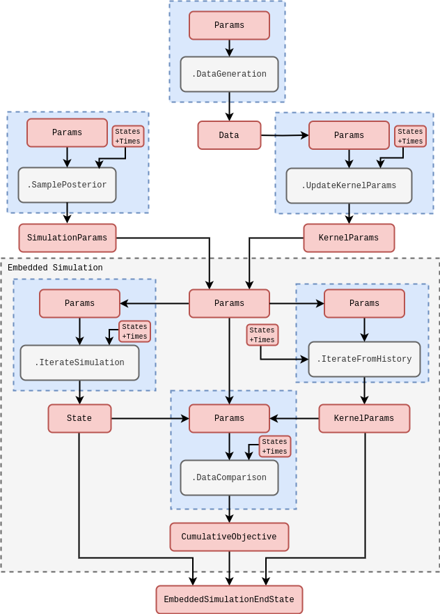
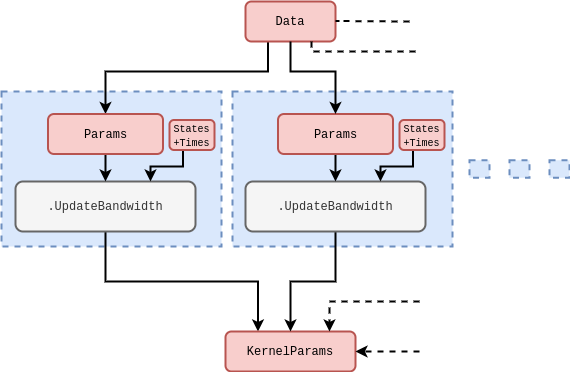

## Introduction

In a previous article [@stochadexIII-2024] we used a simple, but effective, technique to approximate the conditional density of simulation parameters $P_{({\sf t}+1){\sf t}}(z\vert X',{\sf Y})$ such that we were able to both update its shape with the arrival of new data as well as sample new values from it while incorporating a past-discounting distribution ansatz into the model. While robust, this technique only estimated the first two moments of the posterior distribution and that of the synethetic likelihood used to compare simulation states to the data. Ideally, we would like to be able to efficiently sample from the posterior regardless of likelihood/posterior shape and modality.

It is the aim of this article to generalise our distribution sampler using an adaptive sequential Monte Carlo algorithm (see [@del2006sequential] or [@wills2023sequential]) which uses a density kernel to update the importance weights of simulation $(X,z)$ samples as they are taken. This particle filter will, in principle, be capable of adaptively sampling from practically any posterior distribution shape, regardless of stationarity.

Before launching into a description of the algorithm, let's ensure the mathematical details have been covered. To formalise our approach to density estimation, we first recall from [@stochadexII-2024] our fully general description for the time evolution of probabilities over simulation states

$$
\begin{align}
P_{{\sf t}+1}(x\vert z) &= \int_{\Omega_{{\sf t}}} {\rm d}X' P_{{\sf t}}(X'\vert z) P_{({\sf t}+1){\sf t}}(x\vert X',z) \,.
\end{align}
$$

Assuming that the state space is continuous (transformations will always exist to handle discrete variables too), we can approximate the conditional probability of this expression with a sum of logarithmic expansions around past states which are truncated at second order

$$
\begin{align}
\ln P_{({\sf t}+1){\sf t}}(x\vert X',z) &\simeq \sum_{{\sf t}'={\sf t}-{\sf s}}^{\sf t}\bigg[ \ln P_{({\sf t}+1){\sf t}}(x{=}X_{{\sf t}'}\vert X',z) + \frac{1}{2}\sum^n_{i=0}\sum^n_{j=0}(x-X_{{\sf t}'})^i{\cal H}^{ij}_{({\sf t}+1){\sf t}'}(X')(x-X_{{\sf t}'})^j \bigg] \\
{\cal H}^{ij}_{({\sf t}+1){\sf t}'}(X') &= \frac{\partial^2}{\partial x^i\partial x^j}\ln P_{({\sf t}+1){\sf t}}(x\vert X',z) \bigg\vert_{x{=}X_{{\sf t}'}} \,,
\end{align}
$$

where we have assumed that the conditional probability peaks when the past state equals the future one $X_{{\sf t}'}=x$ (such that the first derivatives of the expansion all vanish). Note that we have also truncated the state history depth up to some number of timesteps ${\sf s}$ to write an expression which is closer to that of the computation in practice, as in previous work.

Given the expression above, it's therefore quite natural to consider the following kernel density approximation

$$
\begin{align}
P_{{\sf t}+1}(X\vert z) \simeq Q_{{\sf t}+1}(X\vert z) \propto \sum_{{\sf t}'={\sf t}-{\sf s}}^{{\sf t}}\int_{\Omega_{{\sf t}}} {\rm d}X' P_{{\sf t}}(X'\vert z) K[x,X_{{\sf t}'};{\cal H}_{({\sf t}+1){\sf t}'}(X')] \,,
\end{align}
$$

where $K(x,x';H)$ is some smoothing kernel which takes the form

$$
\begin{align}
K(x,x';H) &\propto \big\vert H \big\vert^{-\frac{1}{2}} \exp \bigg[ -\frac{1}{2}\sum_{i=0}^n\sum_{j=0}^n(x-x')^i(H^{-1})^{ij}(x-x')^j\bigg] \,,
\end{align}
$$

where $H$ is the bandwidth matrix.

In order for the kernel to adapt to the changes in the shape of the probability density over time, we will need to provide a mechanism for updating each bandwidth matrix ${\cal H}_{({\sf t}+1){\sf t}'}(X')$ in response to these changes. This ends up being fairly straightforward if we borrow some concepts from Bayesian analysis.

The conjugate prior for a Bayesian update of the bandwidth matrix would naturally be the inverse-Wishart distribution

$$
\begin{align}
&{\sf InverseWishartPDF}[{\cal H}_{({\sf t}+1){\sf t}'};\Psi_{({\sf t}+1){\sf t}'},d] = \\
& \qquad 2^{-\frac{dn}{2}}\Gamma^{-1}_n\bigg( \frac{d}{2}\bigg)\vert \Psi\vert^{\frac{d}{2}} \vert H_{({\sf t}+1){\sf t}'}\vert^{-\frac{(d+n+1)}{2}}{\rm exp}\bigg\{-\frac{1}{2}\sum_{i=0}^n[\Psi_{({\sf t}+1){\sf t}'}{\cal H}^{-1}_{({\sf t}+1){\sf t}'}]^{ii}\bigg\} \,,
\end{align}
$$

where here $\Gamma_n$ is the multivariate gamma function. Upon updating this prior with a likelihood which follows the same square-exponential (multivariate normal) shape as the smoothing kernel we introduced above via Bayes' rule, it is equivalent to simply update the parameters of the inverse-Wishart distribution like so

$$
\begin{align}
(\Psi^{ij}_{({\sf t}+1){\sf t}'})^{{\sf m}+1} &= \beta (\Psi^{ij}_{({\sf t}+1){\sf t}'})^{\sf m} + (x-x')^i(x-x')^j \\
(d)^{{\sf m}+1} &= \beta (d)^{{\sf m}} + 1\,,
\end{align}
$$

where the ${\sf m}$ superscript here denotes the '${\sf m}$-th' update to the parameter. Note that we have also applied a 'past-discounting' factor $\beta$ (where $0<\beta <1$) to control the responsiveness of the update (as in [@stochadexIII-2024]) in preparation for its application in an online learning context.

Given this prior and data update, a closed-form expression for the posterior distribution can then be used as the smoothing kernel

$$
\begin{align}
K[x,x';\Psi_{({\sf t}+1){\sf t}'},d] &\propto \big\vert \Psi_{({\sf t}+1){\sf t}'} \big\vert^{-\frac{1}{2}} \bigg[ 1+\frac{1}{d}\sum_{i=0}^n\sum_{j=0}^n(x-x')^i(\Psi_{({\sf t}+1){\sf t}'}^{-1})^{ij}(x-x')^j\bigg]^{-\frac{(d + n)}{2}} \,,
\end{align}
$$

since one can marginalise over the possible post-update bandwidth matrices that can exist to arrive at a posterior distribution expressed in terms of updated parameters from the prior. Note that this posterior-updated kernel density is proportional to a multivariate t-distribution [@murphy2012machine].

So we now have a density kernel motivated by a generalised approximation to any simulation which encodes a posterior update from previously seen data, enabling it to be used within an adaptive algorithm. Recalling the original purpose, we now have all we need to construct a kernel-based simulation-to-data comparison likelihood which can be used to weight $z$ samples with 'importances' that encode the $P_{({\sf t}+1){\sf t}}(z\vert X',{\sf Y})$ distribution density. But in order for this posterior sampling algorithm to proceed, how do we use the densities to draw new posterior samples over $z$?

**Continue from here...**

Resampling from the distribution of density-weighted $z$ samples is quite straightforward. To choose a new sample we can:

1. Randomly select a previous sample of $z$, using the weight of each sample to bias the selection towards the higher density regions.
2. Use this selected sample of $z$ as the centre from which to draw another normally-distributed sample, using some new sampling covariance $\Sigma$ to provide local variation or exploration.

## Algorithm design

## References
