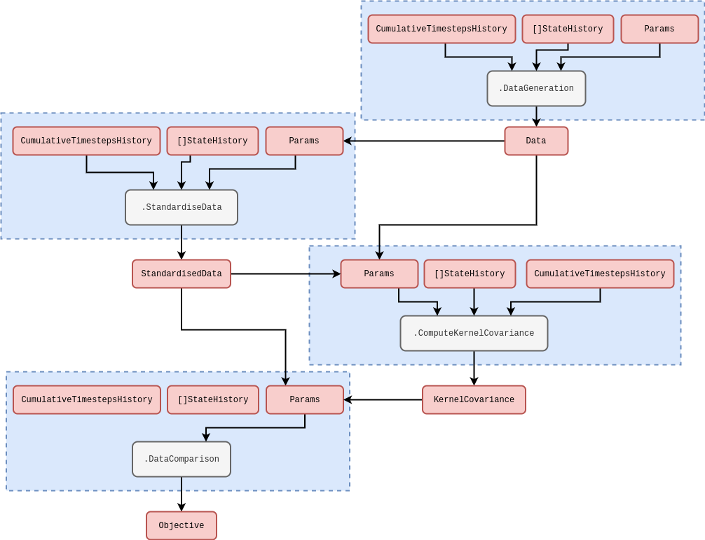

## Research context

In a previous article [@stochadexIII-2024] we used a simple, but effective, technique for approximating the conditional density of simulation parameters $P_{({\sf t}+1){\sf t}}(z\vert X',{\sf Y})$ such that we are able to both update its shape with the arrival of new data as well as sample new values from it --- in both cases being able to incorporate a discounted distribution ansatz into the model. This technique estimated only the first two moments of this distribution, but with techniques like particle filtering it should be possible to generate approximate samples without this limitation. In this article, we will motivate Sequential Importance Resampling (SIR) using a kernel-smoothed approximation of the distribution which takes the form

$$
\begin{align}
P_{({\sf t}+1){\sf t}}(z\vert X',{\sf Y}) \simeq Q_{({\sf t}+1){\sf t}}(z\vert X',{\sf Y}) \propto \sum_{{\sf t}'={\sf t}-{\sf s}}^{{\sf t}}\int_{\zeta_{{\sf t}'+1}} {\rm d}z' P_{({\sf t}'+1){\sf t}'}(z'\vert X'',{\sf Y})K_{({\sf t}+1){\sf t}'}(z,z';H) \,,
\end{align}
$$

where $K_{({\sf t}+1){\sf t}'}(z,z';H)$ is some smoothing kernel which helps to approximate the posterior distribution up to some specified scale using the bandwidth matrix $H$, making use of the full history of $z$ samples. A Gaussian kernel would take the form

$$
\begin{align}
K_{({\sf t}+1){\sf t}'}(z,z';H) &= \beta^{{\sf t}+1-{\sf t}'} \exp \bigg[ -\frac{1}{2}\sum_{i,j}(z'-z)^i(H^{-1})^{ij}(z'-z)^j\bigg] \,,
\end{align}
$$

where $\beta$ is the past-discounting factor. Say that we have a generator of probabilistic weights and $z$ values in time. This generator represents a non-stationary probability distribution and the weights are effectively stochastic around the true value for each given $z$ as input. The problem is that we would like to be able to efficiently sample from the underlying distribution regardless of its shape or modality.

Solution we will study is to create an adaptive sequential Monte Carlo algorithm, e.g., see [@del2006sequential] or [@wills2023sequential].

## Adaptively estimating a smoothed density

We can motivate the density smoothing model through specifying the following functional 'distribution over distributions' which uses a symmetrised form of the Kullback-Leibler divergence [@kullback1951information]

$$
\begin{align}
{\cal P}_{({\sf t}+1){\sf t}}[Q_{({\sf t}+1){\sf t}}] &\propto e^{-D^{\rm sym}_{\rm KL}[Q_{({\sf t}+1){\sf t}},P_{({\sf t}+1){\sf t}}]} \\
D^{\rm sym}_{\rm KL}[Q_{({\sf t}+1){\sf t}},P_{({\sf t}+1){\sf t}}] &= \frac{1}{2}D_{\rm KL}[Q_{({\sf t}+1){\sf t}}\vert\vert P_{({\sf t}+1){\sf t}}] + \frac{1}{2}D_{\rm KL}[P_{({\sf t}+1){\sf t}} \vert\vert Q_{({\sf t}+1){\sf t}}] \\
&= \frac{1}{2}\int_{\zeta_{{\sf t}+1}} {\rm d}z \, Q_{({\sf t}+1){\sf t}}(z\vert X',{\sf Y})\ln \frac{Q_{({\sf t}+1){\sf t}}(z\vert X',{\sf Y})}{P_{({\sf t}+1){\sf t}}(z\vert X',{\sf Y})} \\
&\qquad + \frac{1}{2}\int_{\zeta_{{\sf t}+1}} {\rm d}z \, P_{({\sf t}+1){\sf t}}(z\vert X',{\sf Y})\ln \frac{P_{({\sf t}+1){\sf t}}(z\vert X',{\sf Y})}{Q_{({\sf t}+1){\sf t}}(z\vert X',{\sf Y})} \,,
\end{align}
$$

Note that we can take 'functional expectation values' with this distribution, such that

$$
\begin{align}
{\rm E}_{{\sf t}+1}[Q_{({\sf t}+1){\sf t}}] &= \frac{\int {\cal D}[Q_{({\sf t}+1){\sf t}}] Q_{({\sf t}+1){\sf t}} e^{-D^{\rm sym}_{\rm KL}[Q_{({\sf t}+1){\sf t}},P_{({\sf t}+1){\sf t}}]}}{\int {\cal D}[Q_{({\sf t}+1){\sf t}}] e^{-D^{\rm sym}_{\rm KL}[Q_{({\sf t}+1){\sf t}},P_{({\sf t}+1){\sf t}}]}} \,.
\end{align}
$$

Another pattern to consider is that of the Expectation-Maximisation algorithm, where we can alternate between optimising with respect to $\ell$ and computing the marginal expectation values for $H$ using the resulting samples and their corresponding weights like this

$$
\begin{align}
{\rm E}_{{\sf t}+1}[H] &\simeq \frac{\sum_{H}H{\cal P}_{({\sf t}+1){\sf t}}[Q_{({\sf t}+1){\sf t}};H]}{\sum_{H}{\cal P}_{({\sf t}+1){\sf t}}[Q_{({\sf t}+1){\sf t}};H]} \,.
\end{align}
$$

We could then input these expectation values as the centre of the sampler for the next $H$ (inverse-Wishart distribution) values in the sequence.

## Resampling

Start by drawing samples centred from different points, where each centre is randomly chosen from the current pool of samples with a frequency weighted by the smoothed new density of that point. If we then sample around each point using $fH$ as the covariance around the point (where $f$ is some exploration factor $<1$), we end up being able to effectively sample from the smoothed density.

## Implementation

In the case of the purely time-dependent kernel with a choice of Gaussian data linking distribution above, the hyperparameters that would be optimised could relate to the kernel in a wide variety of ways. Optimising them would make our optimised reweighting similar to (but very much _not_ the same as) evaluating maximum a posteriori (MAP) of a Gaussian process regression. In a Gaussian process regression, one is concerned with inferring the the whole of $X_{{\sf t}}$ as a function of time using the pairwise correlations implied by the second-order log expansion we wrote earlier. Based on this expression, the cumulative log-likelihood for a Gaussian process can be calculated as follows

$$
\begin{align}
\ln {\cal L}_{{\sf t}+1}(Y\vert z) &= -\frac{1}{2}\sum_{{\sf t}'=({\sf t}+1)-{\sf s}}^{({\sf t}+1)}\sum_{{\sf t}''=({\sf t}+1)-{\sf s}}^{{\sf t}'} \bigg[ n\ln (2\pi ) + \ln \big\vert {\cal H}_{{\sf t}'{\sf t}''}(z)\big\vert + \sum_{i=0}^{n}\sum_{j=0}^{n} Y^i_{{\sf t}'} {\cal H}^{ij}_{{\sf t}'{\sf t}''}(z) Y^j_{{\sf t}''} \bigg] \,. \label{eq:log-likelihood-gaussian-proc}
\end{align}
$$

**Rewrite from here to cover the theory behind optimisation code that will be put into practice in the follow-up article...**

As we did for the reweighting algorithm, we have illustrated another rough schematic below for the multi-threaded code needed to compute the objective function of a learning algorithm in the stochadex, based on the equation above. Note that, in this diagram, we have assumed that the data has already been shifted such that its values are positioned around the distribution peak. Knowing where this peak will be a priori is not possible. However, for Gaussian data, an unbiased estimator for this peak will be the sample mean and so we have included an initial data standardisation in the steps outlined by the schematic.

**Here should also talk about how this paper shows online learning of gradients should equilibrate and then be used for debiasing the predictions:** [@angelopoulos2025gradientequilibriumonlinelearning]

The optimisation approach that we choose to use for obtaining the best hyperparameters in the conditional probability of the reweighting approach will depend on a few factors. For example, if the number of hyperparameters is relatively low, but their gradients are difficult to calculate exactly; then a gradient-free optimiser (such as the Nelder-Mead [@nelder1965simplex] method or something like a particle swarm; see [@kennedy1995particle] or [@shi1998modified]) would likely be the most effective choice. On the other hand, when the number of hyperparameters ends up being relatively large, it's usually quite desirable to utilise the gradients in algorithms like vanilla Stochastic Gradient Descent [@robbins1951stochastic] (SGD) or Adam [@kingma2014adam].

## References
