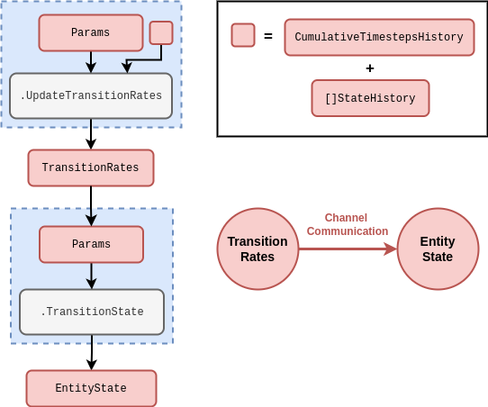
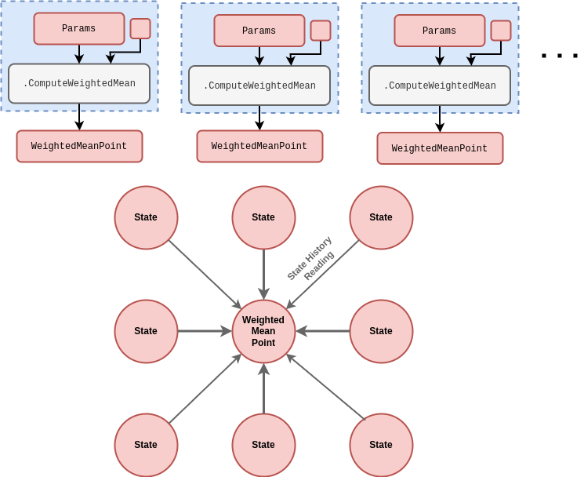
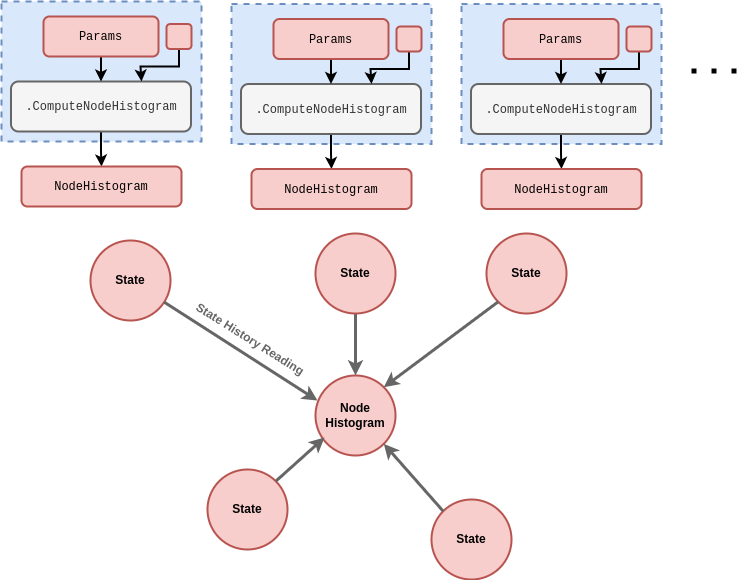
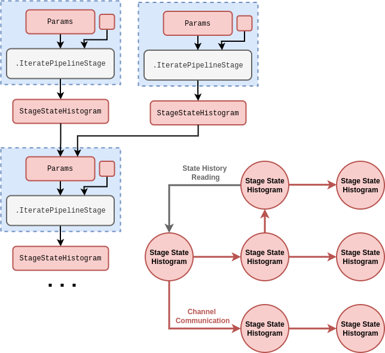
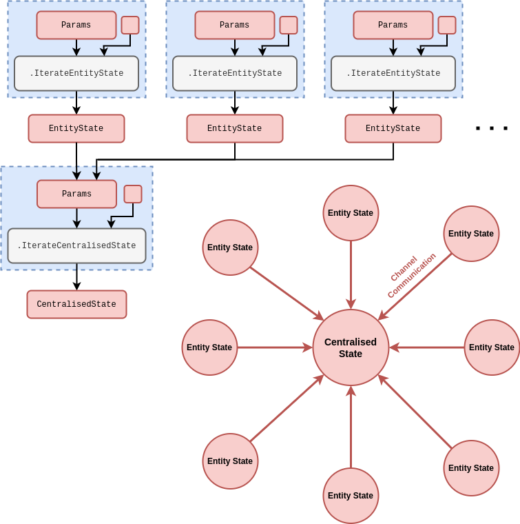

## Entity state transitions

In this article we're going to define some widely-applicable state partitions which are useful in developing simulations of real-world systems. These will help to both illustrate how partitioning the state can be helpful in conceptualising the phenomena one wishes to simulate, and provide some practical insights into how the stochadex may be configured for different purposes.

We begin with the _entity state transition_, which refers to state transitions of any individual 'entity' that occur stochastically according to their respective transition rates. These transition rates may themselves be time-varying (even stochastically) and so it is useful to separate their values into a separate state partition and create a direct dependency channel on them, as in the rough schematic below.

Note how this computational structure is slightly more generic than (but related to) the event-based simulation schematics in [@stochadexI-2024].

Observations of the entity state transition in the real world typically take the form of either partial or noisy detections of the state transition times themselves over some period. Interactions with systems which require this kind of partitioning take the form of either direct changes to the entity state itself at some points in time or modifications to the rates at which state transitions occur.

It seems less useful to provide all of the examples of real-world problems which might use this kind of partitioning as it applies extremely generally. It will be more informative to discuss how these same examples apply in the context of the other partitions which are more specifically applicable. Having said this, it's worth noting that our event-based representation of state transitions can also be trivially adapted to avoid the necessity for a continuous-time representation of the system. The applications for state transition models which only require sequential ordering (but not a continuous time variable) include sequential experimental design problems, e.g., astronomical telescopes (see [@jia2023observation] and [@yatawatta2021deep]) and biological experiments [@treloar2022deep].

## Weighted mean points

The _weighted mean point_ performs a weighted average over a specified collection of neighbouring states. Given that one of the more natural uses cases for this partition is in spatial field averaging, the topology of the subgraph is typically totally connected and highly structured. However, some connections matter more than others, according to the weighting. We have created a rough schematic below.

In the case of spatial fields, you can think of each point as being structured topologically in a kind of 'lattice' configuration where connections to other points are controlled indirectly by the relationship between states and their weighted point averages over time. Different distances in the lattice can contribute different importance weights in affecting each local average.

Which real-world control problems would this partition be useful for? Given the natural spatial interpetation, the kinds of simulation that would leverage it are:

- Spatial simulations of population disease spread and control in the context of global disease outbreaks [@ohi2020exploring] or endemic, spatially-clustered infections like malaria [@carter2000spatial].
- Spatial ecosystem management environments to infer forest wildfire dynamics [@ganapathi2018using] or improve conservation decision-making [@lapeyrolerie2022deep].
- Weather system simulations to improve decision-making for agricultural yields [@chen2021reinforcement] or enhance stormwater flood mitigations [@saliba2020deep].

Observations of the weighted mean point in the real world typically take the form of either partial or noisy detections of the raw state values before averaging. Actors in systems which require this kind of partitioning could be public health or wildlife/national park authorities as well as livestock/crop farmers. The interactions with these systems would therefore focus on modifying the parameters for spatial detection of disease or damage and changing a subset of the population states directly through interventions.

## Node histograms

The _node histogram_ counts the frequencies of state occupations exhibited by all of the specified connected states. This partition provides a summary of information about a single network node which exists as part of a larger 'state network', and can be configured in collection with other partitions of the same type to represent any desirable connectivity structure. We have illustrated how it works in the rough schematic below.

Which real-world control problems would this partition be useful for? If we consider networks which rely on counting the frequencies of neighbouring node states, the kinds of simulation that would leverage it are:

- Computational models of human brain conditions, e.g., Parkinson's disease [@lu2019application], epilepsy [@pineau2009treating], Alzheimer's [@saboo2021reinforcement], etc., for deep brain stimulation control and other forms of treatment.
- Simulations of complex urban infrastructure networks to target various kinds of optimisation, e.g., traffic signal control [@yau2017survey], power dispatch [@li2021integrating] and water pipe maintainance [@bukhsh2023maintenance].

Observations of the node histogram in the real world typically take the form of either partial or noisy detections of the counts. Actors in systems which require this kind of partitioning could be a neurologist, traffic light controller or even city infrastructure maintainer. In all cases, interactions with these systems would typically be directly changing the state of some subset of nodes in the network itself.

## Pipeline stage state histograms

The _pipeline stage state histogram_ counts the frequencies of entity types which exist in a particular stage of some pipeline. These partitions can be connected together in a directed subgraph to represent a multi-stage pipeline structure. We've provided a rough schematic below.

Which real-world control problems would this partition be useful for? If we think about multi-stage pipelines whose future states depend on the frequencies of entity types which exist at each stage, the following real-world examples come to mind:

- Logistics problems, e.g., organised supply chains [@yan2022reinforcement], humanitarian aid distribution pipelines [@yu2021reinforcement] and hospital capacity planning [@shuvo2021deep].
- Software development and engineering improvements, such as frontend user interface journeys [@lomas2016interface] across a population of users or backend data pipeline optimisation problems [@nagrecha2023intune].

Observations of the pipeline stage state histogram in the real world typically take the form of either partial or noisy detections of the entity stage transtition events in time and/or the frequency counts in the stage itself. Actors in systems which require this kind of partitioning could be a supply/relief chain controller, hospital logistics manager, data pipeline maintainer or even software engineer. In all cases, interactions with these systems would likely be directly modifying the relative flows between different pipeline stages.

## Centralised entity interactions

_Centralised entity interactions_ divide the representation of the system state into a partitions of 'entity states' and some partition of 'centralised state' upon which interactions between entities can depend. The subgraph topology is hence a star configuration where every entity state is connected to the centralised state, but not necessarily to each other. We have provided a rough schematic for the structure below.

Which real-world control problems would this partition be useful for? Dividing the state up into a collection of entity states and some centralised state can be useful in a variety of settings. In particular, we can think of:

- Simulations of sports matches, e.g., football [@pulis2022reinforcement], rugby [@sawczuk2022markov], tennis [@ding2022deep], etc., and other forms of game --- all of which typically define a relatively simple global match/gameplay context as their centralised state and players as their entity states.
- Financial (see [@fischer2018reinforcement] and [@meng2019reinforcement]) and sports betting [@cliff2021bbe] market simulations for developing algo-trading strategies and portfolio optimisation [@dangi2013financial], as well as housing market simulations (see [@yilmaz2018stochastic] and [@carro2023heterogeneous]) to evaluate government policies.
- Simulations of other forms of resource exchange through centralised mediation, such as in prosumer energy markets [@may2023multi].

Observations of the centralised entity interactions in the real world typically take the form of either partial or noisy detections of the states and state changes. Actors in systems which require this kind of partitioning could be sports team managers, financial/betting/other market traders or market exchange mediators. The interactions with these systems would therefore typically focus on changing which entities are present, changing their parameters and/or changing the parameters of the centralised state iteration.

## References
