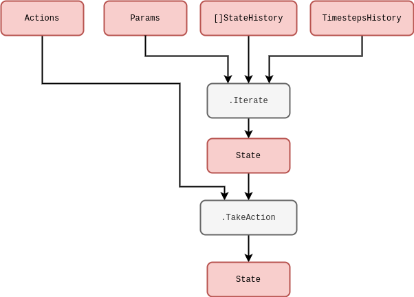
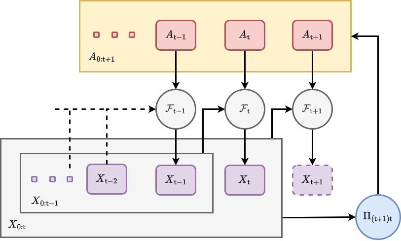

## Introduction

**Big picture: implement a generalised form of Thompson Sampling [@thompson1933likelihood], i.e., sampling from the posterior over beliefs $z$ to compute a maximised $\theta$ (wrt the expected reward) each time! The posterior sampling of $z$ has already been handled by previous articles so in this one we need to figure out gradient-free dynamic optimisation of $\theta$ - we could use some adaptive form of particle swarm (see [@kennedy1995particle] or [@shi1998modified]) but need to figure out how get this to respond to changes by keeping exploration going...**

In designing automated control algorithms of practical importance to the real world it's common to find that only partial observations of the system state are possible. You need only to think of the measurement uncertainties in any scientific experiment, the latent demand behind orders in a financial market, the unknown reservoirs of infection for a disease pathogen or even the limits to complete supply chain component observability in recognising just how commonly we find ourselves in this situation. When data is our only guide, this obscurity can make the learning of algorithms to control these systems an extreme --- if not frequently impossible --- challenge, without further insight provided by a more domain-specific model.

Model-free reinforcement learning is a popular and very powerful approach to optimising actions for 'noisy' systems in the real world [@sutton2018reinforcement], especially when there is plenty of data and the system is fully observable. However, this book will not spend much time thinking about the model-free approach. We will instead be designing and building learning environments with a more model-based approach to control in mind. These environments are intended to replicate situations where the data isn't always so complete and useful, and will provide robust tools to cope with these tricky scenarios. Those readers who are data scientists, research engineers or statistically-minded programmers may find our mathematically descriptive, yet practically-minded, approach in this book quite interesting and maybe a little different to the usual perspectives.

This book is about building more realistic training environments for machine learning systems in the real world. In the previous articles we formalised, designed and built a generalised simulation engine which could serve as the essential scaffolding for these environments. So why then, in this article, do we want to extend our formalism to talk about probabilistic learning methods?

For many of these realistic environments where only partial state observations are possible, probabilistic learning tools can immediately become an essential tool to robustly infer the state of a system and predict its future states from any given point in time. Given that these tools are often so important for extending the capability of learning algorithms to deal with partially-observed domains; we propose to extend the idea of what is more conventionally considered a 'machine learning environment' to include tools for system state inference and future state prediction. In this sense, this article, will consider probabilistic learning as an essential part of the environment for a machine learning system.

## Formalising general interactions

Let's start by considering how we might adapt the mathematical formalism we have been using so far to be able to take actions which can manipulate the state at each timestep. Using the mathematical notation that we inherited from the stochadex, we may extend the formula for updating the state history matrix $X_{0:{\sf t}}\rightarrow X_{0:{\sf t}+1}$ to include a new layer of possible interactions which is facilitated by a new vector-valued 'take action' function $G_{{\sf t}}$. In doing so we shall be defining the domain of an acting entity in the stochastic process environment --- which we shall hereafter refer to as simply the 'agent'.

During a timestep over which actions are performed by the agent, the stochadex state update formula can be extended to include interactions by composition with the original state update function like so

$$
\begin{align}
X_{{\sf t}+1}^i &= G^i_{{\sf t}+1}[F_{{\sf t}+1}(X_{0:{\sf t}}, z, {\sf t}), A_{{\sf t}+1}] = {\cal F}^i_{{\sf t}+1}(X_{0:{\sf t}}, z, A_{{\sf t}+1}, {\sf t}) \,,
\end{align}
$$

where we have also introduced the concept of the 'actions' performed $A_{{\sf t}+1}$ on the system; some vector of parameters which define what actions are taken at timestep ${\sf t}+1$. The code for the new iteration formula would look something like this.

So far, the equation we wrote above on its own will allow the agent to take actions that are scheduled up front through some fixed process or perhaps through user interaction via a game interface. So what's next? In order to start creating algorithms which will act on the system state for us, we need to develop a formalism which 'closes the loop' by feeding information back from the stochastic process to the agent's decision-making algorithm.

If we use $A_{0:{\sf t}+1}$ a referring to the matrix of historically-taken actions which up to time ${\sf t}+1$, we can build up a more generalised, non-Markovian picture of automated interactions with the system which matches the notation we are already using for $X_{0:{\sf t}+1}$. Let us now define a Non-Markovian Decision Process (NMDP) as a probabilistic model which draws an actions matrix $A_{0:{\sf t}+1}=A$ from a 'policy' distribution $\Pi_{({\sf t}+1){\sf t}}(A\vert X,\theta)$ given $X_{0:{\sf t}}=X$ and a new vector of parameters which fully specify the automated interations. Using the probabilistic notation from the previous part of the book, the joint probability that $X_{0:{\sf t}+1}=X$ and $A_{0:{\sf t}+1}=A$ at time ${\sf t}+1$ is

$$
\begin{align}
P_{{\sf t}+1}(X,A\vert z, \theta ) &= P_{{\sf t}}(X'\vert z,\theta ) \, \Pi_{({\sf t}+1){\sf t}}(A\vert X',\theta)P_{({\sf t}+1){\sf t}}(x\vert X',z,A) \,,
\end{align}
$$

where we recall that $P_{({\sf t}+1){\sf t}}(x\vert X',z,A)$ is the conditional probability of $X_{{\sf t}+1}=x$ given $X_{0:{\sf t}}=
X'$ and $z$ that we have encountered before, but it now requires $A_{0:{\sf t}+1}=A$ as another given input. We have illustrated taking of actions while evolving the system state and how it relates to the policy distribution with a new graph representation below.

For additional clarity, let's take a moment to think about what $\Pi_{({\sf t}+1){\sf t}}(A\vert X,\theta)$ represents and how generally descriptive it can be. If an agent is acting under and entirely deterministic policy, then the policy distribution may be simplified to a direct function mapping which is parameterised by $\theta$. At the other extreme, the distribution may also describe a fully stochastic policy where actions are drawn randomly in time. If we combine this consideration of noise with the observation that policies described by a distribution $\Pi_{({\sf t}+1){\sf t}}(A\vert X,\theta)$ permit a memory of past actions and states, it's easy to see that this structure can be used in a wide variety of different use cases.

By marginalising over Eq.~(\ref{eq:joint-prob-x-and-a}) we find an updated probabilistic iteration formula for the stochastic process state which now takes the influence of agent actions into account

$$
\begin{align}
P_{{\sf t}+1}(X\vert z,\theta ) &= \int_{\Xi_{{\sf t}+1}}{\rm d}A \, P_{{\sf t}}(X'\vert z,\theta ) \, \Pi_{({\sf t}+1){\sf t}}(A\vert X',\theta)P_{({\sf t}+1){\sf t}}(x\vert X',z,A)  \,.
\end{align}
$$

This relationship will be very useful in the last part of this book when we begin to look at optimising control algorithms.

What are the main categories of action which are possible in the rows of $A$? Since the NMDP described by $\Pi_{({\sf t}+1){\sf t}}(A\vert X',\theta)$ is just another form of stochastic process, the main categories of action will fall into the same as those we covered in defining the stochadex formalism. The first, and perhaps most obvious, category would probably where the actions are defined in a continuous space and are continuously applied on every timestep. Some examples of these 'continuously-acting' decision processes include controlling the temperature of chemical reactions [@beeler2023chemgymrl] (such as those in a brewery), spacecraft control [@tipaldi2022reinforcement] and guidance systems,  as well as the driving of autonomous vehicles [@kiran2021deep]. Within a kind of subset of the continuously-acting category; we can also find the event-based acting decision processes (where actions are not necessarily taken every timestep), e.g. controlling traffic through signal timings [@garg2018deep], managing disease spread through treatment intervals [@ohi2020exploring] and automated trading on stock markets [@meng2019reinforcement].

Many of the examples we have given above have continuous action spaces, but we might also consider classes of decision processes where actions are defined discretely. Examples of these include the famous multi-armed bandit problem [@gittins2011multi] (like choosing between website layouts for E-commerce [@liu2021map]), managing a sports team through player substitutions, sensor measurement scheduling [@leong2020deep] and the sequential design prioritisation of large-scale scientific experiments [@blau2022optimizing].

## States, actions and attributing rewards

In the previous parts of this book we laid out the concept for a generalised framework to simulate and learn stochastic phenomena continually as data is received. Given that we have also introduced a framework for the automated control of these phenomena, we have all the ingredients we need to create optimal decision-making algorithms. The key question to answer then, is: _optimal with respect to what objective?_

The objective of an automated control algorithm could take many forms depending on the specific context. Since there is no loss in generality in doing so, it seems natural to follow the naming convention used by Markov Decision Processes (MDP) (see [@bertsekas2011dynamic] and [@sutton2018reinforcement]) by referring to the objective outcome of an action at a particular point in time as having a 'reward' value $r$. Since the relationship between reward, actions and states may be stochastic, it makes sense to relate the reward outcome $r$ given a state history $X$ and action history $A$ at timestep ${\sf t}+1$ through the probability distribution $P_{{\sf t}+1}(r\vert X,A)$. Hence, generally, this reward signal is non-Markovian --- as is the case in many real-world problems [@gaon2020reinforcement].

We can use the reward probability distribution to derive a joint distribution over both state history $X'$ and reward $r$ at timestep ${\sf t}+1$ like so

$$
\begin{align}
P_{({\sf t}+1){\sf t}}(r,x'\vert X, z,\theta) &= P_{{\sf t}+1}(r\vert X',A)\Pi_{({\sf t}+1){\sf t}}(A\vert X,\theta)P_{({\sf t}+1){\sf t}}(x'\vert X,z,A)\,.
\end{align}
$$

In this expression, let's recall that we are using the policy distribution $\Pi_{({\sf t}+1){\sf t}}(A\vert X,\theta)$ for agent interactions and the fundamental state update conditional probability for the underlying stochastic process $P_{({\sf t}+1){\sf t}}(x'\vert X,z,A)$.

Note that in most use cases, the state of real-world phenomena cannot be measured perfectly. So to enable any agent trained on simulated phenomena to potentially act in the real world, we will need to include a measurement process as part of the information retrieval step. This is the part where we can leverage our work in a previous article which develops an online learning system for stochastic process models. But we're jumping ahead with this thinking and will return to this point later on.

Using Eq.~(\ref{eq:joint-x-and-r}), we can now define a 'state value function' $V_{{\sf t}}$ at timestep ${\sf t}$ which is the expected $\gamma$-discounted future reward given the current state history $X$ and the other parameters like this

$$
\begin{align}
V_{{\sf t}}(X,z,\theta) &= {\rm E}_{{\sf t}}({\sf Discounted \,Return}\vert X, z, \theta ) \nonumber \\
&= \sum_{{\sf t}'={\sf t}}^{\infty} \int_{\omega_{{\sf t}'+1}}{\rm d}^nx'\int_{\rho_{{\sf t}'+1}} {\rm d}r \,r\, \gamma^{{\sf t}'-{\sf t}}\prod_{{\sf t}''={\sf t}}^{{\sf t}'}P_{({\sf t}''+1){\sf t}''}(r,x'\vert X, z,\theta)\,,
\end{align}
$$

where $0 < \gamma < 1$. Note that the discount factor in continuous time could also be explicitly dependent on the stepsize such that we would replace the discount factor with

$$
\begin{align}
\gamma^{{\sf t}'-{\sf t}} \longrightarrow \frac{1}{\gamma [\delta t({\sf t}+1)]}\prod_{{\sf t}''={\sf t}}^{{\sf t}'} \gamma [\delta t({\sf t}''+1)] \,.
\end{align}
$$

The idea behind this discount factor $\gamma$ is to decrease the contribution of rewards to the optimisation objective (often called the 'expected discounted return' in RL) more and more as the prediction increases into the future. Note also that the state value function is inherently recursively defined, such that

$$
\begin{align}
V_{{\sf t}}(X,z,\theta) &= \int_{\omega_{{\sf t}+1}}{\rm d}^nx\int_{\rho_{{\sf t}+1}} {\rm d}r \, P_{({\sf t}+1){\sf t}}(r,x'\vert X, z,\theta)\big[ r+\gamma V_{{\sf t}+1}(X',z,\theta)\big] \,,
\end{align}
$$

and the optimal $\theta$ can hence be derived from

$$
\begin{align}
\theta^*_{{\sf t}}(X,z) &= \underset{\theta}{{\rm argmax}} \big[ V_{{\sf t}}(X,z,\theta)\big] \,.
\end{align}
$$

By deriving the optimal policy in terms of the parameters $\theta^*_{{\sf t}}(X,z)$, the optimal state value function and policy distribution can therefore be derived from

$$
\begin{align}
V^*_{{\sf t}}(X,z) &= V_{{\sf t}}[X,z,\theta^*_{{\sf t}}(X,z)] \\
\Pi^*_{({\sf t}+1){\sf t}}(A\vert X,z) &= \Pi_{({\sf t}+1){\sf t}}[A\vert X,\theta^*_{{\sf t}}(X,z)] \,.
\end{align}
$$

Note that the type of decision process optimisation which we have introduced above differs from standard RL methodology. In the more conventional 'model-free' RL approaches, the state-action value function

$$
\begin{align}
Q_{{\sf t}}(X,A,z)={\rm E}_{{\sf t}}({\sf Discounted \,Return}\vert X,A,z) \,,
\end{align}
$$

would be used to evaluate the optimal policy instead of the state value function $V_{{\sf t}}(X,z,\theta )$ that we are using above. We are able to use the latter here because the simulation model gives us explicit knowledge of the $P_{({\sf t}+1){\sf t}}(x'\vert X,z,A)$ distribution which is utilised by Eq.~(\ref{eq:joint-x-and-r}). When this model is not known, the state-action value function $Q_{{\sf t}}(X,A,z)$ must be learned explicitly through sample estimation from the measured state and experienced outcomes of actions taken by the agent.

When an agent takes an action to measure the state of the system (or when it is given measurements without needing to take action) there will typically be some uncertainty in how the history of measured real-world data $Y$ maps to the latent states of the system $X$ and its parameters $z$ at time ${\sf t}+1$. It is natural, then, to represent this uncertainty with a posterior probability distribution ${\cal P}_{{\sf t}+1}(X,z\vert Y)$ as we did in the previous article.

## Algorithm designs

Talk about the utility of the model-based online learning approach in the case of partially observed systems [@aastrom1965optimal]. Also look into the overlaps with this approach and Thompson sampling for exploration --- discuss here. Looking at a stochastic policy iteration algorithm here combined with Monte Carlo rollouts.

## Software design

## References
