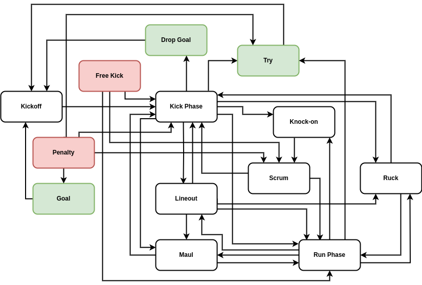
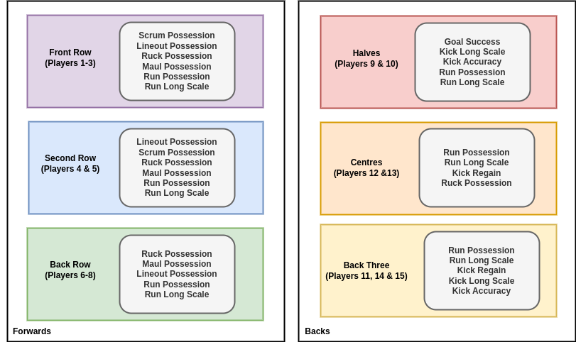
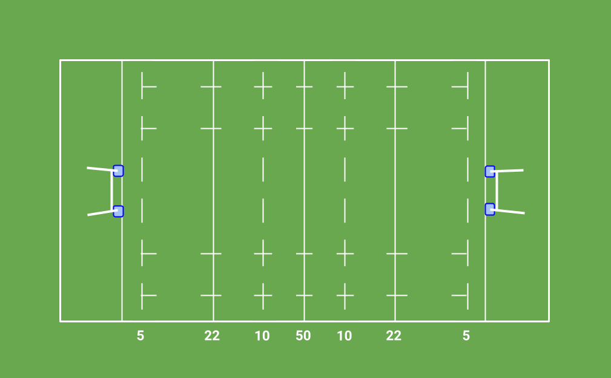

## Conceptualising the event-based simulation

Since the basic state manipulation framework and simulation engine will run using the stochadex (see here: [https://github.com/umbralcalc/stochadex](https://github.com/umbralcalc/stochadex)), the mathematical novelties in this project are all in the design of the rugby match model itself. We're also not especially keen on spending a lot of time doing detailed data analysis to come up with the most realistic values for the parameters that are dreamed up here. Though this would also be interesting --- one could do this data analysis, for instance, by scraping player-level performance data from one of the excellent websites that collect live commentary data such as [@rugbypass] or [@espn-rugby].

Let's begin by specifying an appropriate state space to live in when simulating a rugby match. It is important at this level that events are defined in quite broadly applicable terms, as it will define the state space available to our stochastic sampler and hence the simulated game will never be allowed to exist outside of it. It seems reasonable to characterise a rugby union match by the following set of states:

- ${\sf Penalty}$, ${\sf Free}$ ${\sf Kick}$ (the punitive states),
- ${\sf Penalty}$ ${\sf Goal}$, ${\sf Drop}$ ${\sf Goal}$, ${\sf Try}$ (the scoring states),
- ${\sf Kickoff}$, ${\sf Kick}$ ${\sf Phase}$, ${\sf Run}$ ${\sf Phase}$, ${\sf Knock}$-${\sf on}$, ${\sf Scrum}$, ${\sf Lineout}$, ${\sf Maul}$ and ${\sf Ruck}$ (the general play states).

Using this set of states, in the figure below we have summarised our approach to match state transitions into a single event graph. In order to capture the fully detailed range of events that are possible in a real-world match, we've needed to be a little imaginative in how we define the kinds of state transitions which occur. It's also fair to say that our simplified model here represents just a subset of states that a real rugby match could exist in. For example, kickoffs, 22m dropouts and goal line dropouts are all modelled here as a ${\sf Kickoff}$ state but with different initial ball locations on the pitch (we'll get to how ball location changes later on).

In addition to occupying some state in the event graph, the state of a rugby match must also include a binary 'possession' element which encodes which team has the ball at any moment. We should also include the 2-dimensional pitch location of the ball as an element of the match state in order to get a better sense of how likely some state transitions are, e.g., when playing on the edge of the pitch near the touchline it's clearly more likely that a ${\sf Run}$ ${\sf Phase}$ is going to result in a ${\sf Lineout}$ than if the state is currently in the centre of the pitch. To add even more detail; in the next section we will introduce states for each player.

Since a rugby match exists in continuous time, it is natural to choose a continuous-time event-based simulation model for our game engine. As we have discussed in previous articles already [@stochadexI-2024], this means we will be characterising transition probabilities of the event graph above by ratios of event rates in time. Recalling our notation in previous articles, if we consider the current state vector of the match $X_{\sf t}$, we can start by assigning each transition ${\sf a}\rightarrow {\sf b}$ on the event graph an associated expected rate of occurance $\lambda_{{\sf a}\rightarrow {\sf b}}$ which is defined in units of continuous time, e.g., seconds. In addition to the transitions displayed on the graph, we can add a 'possession change transition'; where the possession of the ball in play moves to the opposing team. This transition may occur while the match is also in most of the white-coloured states on the graph apart from ${\sf Knock}$-${\sf on}$ (which determines a possession change immediately through a ${\sf Scrum}$) or a ${\sf Kickoff}$ (which directly proceeds a ${\sf Kick}$ ${\sf Phase}$ from which the ball may change possession). Let's assign possession changes with a state and timestep-dependent expected rate of occurance $\lambda_{\rm pos}(X_{\sf t}, {\sf t})$.

Based on our dicussion above, an appropriate encoding for the overall game state at timestep index ${\sf t}$ could be a state vector $X_{{\sf t}}$ whose elements are

$$
\begin{align}
X^0_{{\sf t}}&=\begin{cases} 0 & \text{Match State} = \text{${\sf Penalty}$}\\ 1 & \text{Match State} = \text{${\sf Free}$ ${\sf Kick}$} \\ \dots & \end{cases} \\
X^1_{{\sf t}}&=\begin{cases} 0 & \text{Possession} = \text{${\sf Home}$ ${\sf Team}$}\\ 1 & \text{Possession} = \text{${\sf Away}$ ${\sf Team}$} \end{cases} \,.
\end{align}
$$

But how does this overall game state connect to the event rates? The probabilistic answer is quite straightforward. If the probability of the match state being $X^0_{{\sf t}}={\sf a}$ at timestep ${\sf t}$ is written as $P^0_{{\sf t}}({\sf a})$, then the probability of $X^0_{{\sf t}+1}={\sf b}$ in the following timestep is

$$
\begin{align}
P^0_{{\sf t}+1}({\sf b}) = \frac{\frac{1}{\tau}P^0_{{\sf t}}({\sf b})+\sum_{\forall {\sf a}\neq {\sf b}}\lambda_{{\sf a}\rightarrow {\sf b}}{\cal T}_{{\sf a}\rightarrow {\sf b}}(X_{\sf t}, {\sf t})P^0_{{\sf t}}({\sf a})}{\big[ \frac{1}{\tau} + \sum_{\forall {\sf a}\neq {\sf b}}\lambda_{{\sf a}\rightarrow {\sf b}} {\cal T}_{{\sf a}\rightarrow {\sf b}}(X_{\sf t}, {\sf t})\big]} \,,
\end{align}
$$

where $\forall {\sf a} \neq {\sf b}$ in the summation indicates that all the available transitions from ${\sf a}$ to ${\sf b}$, where ${\sf a}\neq {\sf b}$, should be summed over and ${\cal T}_{{\sf a}\rightarrow {\sf b}}(X_{\sf t}, {\sf t})$ is a time and state-dependent transition probability that is determined by the playing tactics of each team as well as the general likelihoods of gameplay which are expected from a real rugby match. Note that in the expression above, we have also defined $\tau$ as a timescale short enough such that no transition is likely to occur during that interval. An equivalent to the expression above should also apply to the possession change transition rate, i.e., the probability that the ${\sf Home}$ ${\sf Team}$ has possession $P^1_{{\sf t}}({\sf H})$ at time ${\sf t}$ evolves according to

$$
\begin{align}
P^1_{{\sf t}+1}({\sf H}) = \frac{ \frac{1}{\tau}P^1_{{\sf t}}({\sf H}) + \lambda_{\rm pos}(X_{\sf t}, {\sf t}) [1-P^1_{{\sf t}}({\sf H})]}{\big[ \frac{1}{\tau} + \lambda_{\rm pos}(X_{\sf t}, {\sf t})\big]} \,.
\end{align}
$$

Before we move on to other details, it's quite important to recognise that because our process is defined in continuous time, the possession change rate may well vary continuously (this will be especially true when we talk about, e.g., player fatigue). Hence, the expression for the match state transition probabilities is only an _approximation_ of the true underlying dynamics that we are trying to simulate - and this approximation will only be accurate if $\tau$ is small. The reader may recall that we discussed this same issue from the point of view of simulating time-inhomogeneous Poisson processes with the rejection method when we were building the stochadex [@stochadexI-2024].

While these match state transitions and possession changes are taking place, we also need to come up with a model for how the ball location $L_{{\sf t}}$ changes during the course of a game, and as a function of the current game state. Note that, because the ball location is a part of the overall game state, it will be included as information contained within some elements of $X_{{\sf t}}$ as well. To make this explicit, we can simply set $X^2_{{\sf t}}=L^{\rm lon}_{{\sf t}}$ and $X^3_{{\sf t}}=L^{\rm lat}_{{\sf t}}$ - where $L^{\rm lon}_{{\sf t}}$ denotes the longitudinal component (lengthwise along the pitch) and $L^{\rm lat}_{{\sf t}}$ denotes the lateral component (widthwise across the pitch). If we associate every state on the event graph with a single change in spatial location of the ball on the pitch, we then need to construct a process which makes 'jumps' in 2-dimensional space each time a state transition occurs. To keep things simple and intuitive, we will say that movements of the ball are only allowed to occur during either a ${\sf Run}$ ${\sf Phase}$ or a ${\sf Kick}$ ${\sf Phase}$. In most cases this restriction makes sense given the real-world game patterns, but perhaps the only clear exception is the ${\sf Penalty}$ $\longrightarrow$ ${\sf Goal}$ transition; which is easier to think of as a kind of '${\sf Kick}$ ${\sf Phase}$ transition' anyway.

In the case of a ${\sf Run}$ ${\sf Phase}$, let's choose the longitudinal component of the ball location $L^{\rm lon}_{{\sf t}}$ to be updated by the difference between samples drawn from two exponential distributions (one associated to each team). Hence, the probability density $P_{{\sf t}+1}(\ell )$ of $L^{\rm lon}_{{\sf t}+1}-L^{\rm lon}_{{\sf t}}=\ell$, evolves according to

$$
\begin{align}
P_{{\sf t}+1}(\ell ) = \int^\infty_0 {\rm d}\ell'\, {\sf ExponentialPDF}(\ell + \ell'; a_{\rm run}){\sf ExponentialPDF}(\ell'; d_{\rm run}) \,,
\end{align}
$$

where $a_{\rm run}$ and $d_{\rm run}$ are the exponential distribution scale parameters for an attacking and defending player, respectively, and we have chosen positive values of $\ell$ to be aligned with the forward direction for the attacking team. We shall elaborate on where $a_{\rm run}$ and $d_{\rm run}$ come from when we discuss associating events for player abilities in due course. If we now consider lateral component of the ball location $L^{\rm lat}_{{\sf t}}$ during a ${\sf Run}$ ${\sf Phase}$; it makes sense that this wouldn't be affected much by either team within the scope of detail in this first version of our model. Hence, the probability density $P_{{\sf t}+1}(w)$ of $L^{\rm lat}_{{\sf t}+1}-L^{\rm lat}_{{\sf t}}=w$ can just be updated like so

$$
\begin{align}
P_{{\sf t}+1}(w) = {\sf NormalPDF}(w; 0, \sigma_{\rm run}^2) \,,
\end{align}
$$

where $\sigma_{\rm run}$ is the typical jump in lateral motion (the standard deviation parameter of the normal distribution).

Turning our attention to the ${\sf Kick}$ ${\sf Phase}$; the longitudinal and lateral components are only realistically controlled by the attacking team --- specifically, by the player who is currently the kicker. Referring back to the state transitions which precede a ${\sf Kick}$ ${\sf Phase}$ in the event graph, we note that there are several types of kick which can dictate what the mechanics of the process should look like. To keep things simple, we can cluster these types of event into the following categories

(1.) Kicks at the goalposts for points:

  - ${\sf Penalty}$ $\longrightarrow$ ${\sf Goal}$
  - ${\sf Kick}$ ${\sf Phase}$ $\longrightarrow$ ${\sf Drop}$ ${\sf Goal}$

(2.) Kicks in the general field of play where the ball does not leave the field:

  - ${\sf Kick}$ ${\sf Phase}$ $\longrightarrow$ ${\sf Try}$
  - ${\sf Kick}$ ${\sf Phase}$ $\longrightarrow$ ${\sf Run}$ ${\sf Phase}$
  - ${\sf Kick}$ ${\sf Phase}$ $\longrightarrow$ ${\sf Knock}$-${\sf on}$
  - ${\sf Kick}$ ${\sf Phase}$ $\longrightarrow$ ${\sf Ruck}$
  - ${\sf Kick}$ ${\sf Phase}$ $\longrightarrow$ ${\sf Maul}$

(3.) Kicks to the touchline where the ball leaves the field:

  - ${\sf Kick}$ ${\sf Phase}$ $\longrightarrow$ ${\sf Lineout}$

To model case (1.) above, the simplest option would be to associate the attempt at goal with a goal success probability for the kicker $p_{\rm goal}$ which, in the simple first version of our model, will not depend on the location on the pitch from which the kick is taken. We will, however, restrict kickers to only be allowed an attempt at goal if they are within their opposing team's half - this is not strictly a rule in rugby, but it simplifies the automation of the decision logic quite nicely for now.

In case (2.) above, we can think of two main tactical options that a team might be employing. The first of these is kicking a further longitudinal distance in the field of play in order to gain territory, but lose possession, and the second is to kick to regain possession but with a shorter longitudinal distance. When kicking to gain territory, we'll just assign a uniform probability to the lateral position update of the ball location for simplicity and for the probability density $P_{{\sf t}+1}(\ell )$ of $L^{\rm lon}_{{\sf t}+1}-L^{\rm lon}_{{\sf t}}=\ell$, we'll use

$$
\begin{align}
P_{{\sf t}+1}(\ell ) = {\sf ExponentialPDF}(\ell ; a_{\rm kick}) \,,
\end{align}
$$

where $a_{\rm kick}$ is the kicking player's longitudinal scale parameter. When kicking to regain possession, we will use another exponential distribution with another constant scale parameter $\ell_{\rm typ}$ for the typical distance gained by this type of kick (unassociated to either team's abilities) and also assign a 'regain possession' probability $p_{\rm reg}$ which is associated to the abilities of the players chasing the kick (on the kicker's team).

Lastly, to model case (3.) above, the event has determined that the ball will leave the field of play and so the remaining unknowns that need to be determined are: which side of the field this occurred (we'll just choose the side closest to touch when the ball was last in play), the longitudinal distance of the kick and whether or not the ball bounced before leaving the field. For simplicity, let's determine the last of these through another kind of kick accuracy probability $p_{\rm kick}$ associated to the kicker. This just leaves the longitudinal distance that the kick achieved along the touchline; in this case we'll just assign the probability density $P_{{\sf t}+1}(\ell )$ of $L^{\rm lon}_{{\sf t}+1}-L^{\rm lon}_{{\sf t}}=\ell$ to that of the longitudinal kick distribution.

Generally, the proceeding ${\sf Lineout}$ will be taken with the opposition team (to the kicker) in possession at the point where the ball left the field. However, there are two notable exceptions to this rule. The first is if the ball does not bounce before leaving the field of play and the player is outside of their team's 22m line - the ${\sf Lineout}$ then must occur where the ball was last kicked from with the opposition team in possession. The second exception is if the ball bounces into touch when the player who kicked it was inside their team's half of the pitch - the ${\sf Lineout}$ then occurs where the ball left the field but is taken with the kicker's team in possession.

Before moving on to player states and abilities it's important to note that, in addition to the other state variables we have discussed above, the score of the match obviously needs to be recorded in the overall match state $X_{\sf t}$ as well. To be explicit, we'll say that $X^4_{\sf t}=$ ${\sf Home}$ ${\sf Team}$ ${\sf Score}$ and $X^5_{\sf t}=$ ${\sf Away}$ ${\sf Team}$ ${\sf Score}$, recalling that kicks at goal from a ${\sf Penalty}$ ${\sf Goal}$ or ${\sf Drop}$ ${\sf Goal}$ are worth 3 points, a ${\sf Try}$ is worth 5 points and if this is proceeded by a conversion (another kick at goal taken laterally inline with where the ${\sf Try}$ was scored across the pitch) then this is worth an additional 2 points.

## Associating events to player states and abilities

In the last section, we introduced a continuous-time event-based simulation model for a rugby union match. In this section we are going to add more detail into this model by inventing how to associate specific player states and abilities to the event rates of the simulation. Before continuing, we want to reiterate that this model is entirely made up and, while we hope it illustrates some interesting mathematical modeling ideas in the context of rugby, there's no particular reason why a statistical inference with a reliable dataset should prefer our model to others which may exist.

In the figure below we have begun by separating playing positions on the rugby field into their usual descriptions and then associating each player type with a short list of simplified attributes. Note that our model associates a player with a 'possession attacking' and 'possession defending' ability which corresponds to each of their possession attributes that are indicated by the diagram. For example, a Front Row Forward will have 10 possession abilities associated to them: 2 for each of their ${\sf Scrum}$, ${\sf Lineout}$, ${\sf Ruck}$, ${\sf Maul}$ and ${\sf Run}$ attributes.

Let's now say that $z$ contains all of these parameters for all of the players on both sides, including those on the bench. With these parameters, the knowledge of which team is in possession from $X^1_{\sf t}$, and the identifiers of those players who are actively playing on the field, it should be simple to create a vector-valued function $a_{\rm pos}(X_{\sf t})$ which returns all of the possession attacking attributes that are associated to match state $X^0_{\sf t}$ and an analogous one $d_{\rm pos}(X_{\sf t})$ for the possession defending attributes. The dependencies of these functions on the ball possession state $X^1_{\sf t}$ comes from the fact that when, e.g., the ${\sf Home}$ ${\sf Team}$ has possession of the ball it will be their possession attacking attributes that are returned by $a_{\rm pos}(X_{\sf t})$ and the ${\sf Away}$ ${\sf Team}$'s possession defending attributes that are returned by $d_{\rm pos}(X_{\sf t})$.

In order to model the effect of player fatigue over the course of a match, we can add some vectors of player fatigue values $f$ into the collection of parameters that are contained within $z$. These new parameters can then be used to define a formula for the decline of each attribute over the course of a match. Let's redefine these declining values as

$$
\begin{align}
a^i_{\rm pos}(X_{\sf t}, {\sf t}) &= a^i_{\rm pos}(X_{\sf t})e^{-f^i[t({\sf t})-t^i_{\rm start}]} \\
d^i_{\rm pos}(X_{\sf t}, {\sf t}) &= d^i_{\rm pos}(X_{\sf t})e^{-f^i[t({\sf t})-t^i_{\rm start}]} \,.
\end{align}
$$

So how does each player affect the events of a match? In our model, we would argue that players should be able to directly influence the possession change rate $\lambda_{\rm pos}(X_{\sf t}, {\sf t})$ through a balance of attacking and defensive attributes in the following relation

$$
\begin{align}
\lambda_{\rm pos}(X_{\sf t}, {\sf t}) &= \frac{\lambda^*_{\rm pos}\sum_{\forall i}d^i_{\rm pos}(X_{\sf t}, {\sf t})}{\sum_{\forall i}a^i_{\rm pos}(X_{\sf t}, {\sf t}) + \sum_{\forall i}d^i_{\rm pos}(X_{\sf t}, {\sf t})} \,,
\end{align}
$$

where $\lambda^*_{\rm pos}$ is the maximum rate that is physically possible and the $\forall i$ in the summations indicates summing over all attacking or defending player attributes of the vector in each instance. In addition to this possession change influence, players who have ${\sf Run}$ ${\sf Phase}$ and ${\sf Kick}$ ${\sf Phase}$ longitudinal scale attributes may affect the gain in distance that each state translates to on the pitch.

Let's first describe how we intend the ${\sf Run}$ ${\sf Phase}$ to work. Every time the match state transitions into a ${\sf Run}$ ${\sf Phase}$, an individual player on the attacking side is chosen at random (uniformally across the team - this uniform sampling could be refined later to associate sampling probabilities with game state and player roles) to be the nominal 'attacker'. At the same time, an individual player on the defending side is chosen at random (again, uniformally across the team) to be the the nominal 'defender'. Once these players have been chosen (and hence the $a_{\rm run}$ and $d_{\rm run}$ parameters have been determined), the longitudinal motion update we described in the equation earlier can then be applied. Note that the $a_{\rm run}$ and $d_{\rm run}$ parameters should also receive a fatigue decrement depending on the time that each player has remained on the pitch, much like the exponential factors we applied in the equations earlier.

Finally, we turn our attention to the mechanics of a ${\sf Kick}$ ${\sf Phase}$. For tactical kicking in the middle of play, this operates in a similar way as a ${\sf Run}$ ${\sf Phase}$; one of the players on the attacking side with kicking parameters is chosen at random (uniformally) and their $a_{\rm kick}$ or $p_{\rm kick}$ attributes are used in the relevant equations. If a kick stays within the field of play for the attacking team to attempt to regain possession, an additional 'chaser' player on the attacking team who possesses a kick regain $p_{\rm reg}$ probability is randomly chosen. In the specific case of ${\sf Goal}$ kicking from a ${\sf Penalty}$, the designated place kicker on each side uses their $p_{\rm goal}$ attribute to determine the success/failure of the kick at the posts.

## Implementation, display and future work

There are many ways to implement state evolution of the rugby match we have described within the stochadex framework. Perhaps the simplest (if not the cleanest) way is to simply implement all of the logic described above in one single $\texttt{simulator.Iteration}$. Given that this is a toy model, it seems acceptable to implement our simulation in this way. However, it's worth noting that the stochadex affords better ways to partition this design into smaller, more coherent chunks of logic if desired in future.

The [stochadex simulation engine API](https://github.com/umbralcalc/stochadex/tree/main/pkg/api) also comes with the capability to launch a React [@react] app which visualises the live output from a simulation on a dashboard. Under the hood, this works by passing serialised data out of the simulation process into another process which runs the app, via a websocket connection. In order to create a more specific live pitch visualisation for our rugby match simulator, it is then a simple matter to change the app which is launched and send the live state data to that instead. We have written some publicly-available code which does all of this here in the 'trywizard' repo: [https://github.com/umbralcalc/trywizard](https://github.com/umbralcalc/trywizard), where the pitch visualisation looks like the diagram displayed below.

In future work, it would be interesting to consider how a manager might take actions which affect the state (and future states) of the match. This could even be adapted to become a game if these actions were taken from user input. So how does managing a rugby match map to taking actions with our formalism? We'd have to start by figuring out what sorts of managerial actions exist in the real world and then specify how we would map these to changes in state.

Our model structure would suggest that the only way in which a manager can influence the state of a match is through modifying the parameters which are used by the $a_{\rm pos}(X_{\sf t})$, $d_{\rm pos}(X_{\sf t})$ or ${\cal T}_{{\sf a}\rightarrow {\sf b}}(X_{\sf t},{\sf t})$ functions. In the case of the possession attacking and defending attributes $a_{\rm pos}(X_{\sf t})$ and $d_{\rm pos}(X_{\sf t})$, an action that the manager can perform would be to modify which players are actively playing through substitutions.

But what about ${\cal T}_{{\sf a}\rightarrow {\sf b}}(X_{\sf t},{\sf t})$? What kinds of managerial actions can change the state transition probabilities? Given that these transition probabilities mostly arise from the tactics of each team, if the tactics of either team were changed throughout the match due to managerial decisions, these actions could be mapped to ${\cal T}_{{\sf a}\rightarrow {\sf b}}(X_{\sf t},{\sf t})$. In order for these actions to have a clear influence on the game, however, we'd need to specify how team tactics get translated into transition probabilities. To keep things as simple as possible, we could specify only two tactical 'axes' on which a manager has to decide a position during each moment of the match.

The first, and perhaps more obvious, tactical decision axis to dynamically manipulate is the ratio between ${\sf Kick}$ ${\sf Phase}$ and ${\sf Run}$ ${\sf Phase}$ that the team chooses when it has possession of the ball, depending on what part of the pitch they are playing in. The second axis maps how aggressively a team pursues scoring tries over any other points (even when they may be on offer from a ${\sf Penalty}$ ${\sf Goal}$). This latter axis also only really matters for the team in possession of the ball, so it might also be interesting to consider mapping out basic defensive tactics in future as well.

## References